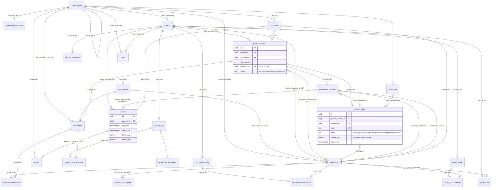
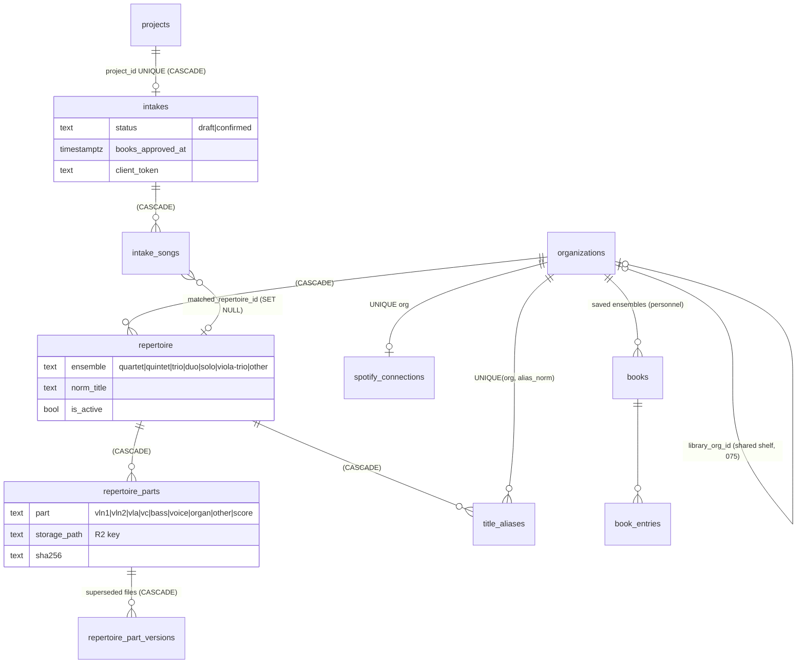

# Section B: Current domain model, database relationship map, and tenant-isolation audit

Repo: `/home/user/podiumpersonnel` (Next.js 16, Supabase Postgres + RLS). Audited read-only on 2026-10-01.
Migration paths below are relative to `supabase/migrations/`. "NNN" means `NNN_*.sql`.

---

## B.0 Sources of truth and where they disagree

| Source | Status | Notes |
|---|---|---|
| `supabase/migrations/001..090` | **Authoritative.** 90 files, 4,505 lines. Commit 199291a says "all 81 migrations replay clean on an empty database"; 082-090 were added later. | Final shape below is built by replaying every migration in order. |
| `supabase/schema.sql` (534 lines) | **Stale, and it is not even an ancestor of 001.** It covers 13 tables with none of the 002-090 changes. | It **differs from 001** in ways that matter (see below). Nothing reads it, but anyone who uses it to bootstrap gets the wrong DB. |
| `scripts/*.sql` | Hand-pasted production scripts (`go-live-2026-07-18.sql`, `security-fixes-2026-07-25.sql`, `w9-upload-2026-07-25.sql`, `launch-pending-migrations.sql`, `launch-hardening-2026-09-18.sql`, `venue-policies-2026-09-17.sql`, `after-gig-2026-09-27.sql`, `gig-lead-2026-09-27.sql`, `staging-replay.sql` (2,927 lines)). | These are the same DDL as 073/074/076/078/084-090, run by hand in the SQL editor. Prod was patched outside the migration runner, so **prod may not match a clean replay** (086 says so directly: prod was patched by the script first). |
| `src/types/database.ts` (975 lines) | **Partly stale and hand-maintained.** Not generated. | It types 18 tables in `Database`, plus manual interfaces for `EmailLog`, `GigDetailSend/Confirmation`, `ProjectFile*`, `MusicSend/Confirmation`, `PreGigReminder`, `ReminderTemplate`. It has **no types** for repertoire*, intakes*, title_aliases, spotify_connections, gig_reports, app_settings, stripe_events or venues-adjacent extras. |
| `src/lib/validations/*.ts` (zod) | Covers only form inputs: projects/services, musicians, instruments, venues, books, schedules, settings, auth. | There is no zod for offers, positions, payments or intakes. Status enums for those exist only as TS unions and string literals in code. |

### schema.sql vs migrations: concrete disagreements

| Item | `schema.sql` | Migrations (final) |
|---|---|---|
| `project_positions` uniqueness | `UNIQUE(project_id, instrument_id, chair_number)` | **No unique constraint at all.** Duplicate chairs are possible. |
| `book_entries` uniqueness | `UNIQUE(book_id, musician_id, instrument_id)` | None. `musician_id` became nullable in 036. |
| `book_entries.priority` default | 0 | 1 (001) |
| `contract_offers.token` default | `encode(gen_random_bytes(32),'hex')` (256-bit) | `replace(uuid_generate_v4()::text,'-','')` (001, about 122 random bits). Comments in 078/082/089 say "256 bits, matching contract_offers", which is **not true of the migration DDL**. Offers are inserted from the client (`send-offer-dialog.tsx:517`) without a token, so they get the DB default. |
| `substitution_requests.service_id` FK | `ON DELETE CASCADE` ("NULL means all services") | `ON DELETE SET NULL` (001) |
| Indexes | `idx_musicians_org`, `idx_instruments_org`, `idx_books_org`, `idx_projects_org`, `idx_services_project`, `idx_project_positions_project`, `idx_contract_offers_position`, `idx_contract_offers_token`, `idx_competing_schedules_*`, `idx_organization_members_*` | **None of these exist in migrations.** No index on `projects(organization_id)`, `services(project_id)`, `project_positions(project_id)`, `contract_offers(project_position_id)` or `instruments(organization_id)`. Only the UNIQUE-backed indexes (token, `org_members(org,user)`, `org_members(user)` from 077) exist. If prod has them, they were added by hand. |
| Varchar vs text | VARCHAR(255) etc. | `text` |
| Helpers | `is_org_member`/`is_org_admin` as plpgsql; `update_updated_at_column()` | sql functions; `update_updated_at()` |
| Policies | "Users can join organizations" (self-insert) | dropped (084) |

**Verdict:** `schema.sql` is a pre-001 design draft. Treat it as dead and delete or label it in the rearchitecture.

### TypeScript type drift (database.ts vs migrations)
- `organizations.Row` has none of: `plan_tier, trial_ends_at, stripe_customer_id, stripe_subscription_id, subscription_status (046), disable_staffing_alerts (056), vertical (065), is_comped (066), intake_enabled (073), library_org_id (075)`.
- `musicians.Row` is missing `street_address, city, state (044)`, `w9_request_token/sent_at/expires_at, w9_uploaded_at (078)`, `email_status, email_status_at (087)`. `call_order` is typed `number`, but the DB column is nullable since 045.
- `contract_offers.Row` is missing `personal_message (024)` and `reminder_sent_at (040)`.
- `Functions` lists only `is_org_member`/`is_org_admin`. No RPC types exist.
- No types for 13 newer tables.

---

## B.1 Table catalog (final composed shape)

There are **40 tables** in `public`. There is **no separate W-9 tokens table**: W-9 tokens are columns on `musicians` (078). There are **no views** and **no materialized views** in any migration. Storage buckets are `w9-documents` (032) and `project-files` (041). Repertoire PDFs live in Cloudflare R2, not Supabase (068).

Legend: **Tenant**: `org_id` = has its own `organization_id` column; `via X` = scoped through a parent; `global` = not tenant-scoped.
`upd_at trg` = has the `set_updated_at` trigger.

### 1. `organizations`: tenant root. Tenant: self.
Introduced 001. Altered 010, 011, 015, 030, 046, 056, 065, 066, 073, 075.
| Column | Type | Null/Default | Constraint | Mig |
|---|---|---|---|---|
| id | uuid PK | uuid_generate_v4() | | 001 |
| name | text | NOT NULL | | 001 |
| slug | text | NOT NULL | UNIQUE | 001 |
| created_at, updated_at | timestamptz | now() | | 001 |
| musician_policy | text | null | | 010 |
| timezone | text | NOT NULL 'America/Los_Angeles' | | 011 |
| email_logo_url | text | null | | 015 |
| email_brand_color | varchar(7) | '#1E293B' (was '#3b82f6') | | 015/030 |
| email_footer_text | text | null | | 015 |
| plan_tier | text | NOT NULL 'trial' | CHECK in ('trial','free','ensemble','orchestra','symphony') | 046 (was trial/free/pro), 066 |
| trial_ends_at | timestamptz | null | | 046 |
| stripe_customer_id | text | null | UNIQUE | 046 |
| stripe_subscription_id | text | null | UNIQUE | 046 |
| subscription_status | text | null | CHECK in ('active','past_due','canceled','incomplete','incomplete_expired','trialing','unpaid','paused') | 046 |
| disable_staffing_alerts | boolean | NOT NULL false | | 056 |
| vertical | text | NOT NULL 'music_contractor' | CHECK `organizations_vertical_check` in 7 keys | 065 |
| is_comped | boolean | NOT NULL false | | 066 |
| intake_enabled | boolean | NOT NULL false | | 073 |
| library_org_id | uuid | null | FK organizations(id) (NO ACTION); CHECK `library_org_id IS NULL OR <> id` | 075 |

Triggers: `set_updated_at` (001); `trg_protect_privileged_org_columns` BEFORE UPDATE (081).
RLS: SELECT `is_org_member(id)` (001); UPDATE `is_org_admin(id)`, no WITH CHECK (001); INSERT `auth.uid() is not null` (018); SELECT `id IN get_musician_org_ids()` (034, musician portal).

### 2. `organization_members`: staff and users. Tenant: org_id.
001; 077.
| Column | Type | Default | Constraint |
|---|---|---|---|
| id | uuid PK | | |
| organization_id | uuid NOT NULL | | FK organizations ON DELETE CASCADE |
| user_id | uuid NOT NULL | | FK auth.users ON DELETE CASCADE |
| role | text NOT NULL | 'member' | CHECK in ('owner','admin','member') |
| created_at/updated_at | timestamptz | now() | |
Unique: `(organization_id, user_id)` (001); **`organization_members_user_id_key UNIQUE(user_id)` (077)**, which enforces one org per account.
Trigger: upd_at. RLS: SELECT `is_org_member(org)`; FOR ALL `is_org_admin(org)` (019). The self-insert policy was dropped in 084.

### 3. `instruments`: skill/role taxonomy. Tenant: org_id.
001. Section values are seeded by 020/029/046/067. No later ALTER.
| id uuid PK | organization_id uuid NOT NULL FK orgs CASCADE | name text NOT NULL | abbreviation text | section text (no CHECK) | sort_order int NOT NULL 0 | created_at/updated_at |
- **No unique `(organization_id, name)`**. 029 dedupes by NOT EXISTS, and `seed-skills` dedupes by "count > 0".
- **No index on organization_id** in migrations.
- `section` has no DB CHECK. Zod `INSTRUMENT_SECTIONS` = strings, woodwinds, brass, percussion, other (`src/lib/validations/instruments.ts`).
RLS: member SELECT, admin ALL (001); musician-portal SELECT via `get_musician_org_ids()` (034). Trigger: upd_at.

### 4. `musicians`: workers. Tenant: org_id (scalar).
001; 002, 004, 007, 008, 009, 016, 032, 044, 045, 050, 078, 087.
| Column | Type / default | Mig |
|---|---|---|
| id uuid PK; organization_id uuid NOT NULL FK orgs CASCADE | | 001 |
| first_name, last_name text NOT NULL; email, phone, notes text | | 001 |
| is_active boolean NOT NULL true | soft-delete flag | 001 |
| tags text[] default '{}' (GIN idx) | | 002 |
| zip_code varchar(10); service_radius_miles int 50; call_order int (default NULL since 045; 100s nulled); is_leader bool false | | 004/045 |
| home_region varchar(100) | | 007 |
| w9_on_file bool false | | 008 |
| zelle_method varchar(10) CHECK in ('email','phone'); zelle_verified bool false | | 009 |
| user_id uuid FK auth.users (NO ACTION); portal_invite_token text; portal_invite_sent_at, portal_invite_expires_at, portal_last_login timestamptz; portal_enabled bool true; profile_photo_url text | | 016 |
| w9_file_url text | | 032 |
| street_address, city text; state varchar(2) | | 044 |
| w9_verified_at timestamptz; w9_verified_by uuid FK auth.users | | 050 |
| w9_request_token text (UNIQUE partial idx where not null); w9_request_sent_at, w9_request_expires_at, w9_uploaded_at timestamptz | | 078 |
| email_status text NOT NULL 'ok' CHECK in ('ok','bounced','complained'); email_status_at timestamptz | | 087 |
Indexes: tags GIN (002); (org, call_order) (004); zip partial (004); home_region (007); (org, w9_on_file) (008); (org, zelle_method, zelle_verified) (009); user_id, portal_invite_token, email (016); w9_request_token unique partial (078); email_status partial (087).
- **No uniqueness on email per org.** Duplicates are handled by `scripts/merge-duplicate-musicians.js` and `musician-duplicates.test.ts`.
Triggers: upd_at; `trg_enforce_musician_limit` BEFORE INSERT (080).
RLS: member SELECT, admin ALL (001); "Musicians can view own musician records" SELECT `user_id = auth.uid()` (016); **"Musicians can update own contact info" UPDATE USING/WITH CHECK `user_id = auth.uid()` with no column restriction (016, still live; see B.5 finding T-1).**

### 5. `musician_instruments`: worker ↔ skill. Tenant: via musicians.
001. `id`, `musician_id` FK musicians CASCADE, `instrument_id` FK instruments CASCADE, `is_primary` bool NOT NULL false, `proficiency` text NOT NULL 'professional' (no CHECK), `created_at`. UNIQUE(musician_id, instrument_id). No updated_at.
RLS: via `musicians m … is_org_member/admin(m.organization_id)` (001). **instrument_id org is not checked.**

### 6. `books`: saved ensembles / rosters (not music books). Tenant: org_id.
001. `id`, `organization_id` FK CASCADE, `name` NOT NULL, `description`, `is_default` bool false, timestamps. upd_at. RLS member/admin.

### 7. `book_entries`: chair template rows. Tenant: via books.
001; 036. `id`, `book_id` FK books CASCADE, `musician_id` FK musicians CASCADE (**nullable since 036**), `instrument_id` FK instruments CASCADE, `chair_number` int null, `priority` int NOT NULL 1, `notes`, timestamps. No unique constraint. upd_at. RLS via books.

### 8. `projects`: events, gigs, work. Tenant: org_id.
001; 023, 037, 051, 052, 089, 090.
| Column | Type / default | Mig |
|---|---|---|
| id; organization_id FK orgs CASCADE; name NOT NULL; description; start_date, end_date date | | 001 |
| status text NOT NULL 'draft' CHECK in ('draft','active','completed','cancelled') | | 001 |
| book_id uuid FK books ON DELETE SET NULL (**unused by app code**) | | 001 |
| internal_notes text | | 023 |
| ensemble_type text | | 037 |
| client_name, client_email, client_phone, event_type text; contract_amount, deposit_amount numeric(10,2); deposit_paid_at date; payment_status text default 'pending' CHECK in ('pending','deposit_paid','fully_paid'); payment_notes | | 051 |
| coordinator_name/email/phone text | | 052 |
| pay_summary_sent_at timestamptz | | 089 |
| gig_lead_musician_id uuid FK musicians ON DELETE SET NULL | | 090 |
No index on organization_id in migrations. Triggers: upd_at; `trg_enforce_project_limit` BEFORE INSERT OR UPDATE OF status (080).
RLS: member SELECT, admin ALL (001); musician SELECT `id IN get_musician_project_ids()` (034).

### 9. `services`: sessions / calls (rehearsal, performance). Tenant: via projects.
001; 003, 005, 021, 025, 058, 059.
| id; project_id FK projects CASCADE; name NOT NULL; service_type text NOT NULL (no DB CHECK; zod `SERVICE_TYPES` = rehearsal, performance, dress_rehearsal, sectional, other); venue text (free-text name); start_time timestamptz NOT NULL; end_time; notes; timestamps (001) |
| venue_id uuid FK venues SET NULL (003) |
| base_pay decimal(10,2); leader_fee decimal(10,2) default 50.00 (005) |
| call_time timestamptz (021); CHECK `services_call_time_before_start`: call_time is null or ≤ start_time (025) |
| venue_2 text; venue_id_2 uuid FK venues SET NULL (058); backfill 059 |
**There is no personnel column on services** (no musician_ids, no positions link). upd_at. RLS via projects; musician SELECT via `get_musician_project_ids()` (034).

### 10. `project_positions`: requirement + assignment, conflated ("chair"). Tenant: via projects.
001 (unchanged since).
| id | project_id FK projects CASCADE | instrument_id FK instruments CASCADE | chair_number int NOT NULL | musician_id uuid FK musicians **ON DELETE SET NULL** | status text NOT NULL 'vacant' CHECK in ('vacant','offered','confirmed','declined') | notes | timestamps |
Index: only `idx_project_positions_musician` (048). **No unique (project, instrument, chair).** upd_at.
RLS via projects; musician SELECT `musician_id IN get_musician_ids_for_auth_user()` (034).

### 11. `contract_offers`: offers. Tenant: via project_positions → projects.
001; 005, 024, 040, 061, 063.
| id | project_position_id FK project_positions **CASCADE** | musician_id FK musicians **CASCADE** | token text NOT NULL UNIQUE default uuid-hex | status text NOT NULL 'pending' CHECK in ('pending','viewed','accepted','declined','rescinded','expired','released') (061, 063) | sent_at, viewed_at, responded_at, expires_at timestamptz | response_notes | custom_pay decimal(10,2) (005) | personal_message text (024) | reminder_sent_at timestamptz (040) | timestamps |
Indexes: token (unique); musician_id, status (048). **No index on project_position_id.** No uniqueness on (position, musician) and no partial unique on "one live offer per position". That rule is enforced only in app code (`offers/send-email/route.ts:79-95`). upd_at.
RLS: member SELECT / admin ALL via position → project (001); the public `using(true)` policies were dropped in 019; musician SELECT `musician_id IN get_musician_ids_for_auth_user()` (034).

### 12. `substitution_requests`: sub workflow. Tenant: via positions.
001; 012, 026.
| id | project_position_id FK positions CASCADE | requesting_musician_id FK musicians CASCADE | service_id FK services SET NULL | reason | status text NOT NULL default **'pending'** CHECK in ('pending_approval','approved','declined','sub_declined','filled','cancelled') (026) | substitute_musician_id FK musicians SET NULL | suggested_sub_name/email/phone text, suggested_sub_instrument_id FK instruments SET NULL, admin_notes, offer_id FK contract_offers SET NULL (012) | timestamps |
**Bug: the column default `'pending'` is no longer allowed by the 026 CHECK.** An insert that omits status fails. App code always sets `pending_approval` (`gig/[token]/request-sub/route.ts:134`).
Index: offer_id (012). upd_at. RLS via position/project; musician SELECT on requesting_musician_id (035).

### 13. `competing_schedules`: worker unavailability. Tenant: via musicians.
001. `id, musician_id FK CASCADE, title NOT NULL, start_time, end_time NOT NULL, notes, timestamps`. No indexes in migrations. upd_at. RLS via musicians.

### 14. `venues`. Tenant: org_id.
003; 057, 060 (data only); 086 (policies).
`id, organization_id FK CASCADE, name NOT NULL, address, city, state, zip, google_place_id, google_maps_url, parking_info, directions, notes, created_at, updated_at`. Index org. **No upd_at trigger.**
RLS: rewritten in 086 to the `is_org_member`/`is_org_admin` helpers; musician SELECT via `get_musician_org_ids()` (034).

### 15. `zip_coordinates`: global reference.
006 (seeded with about 29 CA zips), RLS 043. `zip varchar(10) PK, lat, lng decimal(9,6)`. Policy: `TO authenticated USING (true)`.

### 16. `payments`. Tenant: org_id.
013; 027, 050, 062.
| id uuid gen_random_uuid() | organization_id FK orgs CASCADE | service_id FK services **RESTRICT** (062) | musician_id FK musicians **RESTRICT** (062) | project_position_id FK positions SET NULL | amount decimal(10,2) NOT NULL | is_leader_fee bool false | status varchar(20) default 'unpaid' CHECK in ('unpaid','pending','paid') (nullable!) | payment_date date | payment_method varchar(50) | payment_reference varchar(255) | notes | exported_at | export_batch_id varchar(100) | payment_type varchar(20) NOT NULL 'standard' CHECK in ('standard','adjustment','correction','bonus') (027) | paid_by uuid FK auth.users (050) | created_at/updated_at (nullable) |
Unique: original UNIQUE(service, musician, is_leader_fee) dropped in 027 → partial unique `payments_standard_unique (service_id, musician_id, is_leader_fee) WHERE payment_type='standard'`.
Indexes: org, service, musician, status, payment_date (013); (org, service) (048); (musician, status, payment_date) WHERE paid; (org, status) WHERE unpaid (050). upd_at. RLS: member SELECT, admin INSERT/UPDATE/DELETE on `organization_id`.

### 17. `staffing_presets`. Tenant: org_id.
014. `id, organization_id FK CASCADE, name varchar(100) NOT NULL, description, category varchar(50) 'custom', positions JSONB NOT NULL '[]'` (shape `[{instrument_name, chair_number}]`, keyed by **instrument name**, not id), timestamps. UNIQUE(org, name). Idx org, category. upd_at. RLS member/admin.

### 18. `musician_notification_preferences`. Tenant: via musicians.
016. `musician_id PK FK musicians CASCADE, email_new_offers, email_offer_reminders, email_schedule_changes, email_payment_updates bool true, timestamps`. Own trigger function. RLS: musician self SELECT/UPDATE/INSERT via `musicians.user_id`; admin SELECT via raw join to organization_members. **Unused by app code** (portal removed).

### 19. `user_tutorial_state`. Tenant: org_id + user.
022. `id, user_id FK auth.users CASCADE, organization_id FK orgs CASCADE, wizard_completed bool, wizard_step int, dismissed_tooltips text[], timestamps`. UNIQUE(user_id, org). No upd_at trigger. RLS: `auth.uid() = user_id` (SELECT/INSERT/UPDATE). The org is not checked, which is harmless.

### 20. `impersonation_log`. Tenant: org_id.
028. `id, admin_user_id FK auth.users CASCADE, musician_id FK musicians CASCADE, organization_id FK orgs CASCADE, created_at`. Idx org, admin. RLS: admin SELECT; INSERT `admin_user_id = auth.uid()` (no org check). **Unused by app code today** (`resolveMusicianIds` in `src/lib/supabase/server.ts` remains, with no caller).

### 21. `email_logs`: communication audit. Tenant: org_id.
038; 055. `id, organization_id FK CASCADE, recipient_email NOT NULL, recipient_name, subject NOT NULL, email_type text NOT NULL (no CHECK; about 24 values in code: contract_offer, offer_reminder, offer_reminder_auto, offer_expiring_soon, offer_accepted, offer_declined, offer_expired, offer_rescinded, musician_released, sub_declined, sub_request_approved, position_unassigned(_admin), gig_details(_confirmed/_reminder), music_available/_confirmed/_reminder, pre_gig_notification, staffing_alert, pay_summary, gig_report_request/_submitted), musician_id FK SET NULL, project_id FK SET NULL, offer_id FK SET NULL, resend_email_id, status text NOT NULL 'sent' (code also writes 'suppressed'), metadata jsonb '{}', sent_at, body text (055)`. Idx (org, sent_at desc), musician. RLS: member SELECT and admin INSERT, both via a **raw sub-select on organization_members** (see B.5).

### 22-23. `gig_detail_sends` / `gig_detail_confirmations`
039; 076 (policy fix). 048 index.
- sends: `id, project_id FK CASCADE, organization_id FK CASCADE, sent_at, sent_by FK auth.users NOT NULL (NO ACTION), musician_count int`. Idx project. Tenant: org_id.
- confirmations: `id, send_id FK sends CASCADE, musician_id FK musicians CASCADE, token text UNIQUE default uuid-hex, email_sent_at, confirmed_at`. UNIQUE(send_id, musician_id). Idx token, send_id. Tenant: via sends.
RLS: the `USING(true)` policies were dropped in 076. Remaining: member SELECT (raw sub-select), admin INSERT on sends. All writes go through the service role.

### 24-28. Project files subsystem (041)
- `project_files`: `id, project_id FK CASCADE, organization_id FK CASCADE, file_name, storage_path, file_size bigint, mime_type 'application/pdf', scope text 'all' (no CHECK; values 'all'|'assigned'), uploaded_by FK auth.users NOT NULL, uploaded_at, notes`. Tenant: org_id. RLS member SELECT, admin INSERT/DELETE (raw sub-select). No UPDATE policy.
- `project_file_instruments`: `id, file_id FK CASCADE, instrument_id FK instruments CASCADE`, UNIQUE(file, instrument). Tenant via files.
- `music_sends`: `id, project_id, organization_id, sent_at, sent_by NOT NULL, musician_count, notes`. Tenant org_id.
- `music_confirmations`: `id, send_id FK CASCADE, musician_id FK CASCADE, token UNIQUE, email_sent_at, confirmed_at`, UNIQUE(send, musician). Tenant via sends.
- `project_file_downloads`: `id, file_id FK CASCADE, musician_id FK CASCADE, downloaded_at`. Tenant via files. INSERT policy is for musicians (portal-era).
Storage `project-files` policies were scoped to the first path folder equal to the org uuid in 085.

### 29. `pre_gig_reminders`. Tenant: org_id.
053. `id, project_id FK CASCADE, organization_id FK CASCADE, status text NOT NULL 'draft' CHECK in ('draft','sent','expired'), notes, trigger_date timestamptz NOT NULL, created_at, approved_by FK auth.users, sent_at, musician_count`. UNIQUE(project_id, trigger_date). Idx project, (org, status). RLS member SELECT, admin INSERT/UPDATE.

### 30. `reminder_templates`. Tenant: org_id.
054. `id, organization_id, name, content NOT NULL, created_by FK auth.users, created_at, updated_at`. **No upd_at trigger.** RLS member/admin.

### 31. `stripe_events`: global.
064. `id text PK, type, processed_at`. RLS on with no policies, so service role only.

### 32-34. `repertoire`, `repertoire_parts`, `title_aliases` (068). Tenant: org_id each.
- repertoire: `id, organization_id, title NOT NULL, artist, ensemble text NOT NULL 'other' CHECK in ('quartet','quintet','trio','duo','solo','viola-trio','other'), norm_title NOT NULL, tags text[], is_active bool true (soft delete/archive), timestamps`. UNIQUE INDEX `(org, norm_title, coalesce(artist,''), ensemble)`.
- repertoire_parts: `id, repertoire_id FK CASCADE, organization_id FK, part CHECK in ('vln1','vln2','vla','vc','bass','voice','organ','other','score'), substitute bool, played_on text, storage_path (R2 key), original_filename NOT NULL, bytes, sha256, notes, timestamps`. UNIQUE INDEX `(repertoire_id, part, substitute, coalesce(played_on,''))`.
- title_aliases: `id, organization_id, alias_norm NOT NULL, repertoire_id FK CASCADE, timestamps`. UNIQUE(org, alias_norm).
All have upd_at. RLS: member SELECT, admin ALL (no WITH CHECK).

### 35-36. `intakes`, `intake_songs` (069; 070, 071, 082, 083, 088). Tenant: org_id each.
- intakes: `id, organization_id, project_id UNIQUE FK projects CASCADE, source CHECK in ('17hats','manual','client-form') default '17hats', status NOT NULL 'draft' CHECK in ('draft','confirmed'), raw_text, contact_name, contact_phone, venue_note, spotify_url, processional_order jsonb '[]', recessional_cue, notes, confirmed_at, timestamps, books_approved_at (071), client_token (UNIQUE partial), client_token_expires_at, client_link_sent_at, client_due_at, client_opened_at, client_submitted_at, client_last_reminder_at (082), book_cover_path, book_cover_name (088)`.
- intake_songs: `id, intake_id FK CASCADE, organization_id, section CHECK in ('prelude','ceremony','recessional','postlude','cocktail_hour','reception','other'), position int NOT NULL, title_raw, artist_raw, role, matched_repertoire_id FK repertoire SET NULL, match_status NOT NULL 'missing' CHECK in ('matched','ambiguous','missing','manual'), notes, timestamps, special_request bool false (070), no_music bool false (083)`. UNIQUE(intake_id, section, position).
RLS: member SELECT, admin ALL with WITH CHECK.

### 37. `spotify_connections` (072). Tenant: org_id (UNIQUE).
`id, organization_id UNIQUE FK CASCADE, spotify_user_id NOT NULL, display_name, refresh_token NOT NULL, access_token, token_expires_at, timestamps`. RLS on with **zero policies**, so service role only. upd_at.

### 38. `repertoire_part_versions` (079). Tenant: org_id.
`id, part_id FK parts CASCADE, repertoire_id FK CASCADE, organization_id FK CASCADE, storage_path, sha256, bytes, original_filename NOT NULL, replaced_at, replaced_by FK auth.users, note`. Idx (part_id, replaced_at desc), org. RLS: member SELECT only.

### 39. `app_settings` (080). Global singleton.
`id boolean PK default true CHECK(id), billing_enforced bool false, updated_at`. RLS on, no policies.

### 40. `gig_reports` (089). Tenant: org_id.
`id, organization_id FK CASCADE, project_id FK CASCADE, musician_id FK musicians CASCADE, token text NOT NULL (UNIQUE idx), requested_at, opened_at, submitted_at, overall CHECK null or in ('great','good','issues'), all_on_time bool, late_notes, hiccups, client_follow_up, arrangement_notes, other_notes, created_at, updated_at`. UNIQUE(project_id, musician_id). **No upd_at trigger.** RLS: admin SELECT only.

### Tenant-scoping summary
| Has own `organization_id` (26) | Reached only through a parent (11) | Global (3) |
|---|---|---|
| organizations (self), organization_members, instruments, musicians, books, projects, venues, payments, staffing_presets, user_tutorial_state, impersonation_log, email_logs, gig_detail_sends, project_files, music_sends, pre_gig_reminders, reminder_templates, repertoire, repertoire_parts, title_aliases, intakes, intake_songs, spotify_connections, repertoire_part_versions, gig_reports | musician_instruments, competing_schedules, musician_notification_preferences (via musicians); book_entries (via books); services, project_positions (via projects); contract_offers, substitution_requests (via positions→projects); gig_detail_confirmations, music_confirmations (via sends); project_file_instruments, project_file_downloads (via files) | zip_coordinates, stripe_events, app_settings |

The core staffing chain `services`, `project_positions`, `contract_offers` and `substitution_requests` has **no organization_id**. Every org check on them is a 1-2 hop join to `projects`.

---

## B.2 Status / state columns: values and transition sites

### `projects.status`: CHECK ('draft','active','completed','cancelled') (001); zod `PROJECT_STATUSES` (`validations/projects.ts`)
| Transition | Where |
|---|---|
| create → 'active' (the UI never creates 'draft'; the DB default is 'draft', which is used by templates) | `src/components/projects/project-form-dialog.tsx:177,237` |
| active → completed (manual) | `src/components/projects/projects-client.tsx:473` |
| active → completed (cron, one day after last date in org TZ) | `src/app/api/cron/complete-projects/route.ts:42`, rule in `src/lib/projects/archive.ts` |
| any → cancelled (= "Archive", used when payments block delete) | `src/components/projects/delete-project-dialog.tsx:104` |
| Guard | `trg_enforce_project_limit` counts 'active'+'draft' (080) |
"Archived" in the UI = status in ('completed','cancelled') (`projects-client.tsx:404`). There is no `archived` column.

### `projects.payment_status` (client billing): ('pending','deposit_paid','fully_paid') (051); zod `PAYMENT_STATUSES`. Edited in `project-form-dialog.tsx`.

### `project_positions.status`: CHECK ('vacant','offered','confirmed','declined') (001)
| Transition | Where |
|---|---|
| insert 'vacant' | `add-position-dialog.tsx:192,243,312`, `project-positions.tsx:448`, `projects-client.tsx:564,603,642` (templates/presets) |
| insert 'confirmed' with musician_id (book auto-populate, no offer) | `src/app/api/projects/[projectId]/auto-populate/route.ts:225` |
| → 'offered' (client-side, after inserting the offer) | `send-offer-dialog.tsx:541` (`.neq('status','confirmed')`), `project-offers.tsx:285` (waterfall) |
| → 'confirmed' + musician_id (offer accepted; conditional on `musician_id IS NULL` or = original for subs) | `src/lib/offers/respond.ts:89-98` (`claimChairForAccept`), called from `api/gig/[token]/accept` |
| → 'confirmed' + musician_id (direct assign, no offer) | `src/app/api/positions/[positionId]/assign/route.ts:134-141` |
| → 'vacant', musician_id null | decline: `respond.ts:169-176` (`vacateChair`); expire cron: `api/cron/expire-offers/route.ts:120`; unassign: `positions/[positionId]/unassign/route.ts:125`; rescind: `rescind-offer/route.ts:146` (status only) |
| **'declined' is never written** by app code. It appears only as a derived display state in `lib/email/send.ts:1166` and `email/templates/staffing-alert.tsx:20`. |

### `contract_offers.status`: CHECK ('pending','viewed','accepted','declined','rescinded','expired','released') (001, 061, 063); TS union in `database.ts:526`; `RESPONDABLE_STATUSES = ['pending','viewed']` (`respond.ts:29`)
| From → To | Where |
|---|---|
| insert 'pending' | client: `send-offer-dialog.tsx:517-529`, `project-offers.tsx:269-273`; server: `substitutions/[requestId]/approve/route.ts:217-222` |
| pending → viewed (+viewed_at) | `src/app/gig/[token]/page.tsx:201-207` (skipped for staff preview) |
| pending/viewed → accepted | `respond.ts:79-84`; also `positions/[positionId]/assign/route.ts:166-171` (own offer accepted off-app) |
| accepted → pending (revert when chair lost) | `respond.ts:105-108` |
| pending/viewed → declined | `respond.ts:131-160` via `api/gig/[token]/decline` |
| pending/viewed → expired | cron `api/cron/expire-offers/route.ts:88`; supersede-on-send `api/offers/send-email/route.ts:84-89`; other offers on assign `assign/route.ts:173-177`; sub approve `substitutions/.../approve/route.ts:203-207` |
| pending/viewed → rescinded | `positions/[positionId]/rescind-offer/route.ts:~114-121`; unassign `unassign/route.ts:111-115` |
| accepted → released | sub accepted `api/gig/[token]/accept/route.ts:113-118`; unassign `unassign/route.ts:101-105` |
| side columns | `reminder_sent_at` set by `api/cron/offer-reminders`; `responded_at` set on every terminal move |

### `substitution_requests.status`: CHECK ('pending_approval','approved','declined','sub_declined','filled','cancelled') (026; the 012 legacy values were normalized)
| From → To | Where |
|---|---|
| insert 'pending_approval' (only when the musician's offer is 'accepted') | `api/gig/[token]/request-sub/route.ts:128-134` |
| pending_approval → approved (claim) and revert on failure | `api/substitutions/[requestId]/approve/route.ts:92-120` |
| pending_approval → declined (admin) | `api/substitutions/[requestId]/decline/route.ts:94` |
| approved → filled (sub accepted) | `api/gig/[token]/accept/route.ts:103-106` |
| approved → sub_declined | `api/gig/[token]/decline/route.ts:115`; `rescind-offer/route.ts:164` |
| 'cancelled' | **never written**. Admins hard-delete instead (`components/projects/sub-requests.tsx:116`). |
| Column default 'pending' violates the CHECK (latent bug). |

### `payments.status`: CHECK ('unpaid','pending','paid') (013); `payment_type` ('standard','adjustment','correction','bonus') (027)
Insert 'unpaid': `api/payments/generate/route.ts:100-108`. Transitions: `components/payments/payment-status-dialog.tsx:48` (→paid, paid_by), `components/payments/payments-client.tsx:225` (quick change), `api/payments/bulk-update/route.ts`. Hard delete: `payments-client.tsx:212`.

### `pre_gig_reminders.status`: ('draft','sent','expired') (053)
Insert draft: `api/cron/pre-gig-reminders`. draft → expired: `api/cron/pre-gig-reminders/route.ts:28`. draft → sent: `api/pre-gig-reminders/[reminderId]/approve/route.ts:74`.

### Gig details / music sends: no status column, state comes from timestamps
`gig_detail_confirmations.confirmed_at` / `music_confirmations.confirmed_at` (null = unconfirmed). Set by `api/confirm-details/[token]` and `api/confirm-music/[token]`. Read by `projects/[projectId]/gig-details-status` and `music-status`. Reminders go out via `send-gig-details-reminder` and `send-music-reminder`.

### `intakes.status`: ('draft','confirmed') (069). 082 deliberately added no new value.
draft upsert: `api/intake/[projectId]/route.ts:291`. → confirmed + confirmed_at: same file `:349`. `books_approved_at` set/cleared by `api/intake/[projectId]/approve-books/route.ts:63` and cleared on every intake save (071). The client planner state is derived from `client_token / client_opened_at / client_submitted_at` (082). **The planner route (`/plan/[token]`) does not exist in `src/app` yet**, so these columns are unused.
`intake_songs.match_status` ('matched','ambiguous','missing','manual') plus `special_request` and `no_music` flags: set by the parser/matcher (`api/intake/parse`, `api/intake/[projectId]`).

### `organizations` billing state: `plan_tier` ('trial','free','ensemble','orchestra','symphony'), `subscription_status` (8 Stripe values), `is_comped`, `trial_ends_at`
Written only by `api/billing/webhook/route.ts:154-242` (service role), protected by trigger 081. Effective tier: `org_plan_tier()` (080) mirrors `resolveOrgPlan()` in `src/lib/plan.ts`. Master switch: `app_settings.billing_enforced`.

### `organization_members.role`: ('owner','admin','member')
Written by the `create_organization_with_owner` RPC (owner), `api/settings/members/route.ts` (insert via admin client, owner-only), and `api/settings/members/[memberId]/route.ts`. Zod restricts invites to admin|member (`validations/settings.ts:23,29`).

### `musicians` state
There is no `status` column. `is_active` is the soft delete (`components/musicians/delete-musician-dialog.tsx:100`, used when payments block a hard delete). `email_status` ('ok','bounced','complained') is written by `api/webhooks/resend/route.ts:166,178`. W-9: `w9_on_file`, `w9_verified_at`, `w9_request_token` lifecycle (`api/musicians/send-w9-request`, `api/w9/[token]`).

### Other enumerations (no state machine)
`services.service_type` (zod only), `instruments.section` (zod only), `musician_instruments.proficiency` (free text), `project_files.scope` ('all'|'assigned', no CHECK), `repertoire.ensemble`, `repertoire_parts.part`, `intakes.source`, `intake_songs.section`, `gig_reports.overall`, `musicians.zelle_method`, `email_logs.status` ('sent'|'suppressed', no CHECK).

---

## B.3 Relationship map

### B.3.1 Staffing core

### B.3.2 Music-library subsystem (Book Builder)

Naming trap: **`books`/`book_entries` are personnel "Saved Ensembles"** (chair templates), not music books. The Book Builder's "books" are generated PDFs. They are not stored as rows: they are assembled from `repertoire_parts` (R2) plus the intake and uploaded to the `project-files` bucket. The cover is `intakes.book_cover_path` (088).

When `library_org_id` is set, library routes read and write repertoire under **another org's id** through the service client (`resolveLibraryOrgId` in `src/lib/api-helpers.ts:133`). Intakes and intake_songs stay under the project's own org, but `intake_songs.matched_repertoire_id` then points at a row owned by a different org. That cross-org FK is intended.

### B.3.3 How a "booking" is represented (prose)

1. **The booking lives on `project_positions`.** A chair is booked when `project_positions.musician_id IS NOT NULL AND status = 'confirmed'`. This one row is both the requirement (instrument + chair_number on a project) and the assignment (musician_id + status). Rosters, payments generation (`api/payments/generate/route.ts:39-40`), after-gig reports, gig-details and music sends, and the musician-portal RLS (`get_musician_project_ids()`, 034) all read "who is booked" from `project_positions.musician_id`.

2. **`contract_offers` is the negotiation history plus the acceptance record.** It is not the source of truth for the booking. When an offer is accepted, `claimChairForAccept` (`src/lib/offers/respond.ts:74-125`) does two optimistic, conditional updates with no DB transaction: offer pending/viewed → accepted, then position `musician_id IS NULL` → musician + 'confirmed'. If the second update loses the race it reverts the first. While the booking stands, the two tables mirror each other (accepted offer + confirmed position).
   - A **position can be confirmed with no offer at all**: direct assign (`api/positions/[positionId]/assign`, comment: "Assign the musician directly — no contract_offer, no email") and book auto-populate (`api/projects/[projectId]/auto-populate/route.ts:225`, positions inserted already 'confirmed').
   - `contract_offers.custom_pay` is the agreed pay. `acceptedOfferPay()` in `src/lib/payments/compute.ts` reads it from the accepted offer when generating payments. So the agreed rate lives on the Offer, not on an Assignment.
   - Offer history survives unassign, rescind and substitution as 'released', 'rescinded' and 'expired' (061/063, `unassign/route.ts:86-121`). It is **destroyed** if the position row is deleted (CASCADE) or the musician is hard-deleted (CASCADE).
   - **One live offer per chair** is enforced only in app code: `offers/send-email/route.ts:79-95` expires sibling pending/viewed offers before sending. The DB allows any number of pending offers per position. The client also checks "one active offer per musician per project" (`send-offer-dialog.tsx:485-510`, `project-offers.tsx:235-259`).

3. **Candidate rankings are not stored.** No rank column, no candidate list, no JSON. `getNextCandidates()` (`src/lib/next-candidate.ts`) computes them on demand:
   - musicians in the org with `is_active` and a `musician_instruments` row for the position's instrument;
   - minus musicians with live offers (pending/viewed unexpired, or accepted) and minus decliners for that position;
   - filtered by `zip_code`/`service_radius_miles` against `zip_coordinates` (`lib/zip-distance`);
   - flagged against `competing_schedules` overlapping the project's services;
   - sorted by leaders first for chair 1, then **`musicians.call_order`** (a single org-wide integer per musician, not per instrument; NULL = unranked), conflicts last.
   - `book_entries` (Saved Ensembles) supply a default musician per instrument/chair, with an unused `priority` int, for `auto-populate`.
   - There is **no cascade engine**. When an offer expires, the cron (`api/cron/expire-offers`) vacates the chair and emails admins the next candidate. The "waterfall" send (`components/projects/project-offers.tsx: confirmWaterfallSend`) is a manual, admin-confirmed one-click re-offer that copies `custom_pay`.

4. **Position ↔ service: a position implicitly covers ALL services of its project.** `project_positions` has no service FK, and there is no join table (`position_services`), no `services.musician_ids` and no per-service attendance. Consequences:
   - The offer email lists every service of the project (`offers/send-email/route.ts`, `gig/[token]/accept/route.ts`). Accepting means accepting all of them.
   - **Pay is per service.** `api/payments/generate` loops over every service of the project for every confirmed position and writes one `payments` row per (service, musician), with `amount = custom_pay ?? services.base_pay (+ leader_fee)`. So `custom_pay` is a per-service amount, applied identically to each service. `payments.service_id` is the only per-service personnel linkage in the schema, and it is derived and financial, not a staffing record.
   - `substitution_requests.service_id` lets a musician name the one service they need covered. The fulfilment ignores it: when the sub accepts, the whole chair `project_positions.musician_id` is transferred (`respond.ts:94-96`) and the original's offer goes to 'released' for all services. Partial-service subs are recorded but not modeled.
   - Pay can differ by service (`services.base_pay/leader_fee`), so pay is per-service but personnel is per-project. This confirms the spec's "all services share the same personnel" assumption is how the system works today.

---

## B.4 Functions, triggers, RPCs, views

There are **no `CREATE VIEW`s**. `Database['public']['Views']` is empty in `database.ts`.

| Object | Kind | Defined / last replaced | Security | Purpose | Called from app? |
|---|---|---|---|---|---|
| `is_org_member(org_id)` | sql fn | 001 | SECURITY DEFINER, **no `SET search_path`** | membership test used by most policies | RLS only (typed in database.ts) |
| `is_org_admin(org_id)` | sql fn | 001 | DEFINER, no search_path | owner/admin test | RLS only |
| `update_updated_at()` | trigger fn | 001 | invoker | `set_updated_at` BEFORE UPDATE on orgs, members, instruments, musicians, books, book_entries, projects, services, project_positions, contract_offers, substitution_requests, competing_schedules (001), payments (013), staffing_presets (014), repertoire, repertoire_parts, title_aliases (068), intakes, intake_songs (069), spotify_connections (072) | trigger |
| `update_musician_notification_preferences_updated_at()` | trigger fn | 016 | | upd_at for prefs | trigger |
| `link_musician_records_to_user(p_user_id, p_email)` | plpgsql RPC | 016 → 031 → **074** | DEFINER; 074: non-service callers may link only to `auth.uid()` and only for their own **verified** email; EXECUTE revoked from PUBLIC/anon | binds `musicians.user_id` for every unclaimed row (any org) whose email matches | **yes**: `src/app/auth/callback/route.ts:39` |
| `activate_musician_by_token(p_user_id, p_token)` | RPC | 017 → 049 (expiry) | DEFINER, default PUBLIC execute, trusts `p_user_id` | portal invite activation | **no** (dead; portal removed) |
| `get_musician_by_invite_token(p_token)` | RPC | 017 | DEFINER, PUBLIC execute | invite lookup | **no** (dead) |
| `get_musician_ids_for_auth_user()` / `get_musician_project_ids()` / `get_musician_org_ids()` | sql SETOF fns | 034 | DEFINER STABLE, no search_path | break RLS recursion for musician-portal policies | RLS only |
| `create_organization_with_owner(p_name, p_slug, p_timezone, p_vertical DEFAULT 'music_contractor')` | RPC | 019 → 020 → 029 → 046 → **067** (DROP + CREATE 4-arg; GRANT to authenticated) | DEFINER, no search_path | creates org (14-day trial, vertical), inserts owner membership, and seeds 73 instruments (comment says "64") **only if** vertical in (music_contractor, orchestra_band) | **yes**: `src/components/auth/onboarding-form.tsx:102` (then `POST /api/organization/seed-skills` for other verticals) |
| `org_plan_tier(p_org_id)` | plpgsql | 080 | DEFINER, search_path set | effective tier (comped → symphony; enforcement off → symphony; active/trialing/past_due → plan_tier; trial → symphony; else free) | via triggers |
| `org_plan_limit(p_org_id, p_limit)` | plpgsql | 080 | DEFINER | musicians: free 25 / ensemble 60 / orchestra 250; active_projects: free 3; NULL = unlimited | via triggers |
| `enforce_musician_limit()` → `trg_enforce_musician_limit` BEFORE INSERT ON musicians | trigger | 080 | DEFINER | commercial cap (counts all rows incl. inactive); racy by design | DB |
| `enforce_project_limit()` → `trg_enforce_project_limit` BEFORE INSERT OR UPDATE OF status ON projects | trigger | 080 | DEFINER | caps projects in active+draft | DB |
| `protect_privileged_org_columns()` → `trg_protect_privileged_org_columns` BEFORE UPDATE ON organizations | trigger | 081 | **INVOKER** (required) | rejects changes to is_comped, plan_tier, subscription_status, trial_ends_at, stripe_customer_id, stripe_subscription_id, library_org_id, intake_enabled unless current_user in (service_role, postgres, supabase_admin) | DB |

**`.rpc(` usage in `src/`:** exactly two call sites, `create_organization_with_owner` and `link_musician_records_to_user`.

**Nothing touches `contract_offers` and `project_positions` atomically in the DB.** There is no RPC, no transaction and no trigger keeping `project_positions.status/musician_id` consistent with `contract_offers.status`. All coordination is optimistic conditional `UPDATE … WHERE status IN (…)` / `WHERE musician_id IS NULL` from route handlers (`src/lib/offers/respond.ts`, `assign`, `unassign`, `rescind-offer`, `expire-offers`, `substitutions/approve`). The client-side offer insert followed by the position→'offered' update (`send-offer-dialog.tsx:527-545`) is two independent PostgREST calls from the browser.

Missing `updated_at` triggers on tables that have the column: `venues`, `reminder_templates`, `user_tutorial_state`, `gig_reports`.

---

## B.5 Tenant-isolation audit

### B.5.1 The RLS model
- **RLS is enabled on every public table.** 047 force-enables it with a catch-all loop, and each newer table enables it itself. 199291a reports 39 tables checked; there are 40 after 089.
- **Policy shape (staff):** direct `is_org_member(organization_id)` for SELECT and `is_org_admin(organization_id)` for ALL/INSERT/UPDATE/DELETE. Child tables without an org column use `EXISTS (select 1 from <parent> … where is_org_member(parent.organization_id))`: services/positions → projects; offers/sub requests → positions → projects; musician_instruments/competing_schedules → musicians; book_entries → books. The joins are correct. Policies written as `FOR ALL USING(...)` without WITH CHECK get the USING expression applied to new rows, so inserts are org-checked on the parent.
- **Policy shape (musician portal, 016/033/034/035/041):** keyed on `musicians.user_id = auth.uid()` through the DEFINER helpers. The policies are still live even though the portal UI is gone (`src/app` has no `musician/` route; 078: "The portal is gone"). `auth/callback/route.ts` still redirects linked users to `/musician`, which now 404s.
- **Second pattern, raw sub-select:** `organization_id IN (SELECT organization_id FROM organization_members WHERE user_id = auth.uid())` on email_logs (038), gig_detail_sends/confirmations (039/076), project_files, project_file_instruments, music_sends, music_confirmations, project_file_downloads (041), and the admin policy on musician_notification_preferences (016). Migration 086 says this exact pattern "returns nothing" under a user session for venues. If that is right, these tables are **fail-closed** for user sessions (no leak, but broken reads). If it is wrong, 086's diagnosis needs revisiting. Either way it is inconsistent and should be normalized to the helpers.
- **Service-role-only tables** (RLS on, no policies): `stripe_events`, `spotify_connections`, `app_settings`. **Effectively service-role for writes:** gig_detail_* (no write policies), repertoire_part_versions, gig_reports (admin SELECT only), plus all token flows (`/gig/[token]`, `/confirm-details`, `/confirm-music`, `/music-download`, `/w9`, `/report`).
- **Service-role routes rely on application checks.** 55 of 81 API routes import `createServiceClient`/`createAdminClient`. The ones that take a resource id were spot-checked, and each compares the resource's `organization_id` to the caller's membership: `gig-report`, `gig-lead`, `files/[fileId]/download`, `musicians/[id]/w9`, `pre-gig-reminders/[id]/approve`, `payments/bulk-update`, library routes via `requireIntakeEnabled`/`libraryOrgId`, `offers/[offerId]/calendar` (token or membership). Most core staffing routes (`assign`, `unassign`, `rescind-offer`, `next-candidates`, `auto-populate`, `payments/generate`, `offers/send-email` fetch) use the **user-session client**, so RLS is the gate.
- **Org resolution in app code:** `requireOrgAdmin()` (`src/lib/api-helpers.ts:42-63`) uses `.eq('user_id').single()`, which is only correct because 077 enforces one membership per account.

### B.5.2 Already guarded (by migrations and tests)
| Hole | Fixed in | Test |
|---|---|---|
| `contract_offers` public `using(true)` SELECT/UPDATE | 019 | `rls-policy-safety.test.ts` (token-shaped policy guard) |
| musician-by-invite-token broad SELECT | 017 | |
| RLS recursion in portal policies | 034 | |
| arbitrary-email musician linking (`link_musician_records_to_user`) | 074 | |
| gig_detail_* `USING(true)` FOR ALL (anon read/write and token harvest) | 076 | `rls-policy-safety.test.ts` ("keeps the gig-detail tables free of public policies") |
| second membership per account | 077 | `org-membership.test.ts` |
| org admin self-comping, `library_org_id` hijack | 081 | `privileged-org-columns.test.ts` |
| self-insert membership into any org | 084 | `rls-policy-safety.test.ts` (membership bound to org) |
| project-files storage readable/deletable by any logged-in user | 085 | `rls-policy-safety.test.ts` (bucket scoped) |
| venues raw sub-select | 086 | `rls-policy-safety.test.ts` |
| plan caps bypassable via PostgREST | 080 | `plan-limit-enforcement.test.ts` |
`route-gates.test.ts` covers billing/plan gates, auth on `next-candidates` and `auto-populate`, and the org-membership check on file download. It is a static string check on route source, not a behavioural test. `rls-policy-safety.test.ts` replays the migration SQL and asserts on the final live policies (no `USING(true)` without a TO clause, except zip_coordinates).

### B.5.3 Open findings (cross-org or privilege), ranked

**T-1 (HIGH, verify against a live DB): a linked musician can rewrite their own `musicians` row, including `organization_id`, and so read another tenant's org row, instruments and venues.**
- Policy "Musicians can update own contact info" (016) is `FOR UPDATE USING (user_id = auth.uid()) WITH CHECK (user_id = auth.uid())`. No later migration drops it, and it has **no column restriction**.
- Path: account X creates org A and adds a musician with email Y. Account Y (no org, verified email) calls `rpc('link_musician_records_to_user', {p_user_id: Y, p_email: Y})`, which 074 allows. Y then runs `UPDATE musicians SET organization_id = '<victim org>' WHERE user_id = auth.uid()`, which passes RLS.
- `get_musician_org_ids()` now includes the victim org. That exposes `organizations` SELECT ("Musicians can view own organization", 034, including stripe ids and billing columns), `instruments` and `venues` of the victim org.
- It also plants a roster row in the victim org. The 080 cap is bypassed because the trigger fires on INSERT only.
- Even without the org move, any linked musician can edit `call_order`, `is_leader`, `w9_verified_at/by`, `notes`, `tags` and `email_status` on their own row.
- Fix: drop the portal policies (016 UPDATE/SELECT, 033-035, 041 downloads insert, notification prefs), or add a column-freezing trigger like 081.

**T-2 (MEDIUM): child-row FKs are not tenant-checked, so an org admin can write rows that reference another org's ids.**
- RLS checks only the row's own org path. These FKs are not checked: `contract_offers.musician_id`, `project_positions.musician_id`/`instrument_id`, `substitution_requests.substitute_musician_id`, `book_entries.musician_id/instrument_id`, `musician_instruments.instrument_id`, `services.venue_id/venue_id_2`, `projects.gig_lead_musician_id`/`book_id`, `payments.service_id/musician_id` (RLS checks only `payments.organization_id`), `project_file_instruments.instrument_id`, `pre_gig_reminders.project_id` vs `organization_id`, `gig_detail_sends.project_id` vs `organization_id`.
- 085 notes that ids are not secret: they travel in URLs, emails and payloads.
- Most realistic leak: an admin of org A inserts a `contract_offers` row (client-side insert, `send-offer-dialog.tsx:526`) with a musician_id from org B. Service-role code paths later email that musician: the `offer-reminders` and `expire-offers` crons and the `/gig/[token]` page all use the service client. Each send is logged to `email_logs` under **org A**, with `recipient_email` and `recipient_name` of org B's musician, and org A can read it.
- `api/positions/[positionId]/assign` does check the musician's org (`assign/route.ts:83-88`). The client-side offer insert does not.
- Fix: composite FKs `(id, organization_id)` once child tables carry `organization_id`, or BEFORE INSERT/UPDATE triggers.

**T-3 (LOW-MEDIUM): leftover portal-era DEFINER functions.**
- `activate_musician_by_token(p_user_id, p_token)` and `get_musician_by_invite_token` keep their default PUBLIC/anon EXECUTE. The first trusts the caller-supplied `p_user_id`, which is only token-gated.
- No code issues portal invite tokens any more, so live tokens should be rare.
- Fix: revoke EXECUTE or drop both.
- Separately, all of `is_org_member`, `is_org_admin`, `get_musician_*` and `create_organization_with_owner` are `SECURITY DEFINER` **without `SET search_path`**, which is the standard Supabase linter warning.

**T-4 (LOW): `organizations` INSERT policy (018) lets any authenticated user insert org rows directly**, with arbitrary `is_comped`, `plan_tier`, `library_org_id` or `intake_enabled`. Trigger 081 is BEFORE **UPDATE** only. The rows are orphans, because the caller cannot add a membership to them after 084, so the practical impact is nil today. The policy is unnecessary: onboarding uses the DEFINER RPC. Drop it.

**T-5 (LOW): `impersonation_log` INSERT** checks only `admin_user_id = auth.uid()`, not `is_org_admin(organization_id)`. Anyone can write log rows for any org. The table is dead in app code.

**T-6 (in-tenant privilege, not cross-org):** "Admins can manage organization members" (019) is FOR ALL `is_org_admin`. An **admin** can promote themselves or others to `owner`, or demote and delete the owner, through PostgREST, bypassing the owner-only rule in `api/settings/members`.

**T-7 (design):** `library_org_id` sharing deliberately crosses tenants. Library routes use the service client scoped to `libraryOrgId`, and only the service role can set the pointer (081). This is acceptable but must be modeled explicitly (e.g., a `library_shares` grant table) in the rearchitecture.

Checked and found **not** a cross-org issue: `next-candidates` (user client plus RLS); `auto-populate` (user client); `payments/generate` with `projectId` (user client, so RLS restricts positions to the caller's org); `payments/bulk-update` (explicit org compare); `offers/send-email` (offer fetched with the user client, then sibling expiry by position id); `seed-skills` (org from membership).

### B.5.4 Musicians and multiple orgs; portal auth mapping
- `musicians.organization_id` is a **scalar NOT NULL**. A person working for two contractors is two unrelated `musicians` rows. There is no global person or worker identity. The only cross-org link is the optional `musicians.user_id → auth.users` (016), which `link_musician_records_to_user` sets for **every** unclaimed row matching the verified email, across all orgs (074). `get_musician_org_ids()` returns them all (034).
- Staff are restricted to one org (077 `UNIQUE(user_id)` on organization_members). A single auth user can be both a staff member of one org and a linked musician in others; the callback only attempts linking if the user has no membership.
- Since 078 the musician experience is token-based (`/gig/[token]`, `/w9/[token]`, `/confirm-*/[token]`, `/report/[token]`), with no account needed. `user_id` linking is legacy, but the RLS it powers is still live (T-1).

---

## B.6 The vertical column

- `organizations.vertical` (065): TEXT NOT NULL DEFAULT `'music_contractor'`. CHECK `organizations_vertical_check` in ('music_contractor','orchestra_band','choir','theatre','dance','church_worship','event_agency'). TS mirror: `VERTICAL_KEYS` in `src/lib/verticals/types.ts:13-21`. Zod: `onboardingSchema.vertical = z.enum(VERTICAL_KEYS)` (`validations/auth.ts:37`). `resolveVertical()` never throws and falls back to music_contractor (`src/lib/verticals/registry.ts:29`). 081 does **not** freeze `vertical`, so an org admin can change it via PostgREST. Today it is only a UI template.
- Verticals are **presentation only**: "The database keeps its original nouns (musicians, instruments, books, chair_number) — templates only change what users SEE" (`types.ts` header). Terms cover person/work/session/skill/groupList/materials/rank. Features cover `useChairs`, `useTitleInference`, `useEnsembleDetection` and books tab (`features.ts`).
- `instruments.section`: no DB constraint. Zod `INSTRUMENT_SECTIONS = ['strings','woodwinds','brass','percussion','other']` (`src/lib/validations/instruments.ts:3-9`). The SQL seed (067) files harp, guitar and bass guitar under `'strings'`, while TS `STANDARD_INSTRUMENTS` files them under `'other'`, so the two seed sources already disagree. Keyboards, voices and staff are all `'other'`.
- Seeding:
  1. Music verticals (`music_contractor`, `orchestra_band`): `create_organization_with_owner` seeds the 73-row music taxonomy (the SQL comment says "64") in SQL (067). The template sets `skillSeeds === 'sql'`.
  2. Other verticals: the RPC seeds nothing, and the onboarding form then calls `POST /api/organization/seed-skills` (`src/app/api/organization/seed-skills/route.ts`). That route is admin-only, uses the service client, is idempotent (skips if any instruments exist), and inserts `template.skillSeeds` from `src/lib/verticals/seeds.ts`: CHOIR (11), THEATRE (13), DANCE (7), CHURCH_WORSHIP (12), EVENT_AGENCY (6). Every seed uses section `'other'`; the file says per-vertical section sets are "a v1.1 item".
- `projects.ensemble_type` (037) and `repertoire.ensemble` (068) are music-specific enumerations outside the vertical system.

---

## B.7 Mapping to the target generic vocabulary

| Target | Existing table(s) / columns | Gaps | Verdict |
|---|---|---|---|
| **Organization** | `organizations` (+ billing, vertical, `library_org_id`), `organization_members` (owner/admin/member) | One account = one org (077); cross-org sharing only via `library_org_id` | **exists as-is** |
| **Worker** | `musicians` (name, contact, address, zip/radius, `is_leader`, `call_order`, `tags`, `home_region`, payout (zelle), W-9, `email_status`, `is_active`, optional `user_id`) | Scalar org; no global person; music naming; payout/W-9/leader flags baked in as columns | **exists under a music name** |
| **Role** | `instruments` (name, abbreviation, section, sort_order) | `section` enum is music-only; no unique name per org; non-music verticals all use 'other' | **exists under a music name** |
| **WorkerRole** | `musician_instruments` (`is_primary`, `proficiency` free text) | No rank per role (`call_order` is per worker, not per role); no rate per role | **exists under a music name** (partial) |
| **Event** | `projects` (dates, status, client/coordinator/contract fields, ensemble_type, gig lead, pay_summary_sent_at) | Client-billing fields mixed into the event; `book_id` unused | **exists under a music name** |
| **Call** (time-boxed session) | `services` (service_type, call_time, start/end, venue_id ×2, base_pay, leader_fee) | Pay terms on the session; free-text venue duplicates | **exists under a music name** |
| **Requirement** (slot to fill) | `project_positions` (instrument_id, chair_number) | Same row is also the Assignment; no headcount/quantity concept (one row per chair); no unique (project, role, chair); templates in `staffing_presets` (JSON by instrument *name*) and `books`/`book_entries` | **partially exists (conflated with Assignment)** |
| **RequirementCall** (which calls a requirement covers) | none. A position implicitly covers every service of its project | No per-call staffing, no partial-call subs (`substitution_requests.service_id` recorded but ignored) | **missing** |
| **Candidate** | Computed on the fly in `src/lib/next-candidate.ts` from `musician_instruments`, `call_order`, zip radius, `competing_schedules`, declined/active offers; `book_entries` as default picks | No persisted candidate list, rank or reason; `book_entries.priority` unused | **missing (derived only)** |
| **Offer** | `contract_offers` (token, status ×7, sent/viewed/responded/expires, custom_pay, personal_message, reminder_sent_at) | One-live-offer-per-requirement is app-enforced only; token is about 122 bits, not the claimed 256 | **exists under a music name** |
| **OfferCascade** | none persisted. Manual "waterfall" (`project-offers.tsx`), and the expire cron emails a next-candidate suggestion | No sequence, no auto-advance, no cascade policy | **missing** |
| **Assignment** | `project_positions.musician_id` + `status='confirmed'`; accepted `contract_offers` row when booked via offer; `substitution_requests` for replacement | Conflated with Requirement; no own history (replacing the musician overwrites `musician_id`; history survives only in offers); agreed pay on Offer | **partially exists (conflated with Requirement and Offer)** |
| **Availability** | `competing_schedules` (busy blocks per musician), `zip_code`/`service_radius_miles`, `is_active` | No recurring availability, no "available" windows, no per-org vs global | **partially exists** |
| **Credential** | `musicians.w9_on_file / w9_file_url / w9_verified_at/by / w9_request_token… / w9_uploaded_at` | W-9 only; no generic credential or expiry model | **partially exists (W-9 only)** |
| **Document** | `project_files` (+ `project_file_instruments` role scoping, `project_file_downloads`), storage `project-files` / `w9-documents`, `repertoire_parts`(+versions, R2), `intakes.book_cover_path` | Several unrelated document stores; no generic document entity | **partially exists** |
| **Communication** | `email_logs` (all sends, body, resend id), `gig_detail_sends/confirmations`, `music_sends/confirmations`, `pre_gig_reminders`, `reminder_templates`, `musician_notification_preferences` (dead), `gig_reports` (inbound), `musicians.email_status` | Email only (no SMS); per-feature send/confirm tables instead of one model; `email_type` unconstrained | **exists (fragmented)** |
| **Payment** | `payments` (per service × musician, leader fee, type, status, export batch, paid_by); client-side billing on `projects`; Stripe subscription on `organizations` | Derived by re-running generate; amounts come from Offer.custom_pay or Call.base_pay | **exists as-is** (worker payouts) |
| **AuditEvent** | No generic table. Fragments: `email_logs`, `impersonation_log` (dead), `repertoire_part_versions`, `stripe_events`, offer timestamps, `payments.paid_by`, `w9_verified_by`, `pre_gig_reminders.approved_by` | No who/what/when log of state transitions | **missing** |

---

## B.8 Historical-data considerations

**Never reinterpret these:**
- **`payments`** (1099 and tax records). Since 062 the FKs to `musicians` and `services` are `ON DELETE RESTRICT`, so deleting a musician, service or project with payments fails. The UI then archives instead (`delete-project-dialog.tsx` sets status 'cancelled'; `delete-musician-dialog.tsx` sets `is_active=false`). `payment_type` corrections and adjustments (027) are append-only by convention, but `payments-client.tsx:212` can still hard-delete rows. `amount` was computed at generation time from `contract_offers.custom_pay` or `services.base_pay/leader_fee`, so it must not be recomputed from current rates.
- **`contract_offers`**: the only proof a musician said yes (comment in `unassign/route.ts:86`). The statuses 'rescinded' (061) and 'released' (063) were added specifically to keep history honest. Risk: `project_position_id … ON DELETE CASCADE` and `musician_id … ON DELETE CASCADE` mean that deleting a position (`project-positions.tsx:349,370`, allowed only when no musician is assigned, but old offers may exist) or hard-deleting a musician with no payments **erases offer history**. `email_logs.offer_id` is SET NULL in that case.
- **`project_positions` for past projects**: the record of who played. `musician_id ON DELETE SET NULL` loses it if a musician is hard-deleted. `status='confirmed'` drives payment generation, so changing status semantics re-scopes `api/payments/generate`.
- **`substitution_requests`**: CASCADE from position and requesting musician.
- **`email_logs`** (with `body`, 055): communications history; FKs are SET NULL.
- **`gig_detail_confirmations`, `music_confirmations`, `project_file_downloads`**: receipts of what each musician confirmed or downloaded. All CASCADE from musician.
- **`intakes.raw_text` and `recessional_cue`**: stored **verbatim by contract** (069: "the cue must never be reworded").
- **`repertoire_part_versions`**: append-only archive of replaced parts (079). R2 objects are never deleted.
- **`gig_reports`, `projects.pay_summary_sent_at`** (089) and **`projects.gig_lead_musician_id`** (090): after-gig records. `pay_summary_sent_at` is also a once-only claim flag.
- **`stripe_events`**: idempotency ledger.

**Soft-delete and archive flags present today:**
- `projects.status` in ('completed','cancelled') is the "Archived" view. There is **no `archived` boolean**. `cancelled` doubles as "archived because it has payments", so a real cancellation and an archive are indistinguishable.
- `musicians.is_active` (001): soft delete. The plan-limit count still includes inactive rows (080).
- `repertoire.is_active` (068): archived works (`archived-work-books.test.ts`).
- `intakes.books_approved_at` (071): cleared on each save.
- Token revocation by nulling: `intakes.client_token`, `musicians.w9_request_token`, `portal_invite_token`.
- `pre_gig_reminders.status='expired'`, `contract_offers` terminal statuses.
- No `deleted_at` columns anywhere. Every other delete is a hard delete.

**Migration-order hazards for a rearchitecture:**
1. The `substitution_requests.status` default 'pending' violates its own CHECK.
2. No uniqueness on chairs: data may already contain duplicate (project, instrument, chair_number) rows.
3. Legacy `call_order = 100` values were nulled in 045; NULL means unranked.
4. `services.venue` free text co-exists with `venue_id`. 059 backfilled by exact name.
5. Prod was patched by hand-run scripts, so introspect the live catalog (`pg_policies`, `pg_constraint`, `pg_indexes`) before writing transforms. In particular, check whether the `schema.sql` indexes and uniques exist in prod.
