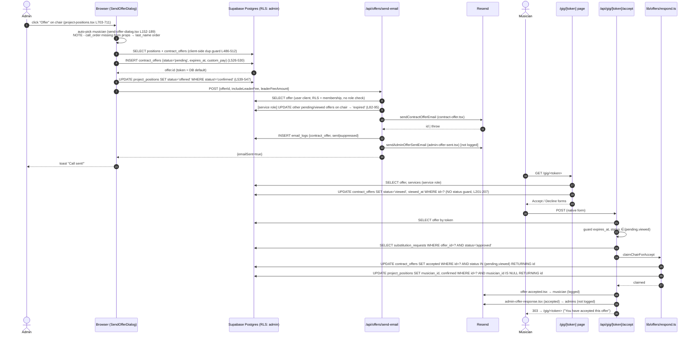
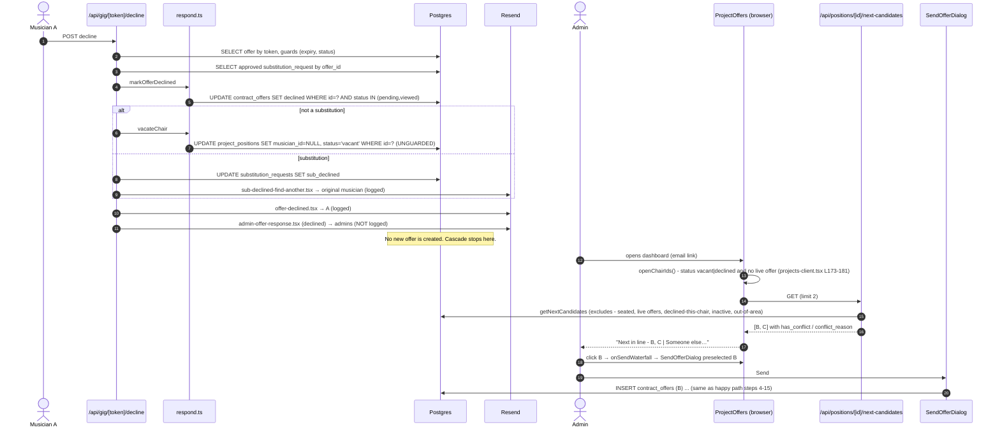
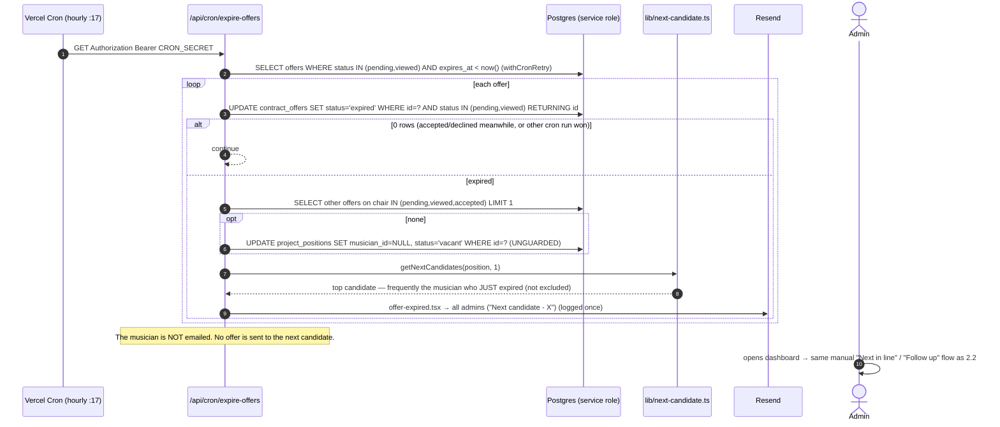
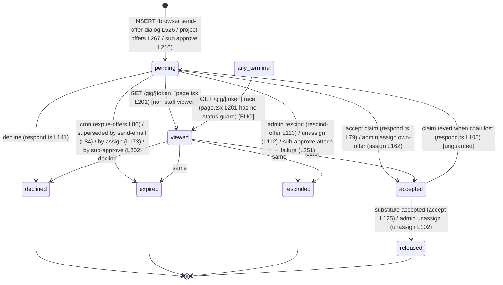
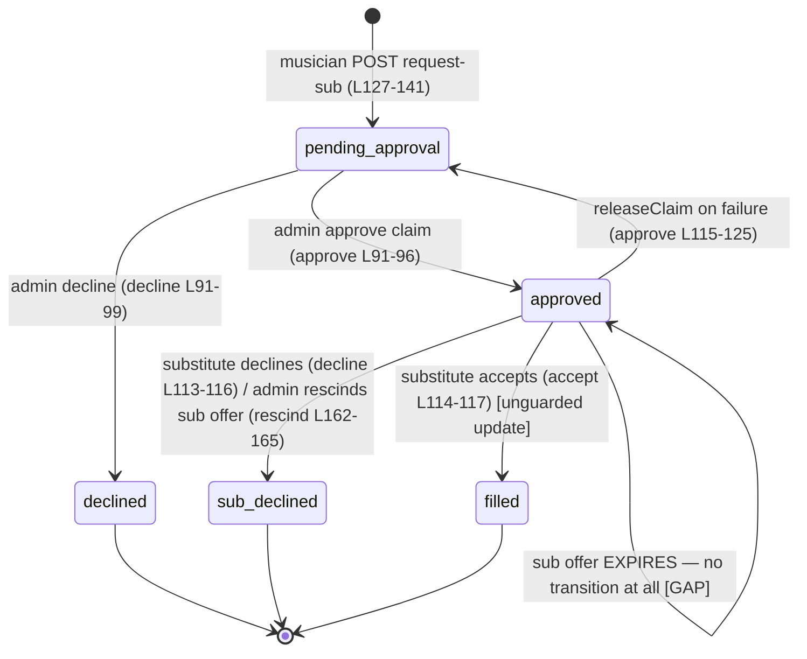

# Section C — Offer cascade implementation trace

Audit of `/home/user/podiumpersonnel` at HEAD `869ece3`. Read-only. Every claim cites `file:line`; paths are relative to the repo root.

> **Answer in one line:** there is no automatic cascade. The system **never sends an offer by itself**. On decline, expiry or rescind it frees the chair and emails the admins, sometimes naming a suggested next musician. A human then clicks to send the next offer. The "atomic seat claim" is two separate PostgREST `UPDATE`s, each with a `WHERE` guard (no transaction, RPC, unique index or version column), and it undoes itself if the second update matches no rows.

---

## 0. Inventory: files in the brief vs files that exist

The brief names several files that **do not exist**. Each row says where that responsibility actually lives.

| Named in brief | Status | Where the logic actually lives |
|---|---|---|
| `src/app/api/positions/route.ts` | **does not exist** | Positions are created/deleted **client-side** from the browser Supabase client: `src/components/projects/add-position-dialog.tsx:192,243,312`, `project-positions.tsx:349,370,444`, `projects-client.tsx:559,598,637`, `import-from-book-dialog.tsx:84` |
| `src/app/api/positions/[positionId]/route.ts` | **does not exist** | same as above (client-side `delete()` at `project-positions.tsx:349`) |
| `src/app/api/offers/[offerId]/route.ts` | **does not exist** | only `src/app/api/offers/[offerId]/calendar/route.ts` |
| `src/app/api/gig/[token]/route.ts` | **does not exist** | the gig page is a server component, `src/app/gig/[token]/page.tsx` |
| `src/app/api/projects/[projectId]/route.ts` (cancellation) | **does not exist** | Cancellation is a client-side `update({status:'cancelled'})` in `src/components/projects/delete-project-dialog.tsx:102-105`; completion at `projects-client.tsx:470-474`, `src/app/dashboard/projects/page.tsx:79-84`, `src/app/api/cron/complete-projects/route.ts:38-47` |
| `/api/musician/offers/[id]/{accept,decline}` (named in `respond.ts:14` comments) | **removed** | portal routes are gone (`src/app/api/musician` absent). Comments at `respond.ts:11-25` and `gig/[token]/accept/route.ts:94-96,136-138` are stale. Musician-portal RLS still exists (`supabase/migrations/034_fix_musician_rls_recursion.sql:65-66`) |
| `src/lib/validations/*` for offers/positions | **none exist** | `src/lib/validations/` has auth, books, instruments, musicians, projects, schedules, settings, venues. No offer, position or sub-request body is schema-validated anywhere. |
| `src/lib/projects/*` | `archive.ts` (completion date rule), `contract-parser.ts` (unrelated) | — |

**Offer creation is NOT a server route.** The `contract_offers` row is inserted from the **browser** (`send-offer-dialog.tsx:526-530`, `project-offers.tsx:267-279`), protected only by RLS (`001_initial_schema.sql:353-361`, admin `for all`). The browser then calls `/api/offers/send-email` to deliver it. Only the substitution flow creates offers server-side (`substitutions/[requestId]/approve/route.ts:216-227`).

---

## 1. Narrative trace (numbered steps)

Conventions: **T** = trigger, **F** = file:function, **DB** = reads/writes, **E** = emails (template = `src/lib/email/templates/<name>.tsx`), **X** = failure handling.

### Step 1 — A position comes to need staffing
- **T:** admin action (UI). Four creation paths, none server-side:
  1. Manual add: `add-position-dialog.tsx:192,243,312` inserts `project_positions {status:'vacant'}`.
  2. Duplicate a chair: `project-positions.tsx:438-452` inserts `{status:'vacant', chair_number:max+1}`.
  3. Project template on create: `projects-client.tsx:559,598,637` inserts vacant positions.
  4. Import from book: `import-from-book-dialog.tsx:63-85` inserts `{musician_id: entry.musician_id, status: entry.musician_id ? 'confirmed' : 'vacant'}`. **This seats musicians without any offer.**
  5. (API only, no UI caller found) `api/projects/[projectId]/auto-populate/route.ts:200-244` `PUT` inserts positions, `confirmed` if `musician_id` is given. No offer row, no conflict re-check, no role check beyond auth+RLS.
- **DB:** `project_positions` insert. Schema: `001_initial_schema.sql:114-124`, status ∈ `vacant|offered|confirmed|declined`. **No unique index on (project_id, instrument_id, chair_number).** The `23505` handler at `import-from-book-dialog.tsx:90-91` is unreachable.
- **E:** none.
- **X:** client toast only.

### Step 2 — Candidate ranking and selection (admin-driven)
Three separate rankers run, each with different inputs:

| Ranker | Where | Inputs | Ordering | Exclusions |
|---|---|---|---|---|
| **A. `getNextCandidates`** (server) | `src/lib/next-candidate.ts:21-214` | `musicians.call_order`, `is_leader`, `musician_instruments`, `competing_schedules`, service area, `findConflicts` | conflicts last, then leaders first if chair 1, then `call_order` asc (`:193-206`) | seated on this project (`:76-78`); live pending/viewed/accepted offer on any position in this project (`:80-90`); declined **this** position (`:93-99`); `is_active=false` (`:120`); out of service area (**hard filter**, `:146-152`) |
| **B. SendOfferDialog auto-pick** (browser) | `send-offer-dialog.tsx:152-189` | `musicians` prop from `dashboard/projects/page.tsx:114-123` | intended: leaders first, then `call_order` | `existingOfferMusicianIds` = musicians with pending/viewed/accepted offers in this project (`project-positions.tsx:269-275`) |
| **C. Auto-populate suggestions** (API, no UI caller) | `auto-populate/route.ts:101-189` | book entries + roster | in-area first, then no-conflict, then leader, then `call_order` (`:136-153`) | none (out-of-area is only demoted, not filtered) |

**Bug in ranker B:** the `musicians` prop is selected as `id, first_name, last_name, email, musician_instruments, competing_schedules` (`dashboard/projects/page.tsx:116-120`). That select has **no `call_order` or `is_leader`**. The sort at `send-offer-dialog.tsx:170-177` therefore sees `undefined ?? 999999` for every musician, and the stable sort keeps the server's `order('last_name')` (`page.tsx:123`). The "top call-order musician" auto-pick is really **alphabetical by last name**. The leader-fee auto-check (`:182-186`) can never fire. Ranker B also does not exclude musicians already **seated without an offer** (direct assign or book import), which is the bug `next-candidate.ts:70-75` fixed for ranker A only. `assign-musician-dialog.tsx:76,133` sorts on the same missing field. Its "conflict" badge (`:312,358`) is just `competing_schedules.length > 0`, with **no time-overlap check**: a fourth conflict implementation.

- **T:** admin clicks **Offer** on a chair (`project-positions.tsx:703-711`, shown whenever `status !== 'confirmed'`, **including `offered`**). Or the admin clicks a "Next in line" name in the offers panel (`project-offers.tsx:570-615`), which loads `GET /api/positions/[id]/next-candidates` (`project-offers.tsx:195-216` → `next-candidates/route.ts:17`, `limit=2`, auth only, no role check). That click routes through `onSendWaterfall` → `projects-client.tsx:1016-1018` → `project-positions.tsx:236-253`, which opens the same SendOfferDialog with `preSelectedMusicianId`.
- **DB reads (ranker A):** `project_positions` (position + project + services + venue zip, `:27-44`); all positions in the project (`:63-66`); `contract_offers` in those positions with status pending/viewed/accepted (`:80-84`); declined offers for this position (`:93-97`); `musicians` (`:105-122`); `services` (`:129-132`); `zip_coordinates` once per musician, sequentially (`zip-distance.ts:39-42`, awaited in a loop at `next-candidate.ts:141-155`); and inside `findConflicts`, `contract_offers` + `services` of other projects (`schedule-conflict.ts:126-160`).
- **X:** any error returns `{candidates: [], totalAvailable: 0}` silently (`next-candidate.ts:46-48,124-126`).

### Step 3 — The offer row is created (browser)
- **T:** admin clicks Send in SendOfferDialog → `handleSend` (`send-offer-dialog.tsx:467-627`).
- **F/DB, in order:**
  1. Compute `expires_at` in **browser local time** (`:475-483`). Options: 4h, 24h, 48h (default `'2'`, `:85`), 1 week, custom date (`T23:59:59` local), or **"No expiration"** (`:1110`, which writes `expires_at = null`).
  2. Client-side guard: read project positions, then `contract_offers` for this musician with status pending/viewed/accepted (`:486-512`). If any exist, show an error. It is check-then-insert with **no lock**, and it ignores chairs held without offers.
  3. `INSERT contract_offers {project_position_id, musician_id, status:'pending', sent_at: now, expires_at, custom_pay: finalPay, personal_message?}` (`:514-530`). The token comes from the DB default `replace(uuid_generate_v4()::text,'-','')` (`001_initial_schema.sql:131`), which is unique. **There is no guard on the position's current state**: an offer can be inserted against a `confirmed` chair.
  4. `UPDATE project_positions SET status='offered' WHERE id=? AND status <> 'confirmed'` (`:539-547`). Failure is only `console.error`.
- **E:** none yet.
- **X:** insert error → message in the dialog, nothing written.

### Step 4 — The offer is delivered (email)
- **T:** the same `handleSend`, when the "send email" toggle is on (`:557-591`). It POSTs `/api/offers/send-email {offerId, includeLeaderFee, leaderFeeAmount}`.
- **F:** `src/app/api/offers/send-email/route.ts:11-302`.
  1. Requires an authenticated user (`:19-25`). **No org-role check**: the offer read at `:35-63` goes through the user-scoped client, so any user who can SELECT the offer passes. That covers every org member (`001:342-350`) **and the musician on the offer** if they have a linked auth user (`034:65-66`).
  2. **Supersede**: using the **service-role** client, `UPDATE contract_offers SET status='expired', responded_at=now WHERE project_position_id=? AND id<>offerId AND status IN ('pending','viewed')` (`:82-95`). This runs **before** the send. A failure returns 500 and nothing is sent.
  3. Pay calculation (`:99-114`): `basePay = services[0].base_pay`, where `services` is the **unsorted** PostgREST embed (sorting happens later at `:140-141`). `payAmount = custom_pay ?? basePay + leaderFee?`.
  4. 400 if the musician has no email (`:128-133`). The offer stays `pending` and the chair stays `offered`.
  5. `sendContractOfferEmail` → template **`contract-offer.tsx`** (`send.ts:212-243`).
  6. `logEmail({emailType:'contract_offer', status: suppressed?'suppressed':'sent'})` (`:227-246`).
  7. Unless suppressed, `sendAdminOfferSentEmail` → **`admin-offer-sent.tsx`** (`:250-283`). This send is **not logged**.
- **X:** if `sendContractOfferEmail` throws (Resend error, `send.ts:168-171`), the route's catch returns 500 (`:295-301`). **No `email_logs` row is written for the failure.** The supersede in step 2 has already run, so a previously live offer on the chair is now dead. The dialog shows a 12-second error toast (`send-offer-dialog.tsx:602-618`) and closes. The offer stays `pending`.

### Step 5 — The musician views the offer
- **T:** the musician opens `/gig/<token>` (a GET with no session).
- **F:** `src/app/gig/[token]/page.tsx:64-240`, using the service-role client.
  - Reads the offer, musician, position, project and org (`:69-97`), plus services ordered by `start_time` (`:131-135`).
  - Pay shown = `custom_pay ?? services[0].base_pay + (chair_number===1 ? leader_fee ?? 50 : 0)` (`:127-145`). This is a **different leader rule** from send-email; see §6.
  - If `status==='pending'` and the viewer is not org staff (`:27-62,194-199`): `UPDATE contract_offers SET status='viewed', viewed_at=now WHERE id=?` (`:201-207`). **This update has no status guard** (see §5, race R-7).
- **UI:** `src/components/gig/gig-page-client.tsx`. Accept and Decline are **native HTML form POSTs** (`:460-487`), with a double-tap guard that only disables the buttons client-side (`:97-98`). It renders messages for `accepted`, `declined` and `rescinded` (`:312,428,434`), and for "pending/viewed past `expires_at`" (`:440`). It renders **nothing** for `expired` or `released` (no branch exists), so a cron-expired, superseded or released musician sees a card with no status line and no buttons.

### Step 6a — The musician ACCEPTS
- **T:** `POST /api/gig/[token]/accept` (form POST; no CSRF token; the token is the only credential).
- **F:** `gig/[token]/accept/route.ts:24-248` → `claimChairForAccept` (`src/lib/offers/respond.ts:74-125`).
  1. Fetch the offer by token (`:28-52`).
  2. App-level guards: redirect if `expires_at < now` (`:59-61`) or if status is not pending/viewed (`:64-66`). **The project's status, the musician's `is_active`, and the position's `status` are not checked.**
  3. Look up an **approved** substitution request with `offer_id = offer.id` (`:80-92`).
  4. **Seat claim** (`respond.ts:79-124`):
     - (a) `UPDATE contract_offers SET status='accepted', responded_at=now WHERE id=? AND status IN ('pending','viewed') RETURNING id` (`:79-84`). Zero rows → `already_responded`.
     - (b) `UPDATE project_positions SET musician_id=<offer.musician_id>, status='confirmed' WHERE id=? AND musician_id IS NULL` (normal offer) or `AND musician_id = <requesting_musician_id>` (substitution) (`:89-98`).
     - (c) If (b) matched zero rows: `UPDATE contract_offers SET status='pending', responded_at=NULL WHERE id=?` (`:105-108`; this undo has **no status guard**) and return `position_filled`. If the undo itself fails, return `error` and the offer stays wrongly `accepted` (`:110-119`).
  5. Any outcome other than `claimed` → redirect to the gig page (`:99-106`). For `position_filled`, the offer is back to `pending`, so **the page shows the Accept and Decline buttons again with no explanation**.
  6. Substitution bookkeeping (`:112-149`): set `substitution_requests.status='filled'`; set the original's accepted offer to `released` (`.eq(status,'accepted')`); call `notifyMusicianReleased` → **`musician-released.tsx`**, logged as `musician_released` (`respond.ts:199-244`).
  7. Emails (`:152-245`): **`offer-accepted.tsx`** to the musician, logged as `offer_accepted`; **`admin-offer-response.tsx`** with `status:'accepted'` to admins, **not logged**.
- **X:** the whole handler is wrapped so that **any thrown error redirects to the gig page** (`:14-21`). Bookkeeping failures are only `console.error`.

### Step 6b — The musician DECLINES
- **F:** `gig/[token]/decline/route.ts:23-200` → `markOfferDeclined` and `vacateChair` (`respond.ts:131-181`).
  1. Same guards as accept (`:53-65`).
  2. `UPDATE contract_offers SET status='declined', responded_at=now WHERE id=? AND status IN ('pending','viewed')` (`respond.ts:141-152`). The token path passes `responseNotes` as undefined, so nothing is written to `response_notes`.
  3. If this was not a substitution: `vacateChair` → `UPDATE project_positions SET musician_id=NULL, status='vacant' WHERE id=?` (`respond.ts:173-176`). **This update is unguarded** (see §5, R-2).
  4. If it was a substitution: set `substitution_requests.status='sub_declined'` (`:113-120`), then `notifySubDeclined` → **`sub-declined-find-another.tsx`**, logged as `sub_declined` (`respond.ts:250-309`).
  5. Emails: **`offer-declined.tsx`** to the musician, logged; **`admin-offer-response.tsx`** with `status:'declined'`, **not logged** (`:138-197`).
- **Next candidate:** **nothing automatic.** The admin email (`admin-offer-response.tsx`) links to the dashboard. In the dashboard, the chair now counts as open (`projects-client.tsx:173-181`), and `ProjectOffers` shows "Next in line" names from `next-candidates` (`project-offers.tsx:187-216,570-615`). The admin must click.

### Step 6c — The offer EXPIRES (cron)
- **T:** Vercel cron `/api/cron/expire-offers`, hourly at :17 (`vercel.json`). Auth via `requireCronAuth`; kill switch `CRON_ENABLED` (`src/lib/cron.ts:14-59`).
- **F:** `src/app/api/cron/expire-offers/route.ts:9-196`.
  1. Fetch the offers where `status IN ('pending','viewed') AND expires_at IS NOT NULL AND expires_at < now()` (`:21-51`), with retry (`withCronRetry`). A fatal error throws, which triggers `notifyOps` and a 500.
  2. Per offer: `UPDATE contract_offers SET status='expired' WHERE id=? AND status IN ('pending','viewed') RETURNING id` (`:86-91`). Zero rows → skip. Note that `responded_at` is not set here, while every other expiring writer does set it.
  3. If no **other** offer on the chair is pending/viewed/accepted (`:109-115`): `UPDATE project_positions SET musician_id=NULL, status='vacant' WHERE id=?` (`:117-126`). This update is **unguarded**.
  4. `getNextCandidates(position.id, 1)` (`:129-136`). The top candidate is put in the admin email only if it has no conflict.
  5. **`offer-expired.tsx`** goes to all admins, logged once as `offer_expired` to `adminEmails[0]` with `allRecipients` in metadata (`:150-185`).
- **No email goes to the musician** whose offer expired.
- **Next candidate:** only *named* in the admin email. **Defect:** `getNextCandidates` excludes only *declined* musicians for this chair (`next-candidate.ts:93-99`). The musician whose offer was **just expired** (or rescinded) is no longer pending, so they are **re-suggested**, typically as #1, because they were picked first on call order. The "Next candidate" in the expiry email is very often the person who just timed out.
- **X:** per-offer errors are logged and skipped; email failures are counted. The comment at `:83-85` mentions "this loop sleeps 600ms per offer", but there is no sleep in the loop; the comment is stale.

### Step 6d — The admin RESCINDS
- **T:** the admin clicks Rescind on a chair (`project-positions.tsx:651-660` → `confirmRescind` `:410-433`) or Revoke in the offers list (`project-offers.tsx:339-363`). Both call `POST /api/positions/[positionId]/rescind-offer`. **This route is keyed by position, not by offer.**
- **F:** `positions/[positionId]/rescind-offer/route.ts:9-307`.
  1. Auth plus owner/admin membership (`:64-73`).
  2. Find **the** pending/viewed offer for the position with `.single()` (`:75-91`). **If two live offers exist, `.single()` errors and the route returns 400 "No active offer found".** Neither offer can then be rescinded from the UI.
  3. Optimistic update to `rescinded` with `response_notes=reason` (`:113-122`). Zero rows → 409.
  4. If not a substitution: `UPDATE project_positions SET status='vacant' WHERE id=? AND musician_id IS NULL` (`:143-156`). This one **is guarded**, unlike decline and expire.
  5. If it was a substitution: `sub_declined`, plus **`sub-declined-find-another.tsx`** to the original, logged (`:159-229`).
  6. **`offer-rescinded.tsx`** to the musician, logged; **`admin-offer-response.tsx`** with `status:'rescinded'`, not logged (`:231-297`).

### Step 6e — The admin assigns directly (bypasses the offer)
- **F:** `positions/[positionId]/assign/route.ts:4-192`.
  1. Owner/admin check (`:54-63`); 400 if the chair is `confirmed` with a musician (`:66-71`); same-org check (`:84-89`); 400 if the musician is confirmed on another chair of this project (`:92-106`), or holds a pending/viewed offer on another chair here (`:112-130`).
  2. `UPDATE project_positions SET musician_id=?, status='confirmed' WHERE id=? AND musician_id IS NULL` (`:134-154`). Zero rows → 409.
  3. That musician's own pending offer on this chair → `accepted` (`:162-171`). Every other pending offer on the chair → `expired` (`:173-182`).
- **E:** **none** (`:132`, "no contract_offer, no email"). The superseded musicians are **not notified**: their gig page shows nothing (see Step 5).
- **No conflict check:** neither `findConflicts` nor `competing_schedules` is consulted.

### Step 6f — The musician requests a substitute (after accepting)
- **T:** a form on the gig page (`components/gig/sub-request-form.tsx`) → `POST /api/gig/[token]/request-sub`.
- **F:** `gig/[token]/request-sub/route.ts:8-207`. The offer must be `accepted` (`:71-76`). There is a plan gate (`:92-98`). A duplicate check (`:104-117`) looks for `pending_approval|approved` and is check-then-insert with no unique index. Then `INSERT substitution_requests {status:'pending_approval', service_id: serviceId|null, suggested_sub_*}` (`:127-141`).
- **E:** **`admin-sub-request.tsx`** to admins, **not logged** (`:174-200`).
- **Validation:** only presence checks (`:34-39`). The email format is not validated and the endpoint has no rate limit.

### Step 6g — The admin approves or declines the substitution
- **Approve:** `substitutions/[requestId]/approve/route.ts:10-409`. It claims the request with `UPDATE ... SET status='approved' WHERE id=? AND status='pending_approval'` (`:91-108`). It finds or creates the substitute musician by case-insensitive email (`:142-188`). It expires the substitute's prior live offers on this chair (`:202-213`), then `INSERT contract_offers {pending, 7-day expiry}` (`:216-227`) and attaches `offer_id` and `substitute_musician_id` (`:237-261`). Any failure calls `releaseClaim` → `pending_approval`. Emails: **`sub-request-approved.tsx`** to the original (logged), **`contract-offer.tsx`** to the substitute (logged), **`admin-offer-sent.tsx`** (not logged).
  - The route does **not** verify that the requesting musician still holds the chair, or that no other sub request for the chair is approved or filled.
  - The substitute's offer does not supersede *other* musicians' offers on the chair, which is correct because the chair is held.
- **Decline:** `substitutions/[requestId]/decline/route.ts:6-166`. A guarded update to `declined` (`:91-111`), then **`sub-request-declined.tsx`** to the original, **not logged** (`:139-160`).
- **The substitute answers** on their own token, through the same accept/decline routes (Steps 6a/6b, substitution branches).

### Step 7 — A confirmed musician drops (backfill)
There is **no "drop" action for the musician**. The two paths are:
- **Substitution** (Step 6f/6g). The musician finds their own replacement, and the chair transfers atomically on the substitute's accept (`respond.ts:94-96`).
- **Admin unassign:** `positions/[positionId]/unassign/route.ts:8-217`. Owner/admin only. Accepted offers on the chair → `released` (`:102-110`); pending/viewed → `rescinded` (`:112-120`); `project_positions → vacant, musician_id NULL` (`:122-132`, unguarded). Emails: **`position-unassigned.tsx`** to the musician (logged, `:141-165`) and an inline-HTML admin email (logged per recipient, `:168-203`). After that, the chair is open again and the admin re-offers by hand (Steps 2-4).
  - Unassign does **not** touch `substitution_requests`, so a `pending_approval` or `approved` request on the chair is left dangling.

### Step 8 — The project (event) is cancelled or completed
- **Cancel (archive):** `delete-project-dialog.tsx:96-115` → client-side `UPDATE projects SET status='cancelled'`. **No offer, position or substitution side effects. No emails.** Pending offers stay live. The gig link still accepts and claims a chair (the accept route never reads `projects.status`). `offer-reminders` (`:22-65`) and `expire-offers` (`:21-51`) do not filter on project status, so the musician still gets reminders and the admins still get "expired" emails for a cancelled event. Only `staffing-alerts` filters `status='active'` (`:56`).
- **Delete (only when there are no payments):** `delete-project-dialog.tsx:72-94` → `DELETE projects`. This cascades to positions, then `contract_offers` (`001:129`, `on delete cascade`), then `substitution_requests` (`001:145`). **All offer history is destroyed and no one is told.** `email_logs.offer_id` is set to NULL (`038:11`), so the email bodies survive but are orphaned.
- **Complete:** the `complete-projects` cron (`route.ts:14-61`) and the projects-page safety net (`dashboard/projects/page.tsx:79-84`) flip `active→completed`. **No offer cleanup.** Offers created with "No expiration" stay `pending` forever.

---

## 2. Sequence diagrams

### 2.1 Happy path (admin offers, musician accepts)



### 2.2 Decline → next candidate (human in the loop)



### 2.3 Expire → next candidate (cron proposes, admin disposes)



---

## 3. State machines as implemented

### 3.1 `contract_offers.status`

Allowed values (`063_add_released_offer_status.sql:11-13`): `pending, viewed, accepted, declined, rescinded, expired, released`. Type: `src/types/database.ts:526`. **No DB trigger, function or transition table enforces legal transitions.** Any writer with UPDATE rights (admins via RLS `001:353-361`, or the service role) can set any value.



| From → To | Initiator | Code | Guard | Side effects |
|---|---|---|---|---|
| ∅ → pending | Admin (browser) | `send-offer-dialog.tsx:526-530` | RLS admin; client-side dup check (`:486-512`), racy | position → `offered` (`:539-547`); then the send-email route |
| ∅ → pending | Admin (browser, inline waterfall fallback) | `project-offers.tsx:267-279` | same; **dead code in practice**, because `onSendWaterfall` is always passed (`projects-client.tsx:1016`) | hard-coded 7-day expiry |
| ∅ → pending | Admin (sub approval) | `approve/route.ts:216-227` | request claimed `pending_approval→approved` | 7-day expiry; 3 emails |
| pending → viewed | Musician GET | `gig/[token]/page.tsx:194-213` | **read-time** `status==='pending'` only; write is `WHERE id=?` | `viewed_at=now` |
| pending/viewed → accepted | Musician POST | `respond.ts:79-84` | `WHERE status IN (pending,viewed)` | then chair claim |
| pending/viewed → accepted | Admin assign | `assign/route.ts:162-171` | `WHERE status IN (pending,viewed)`, after the chair claim | none |
| accepted → pending | System (claim revert) | `respond.ts:105-108` | **none** (`WHERE id=?`) | `responded_at=NULL` |
| pending/viewed → declined | Musician POST | `respond.ts:141-152` | `WHERE status IN (pending,viewed)` | vacate chair (unguarded) or sub bookkeeping |
| pending/viewed → expired | Cron | `expire-offers/route.ts:86-91` | `WHERE status IN (pending,viewed)` | conditional vacate; admin email. `responded_at` **not** set |
| pending/viewed → expired | send-email supersede | `send-email/route.ts:84-89` | `WHERE status IN (pending,viewed) AND id<>?` | none; superseded musician **not notified** |
| pending/viewed → expired | Admin assign | `assign/route.ts:173-178` | same | none; **not notified** |
| pending/viewed → expired | Sub approval retry | `approve/route.ts:202-207` | same, scoped to the substitute | none |
| pending/viewed → rescinded | Admin rescind | `rescind-offer/route.ts:113-122` | `WHERE status IN (pending,viewed)` | guarded vacate; emails |
| pending/viewed → rescinded | Admin unassign | `unassign/route.ts:112-116` | same | musician on the pending offer **not notified** (only the seated musician is) |
| pending/viewed → rescinded | Sub approval attach failure | `approve/route.ts:251-255` | same | — |
| accepted → released | Substitute accepts | `accept/route.ts:125-130` | `WHERE status='accepted' AND musician_id=<orig>` | `musician-released` email |
| accepted → released | Admin unassign | `unassign/route.ts:102-106` | `WHERE status='accepted'` | `position-unassigned` email |

**Status inferred from other columns ("boolean soup"):**
- **`expires_at` acts as a hidden status.** An offer whose `status` is `pending|viewed` but whose `expires_at < now()` is treated as expired by: the accept/decline routes (`accept:59`, `decline:58`); the gig UI (`gig-page-client.tsx:100,440`); the offers list (`project-offers.tsx:404-418,470-472`, `displayStatus = 'expired'`); `openChairIds` (`projects-client.tsx:178-179`); `getNextCandidates` (`next-candidate.ts:88-90`); and `findConflicts` (`schedule-conflict.ts:142-147`). The real `status='expired'` transition lags by up to an hour (cron at :17). Meanwhile `rescind-offer` (`:86`), `unassign` (`:116`), `assign` (`:121`), `send-email` supersede (`:89`), `send-reminder` (`:62`) and the client dup guard (`send-offer-dialog.tsx:504`) look **only at `status`**. So a timed-out-but-not-yet-cron'd offer is "dead" to some readers and "live" to others. Example: `send-reminder` will happily remind on an already-lapsed offer whose link then refuses the response.
- **`reminder_sent_at`** (`040_offer_reminder_sent_at.sql:2`) is a once-only latch, and it doubles as the cron claim token (`offer-reminders/route.ts:94-110`). Manual reminders (`send-reminder/route.ts`) do not set it.
- **`viewed_at` is redundant with status `viewed`.** It is set only on the first pending→viewed write. After acceptance, `viewed_at` stays the only trace that the offer was viewed.
- **`responded_at`** is overloaded. It means "musician answered" (accept/decline), "admin withdrew" (rescind/unassign), "superseded" (send-email/assign/sub-approve set it on `expired`), and is **not** set for a cron expiry. A revert nulls it.
- **`response_notes`** is overloaded: the musician's decline reason (portal only, now gone) or the admin's rescind reason (`rescind-offer:118`).
- The **substitution link is inferred**: an offer is a "sub offer" only if a `substitution_requests` row with `offer_id=offer.id AND status='approved'` exists (`accept:80-92`). Once that request flips to `filled` or `sub_declined`, the offer can no longer be identified as a sub offer from its own row.

### 3.2 `project_positions.status`

Allowed values (`001_initial_schema.sql:120`): `vacant, offered, confirmed, declined`. **`declined` is never written anywhere** (grep of all writers), but `openChairIds` still reads it (`projects-client.tsx:177`) and the staffing-alert email types it (`send.ts:1166`). The real invariant ("who sits here") is **`musician_id`**, and `status` is a partly-redundant flag.

| From → To | Initiator | Code | Guard |
|---|---|---|---|
| ∅ → vacant / confirmed | Admin (browser) | add/duplicate/template/book import (§1 step 1) | RLS only |
| vacant/declined → offered | Admin (browser) | `send-offer-dialog.tsx:539-543` | `status <> 'confirmed'` |
| any → offered | Admin (browser, inline waterfall) | `project-offers.tsx:283-286` | **none** (dead path) |
| * → confirmed (+musician_id) | Musician accept | `respond.ts:89-98` | `musician_id IS NULL` / `= orig` |
| * → confirmed (+musician_id) | Admin assign | `assign/route.ts:134-142` | `musician_id IS NULL` |
| * → vacant (musician_id NULL) | Musician decline | `respond.ts:173-176` | **none** |
| * → vacant (musician_id NULL) | Cron expiry | `expire-offers/route.ts:118-121` | read-then-write "no other active offers"; **write unguarded** |
| * → vacant (musician_id NULL) | Admin unassign | `unassign/route.ts:123-126` | none (intended) |
| offered → vacant | Admin rescind | `rescind-offer/route.ts:144-149` | `musician_id IS NULL` |
| confirmed → confirmed (musician_id NULL) | **musician hard-deleted** | FK `on delete set null` (`001:119`) | — leaves a "confirmed" chair with nobody in it. `staffing-alerts` counts it as filled (`staffing-alerts/route.ts:101-103`) |
| row deleted | Admin (browser) | `project-positions.tsx:342-356,367-378` | UI-only check on stale state: `status==='confirmed' || musician_id`. An `offered` chair **can** be deleted, which cascades its offers |

`offered` is set by the browser after the insert and is never cleared by supersede, so it is purely advisory. The authoritative "open chair" test in the UI combines status and live offers (`projects-client.tsx:173-181`).

### 3.3 `substitution_requests.status`

Allowed values (`026_normalize_sub_request_status.sql:13-15`): `pending_approval, approved, declined, sub_declined, filled, cancelled`. **`cancelled` is never written.**



- **Expiry gap:** when a substitute's offer expires (7 days, `approve:194-195`), `expire-offers` sees another live offer on the chair (the original's `accepted`), so it does not vacate. It **never moves the request out of `approved`**. The original musician is never told. `request-sub` blocks any new request while one is `approved` (`request-sub/route.ts:104-117`), so **the original musician is permanently locked out of requesting another sub** for that chair. Their gig page keeps saying "We're contacting <sub>" (`gig-page-client.tsx:336-340`). The admin instead receives a generic "offer expired, next candidate: X" email that makes no sense for a held chair.
- **Unassign gap:** `unassign` rescinds the substitute's pending offer, but leaves the request in `approved` or `pending_approval`.
- **Per-service field ignored:** `service_id` is captured (`request-sub:132`) and shown in emails, but the transfer is whole-chair (`respond.ts:89-96`). See §6.

---
## 4. Candidate ranking: storage, advancement, skipping

### 4.1 Where the ordered list lives
**It is not stored. There is no per-position or per-project candidate list**, no rank column on `contract_offers`, and no queue table. The order is recomputed on every request from the following inputs:

| Input | Column | Scope | Notes |
|---|---|---|---|
| Call order | `musicians.call_order INTEGER` (`004_musician_service_area.sql:4`, default NULL since `045_call_order_nullable.sql`) | **One number per musician, org-wide, regardless of instrument.** A doubler (violin + viola) has one rank for both. | Index `(organization_id, call_order)` (`004:8`) |
| Leader flag | `musicians.is_leader BOOLEAN` (`004:5`) | org-wide | promotes the musician only for `chair_number === 1` (`next-candidate.ts:135,198-202`) |
| Instrument eligibility | `musician_instruments(musician_id, instrument_id, is_primary, proficiency)` (`001:51-59`) | per instrument | `is_primary` and `proficiency` are **not used** in ranking |
| Service area | `musicians.zip_code`, `service_radius_miles`; `zip_coordinates` | per musician vs **first** service venue with a zip (`next-candidate.ts:53-60`) | hard filter in ranker A, soft in ranker C |
| Conflicts | `competing_schedules` + other-project offers (`schedule-conflict.ts`) | time overlap | conflicts are **demoted to the end, not excluded** (`next-candidate.ts:194-196`) |
| Book entries | `book_entries.priority`, `chair_number`, `musician_id` (`001:72-82`) | per book | `priority` is selected (`auto-populate/route.ts:36`) but **never used**. Book import seats people directly, without offers |
| `staffing_presets` | JSONB `[{instrument_name, chair_number}]` (`014_add_staffing_presets.sql:2-17`) | per org | **shape templates only**: no people, no ranking |

### 4.2 How "next" is advanced
There is no cursor. "Advance" means: recompute `getNextCandidates`, which drops anyone who currently holds a live offer on the project, is seated on the project, or has declined *this* chair. Then take the top `limit` (2 for the UI, `next-candidates/route.ts:17`; 1 for the cron, `expire-offers/route.ts:129`).

### 4.3 Who is skipped, and who is wrongly not skipped

| Case | Skipped by ranker A? | Evidence |
|---|---|---|
| Declined this chair | yes | `next-candidate.ts:93-99` |
| Declined a *different* chair on the same project | **no** | only `.eq('project_position_id', positionId)` |
| **Expired** on this chair (timed out) | **no**, re-suggested, usually first | only `declined` is excluded; `expired` drops out of the live-offer list (`:84-90`) |
| **Rescinded** by admin on this chair | **no** | same |
| Released (subbed out / unassigned) from this chair | **no** | same |
| Pending/viewed offer anywhere on this project, not lapsed | yes | `:80-90` |
| Pending offer that has **lapsed by time but not yet cron-expired** | **no** (counted as not live) | `:89` |
| Seated on this project (any path) | yes | `:76-78` (fix for book-import/direct-assign) |
| Inactive (`is_active=false`) | yes | `:120` |
| No email | **no**. Candidate returned with `email` null; send-email later 400s (`send-email/route.ts:128-133`) | `:7-9` |
| Email bounced (`musicians.email_status='bounced'`) | **no** | not read |
| Booked on another Podium project at the same time (via **offer**) | demoted to the end, flagged `has_conflict`, `conflict_reason` | `schedule-conflict.ts:125-184` |
| Booked on another project via **direct assign or book import** (no offer row) | **no**. `findConflicts` only reads `contract_offers` | `schedule-conflict.ts:126-138` |
| Outside commitment overlapping (`competing_schedules`) | demoted, flagged | `schedule-conflict.ts:109-123` |
| Out of service area | **excluded entirely** (cannot be found via "Next in line" at all) | `next-candidate.ts:146-152` |
| Doesn't play the instrument | excluded (`musician_instruments!inner`) | `:116,121` |

The cron picks a "next candidate" for its email only if `candidates[0]` has no conflict (`expire-offers/route.ts:130`). If the top-ranked candidate is conflicted, the email says there is no next candidate, even when unconflicted candidates exist further down (since `limit=1`).

### 4.4 Automatic or admin-driven?
**Admin-driven, without exception.** Code that creates an offer exists only in:
1. `send-offer-dialog.tsx:526` (browser, admin click)
2. `project-offers.tsx:267` (browser, admin click; dead fallback)
3. `substitutions/[requestId]/approve/route.ts:216` (server, admin click)

None of the decline route, rescind route, expire cron or reminder cron inserts into `contract_offers`. The system's role is limited to **suggesting**:
- the "Next in line" chips in `ProjectOffers` (`project-offers.tsx:570-615`), shown only for chairs in `openPositionIds`;
- the "Follow up" button, which re-offers the *same* musician on an expired offer (`project-offers.tsx:555-560,631-790`);
- the `nextCandidate` line in the `offer-expired` admin email (`expire-offers/route.ts:129-136,154-165`).

The decline admin email (`admin-offer-response.tsx` via `decline/route.ts:178-191`) does **not** compute a next candidate.

**Product implication:** the "waterfall" in the code and UI copy (`project-offers.tsx:36,96-98`) is a **suggest-and-click waterfall**. Calling it an automatic cascade in marketing would overstate what the code does. The latency between a decline and the next offer is bounded by admin attention, and on expiry by up to 1 hour of cron lag plus admin attention.

---

## 5. Concurrency and idempotency analysis

Concurrency model in brief: every write is a separate PostgREST call (its own implicit transaction). **The codebase has no RPC/SQL function, no explicit transaction, no `SELECT ... FOR UPDATE`, no version column, no advisory lock, and no unique or partial-unique index** on `contract_offers` (beyond `token`, `001:131`), `project_positions` or `substitution_requests` that encodes a cascade invariant. The only mechanism is a **conditional UPDATE with a `WHERE status IN (...)` or `WHERE musician_id IS NULL` guard**, checked via `.select('id')` row count. Under Postgres READ COMMITTED, two concurrent UPDATEs on the same row serialize on the row lock, and the second re-evaluates its WHERE clause against the committed row (EvalPlanQual). That makes each **single-row** guard correct. Multi-step sequences are **not** atomic.

| # | Scenario | What the code does today | Safe? | Mechanism / gap |
|---|---|---|---|---|
| S1 | **Two musicians accept simultaneously, same quantity-one chair** (requires two live offers on one chair; possible, see R-1) | Both step-(a) updates succeed (different offer rows). Step-(b) `UPDATE project_positions ... WHERE musician_id IS NULL` serializes on the position row lock; the loser re-evaluates, matches 0 rows, and reverts its offer to `pending` (`respond.ts:89-121`). | **Chair: safe. Offer state: mostly safe.** | Conditional UPDATE on `project_positions.musician_id`. Gaps: (1) between (a) and (b) the loser's offer briefly reads `accepted`; (2) if the function dies between (a) and (b), or the revert errors (`:110-119`), the offer is **stuck `accepted` with no chair**, and there is no reconciliation job. (3) The loser is redirected to a page that shows the **Accept button again** with no "position filled" message. (4) No DB constraint backs this up; any other writer (admin assign, client RLS update) bypasses it. |
| S2 | **Same accept link clicked twice / replayed** | Sequential: the 2nd request reads `status='accepted'` and redirects (`accept:64-66`), so no writes or emails happen. Concurrent: both pass the read guard, but only one wins step (a); the other gets `already_responded` → redirect. | **Safe** | Conditional UPDATE on `contract_offers.status`. Emails go out only after a successful claim. The client double-tap guard is cosmetic (`gig-page-client.tsx:97-98`). Tested behaviourally (`offer-lifecycle-behavior.test.ts:213-226`) and the race simulated (`:228-251`). |
| S3 | **Accept arrives after the expire cron expired the offer and "advanced"** | Status is `expired`, so the read guard redirects. The cron did not send anything to anyone, so "advanced" can only mean an admin later sent a new offer, which superseded this one anyway. If the accept lands *during* the cron, between its fetch and its guarded update: the accept wins, the cron's update matches 0 rows and skips (`expire-offers:86-101`). If `expires_at` has passed but the cron has not run, accept is refused at app level (`accept:59-61`). | **Safe** | Conditional UPDATE. **Residual gap:** the claim itself does not re-check `expires_at` in SQL, so an accept whose read happened 1ms before expiry still succeeds. That is acceptable. Tested: `cron-expire-behavior.test.ts:227-265`. |
| S4 | **Accept arrives after admin rescinded** | Status `rescinded` → redirect, and the page shows "withdrawn" (`gig-page-client.tsx:434`). Concurrent: whichever conditional UPDATE commits first wins; rescind returns 409 if the musician won (`rescind-offer:129-136`). | **Safe** | Conditional UPDATE on both sides. Tested: `rescind-guard.test.ts:135-171`. |
| S5 | **Accept arrives after admin directly assigned someone else** | `assign` sets the chair, then expires other live offers (`assign:173-182`). If the accept arrives after the expiry: redirect, and **the page renders nothing** for `expired`. If it lands in the window between `assign`'s chair claim and its offer expiry: accept step (a) succeeds, (b) finds `musician_id` not null → revert to `pending`, then `assign`'s expire-others flips it to `expired`. | **Chair: safe. UX: poor.** | Conditional UPDATE on the chair. The musician is never told; there is no "position filled" or "you were replaced" message or email. `assign` sends **no** email at all. |
| S6 | **expire-offers runs twice concurrently** | Both fetch the same set. For each offer only one guarded UPDATE succeeds; the other `continue`s, so there are no duplicate admin emails. The vacate step is run only by the winner. | **Safe for offers. Chair vacate is a check-then-act race.** | Conditional UPDATE. **Gap:** `otherActiveOffers` read (`:109-115`) followed by an unguarded vacate (`:117-121`). A direct assign or an accept on another live offer landing between them gets **wiped**: `musician_id` set NULL on a chair someone just won. Mitigation: add `.is('musician_id', null)` or `.neq('status','confirmed')` to the vacate. A normal pending offer never sets `musician_id`, so the NULL write is never needed. |
| S7 | **Decline for an offer that is already declined/expired** | Read guard redirects (`decline:63-65`). Concurrent: `markOfferDeclined` matches 0 rows → `already_responded`, and the route returns before vacating or emailing (`decline:96-100`). | **Safe** | Conditional UPDATE. Tested: `offer-lifecycle-behavior.test.ts:375-417`. |
| S7b | **Decline of a live offer on a chair that is held by someone else** (second live offer, or an offer sent against a book-import/direct-assign seat) | `markOfferDeclined` succeeds (the offer *was* live), then `vacateChair` runs `UPDATE project_positions SET musician_id=NULL, status='vacant' WHERE id=?` with **no guard** (`respond.ts:173-176`). **This evicts the musician who holds the chair.** Their accepted offer stays `accepted` and they receive no notification. | **UNSAFE** | Missing guard. Contrast `rescind-offer:143-149`, which does guard with `.is('musician_id', null)`. **Not covered by any test.** The behaviour test only checks "already-accepted offer + decline" (`offer-lifecycle-behavior.test.ts:375-390`), not "other musician holds chair + live offer declined". |
| S8 | **Project cancelled while offers pending** | Nothing. Cancellation is a client-side `projects.status='cancelled'` (`delete-project-dialog.tsx:102-105`). Offers remain `pending`. Reminders still go out (`offer-reminders:60-64` has no project filter). The accept route never reads `projects.status`, so **a musician can accept, and gets a "Confirmed" email, for a cancelled event**. Expiry emails go to admins about a cancelled project. | **UNSAFE** | No mechanism. |
| S8b | **Project hard-deleted while offers pending** | FK cascades delete the offers (`001:129`). The musician's link 404s (`page.tsx:99-101`); accept/decline redirect to a 404. No notification. History gone. | **Unsafe (silent data loss)** | `on delete cascade` |
| S9 | **Position deleted while offers pending** | The UI allows deleting any non-confirmed chair (`project-positions.tsx:342-356`), checked against **stale** client state. The DB cascades `contract_offers` and `substitution_requests` (`001:129,145`). The musician holding the live offer gets a 404 link and no email. `email_logs.offer_id` is set NULL (`038:11`); `payments.project_position_id` set NULL (`013:9`). "Clear all" (`:367-378`) does the same for every chair on the project. A concurrent accept between the UI check and the delete is lost entirely. | **UNSAFE** | No server route; RLS only; cascade |
| S10 | **Musician deactivated while holding a pending offer** | `is_active=false` (`delete-musician-dialog.tsx:96-115`) has no offer side effects. The offer stays live, **the musician can still accept**, and the accept route never checks `is_active`. They drop out of future ranking (`next-candidate.ts:120`) and out of the dialog roster (`dashboard/projects/page.tsx:122`). | **Unsafe (policy)** | No mechanism |
| S10b | **Musician hard-deleted** (only allowed with no payments) | FK cascade deletes all their offers (`001:130`). `project_positions.musician_id` is set NULL with **status left `confirmed`** (`001:119`). Staffing alerts treat the chair as filled (`staffing-alerts:101-103`). `assign` allows re-filling it (`assign:66` requires `musician_id` to be set to block). | **Unsafe** | FK actions |
| S11 | **Substitution approved while another sub is already confirmed** | `approve` only guards on its own request's `pending_approval` (`approve:91-108`). It does not check that the requesting musician still holds the chair or that another request for the chair is approved or filled. Duplicate requests can exist because `request-sub` is check-then-insert (`request-sub:104-141`) with no unique index. A second sub offer goes out; when that sub accepts, the claim's `.eq('musician_id', requesting_musician_id)` fails because the chair is now held by sub #1 → revert to `pending` (`respond.ts:94-121`). Request #2 stays `approved` indefinitely; sub #2 sees Accept again with no message. | **Chair: safe. State: leaks.** | Conditional UPDATE on the chair. Tested only for "requesting musician no longer holds it" (`offer-lifecycle-behavior.test.ts:320-336`) and for double-approval of the *same* request (`substitution-guards.test.ts:224-262`). |
| S12 | **Email send fails after the offer row was created** | The offer row is inserted by the browser *before* the send (`send-offer-dialog.tsx:526-530`). On a Resend error, `send-email` throws → 500 (`send-email/route.ts:295-301`). **No `email_logs` row** (logging happens after the send, `:227`). Any prior live offer on the chair was **already superseded** (`:82-95`). The dialog shows an error toast for 12s (`send-offer-dialog.tsx:602-618`). The offer stays `pending` and the chair `offered`. Nothing in the dashboard marks "offer never delivered": the offers list shows it as a normal pending row (`project-offers.tsx:470-500`). Recovery options are the "Send Reminder" button (`send-reminder` route, which links the same token) or rescind and re-offer. A safe-mode suppression is reported honestly (`status:'suppressed'` in `email_logs`, warning toast). A later **bounce** marks `email_logs.status='bounced'` and `musicians.email_status` (`webhooks/resend/route.ts:152-170`), but the offer is unaffected and expires on schedule. With `sendEmail=false` the offer is created **without** superseding prior live offers (that step lives only in the send-email route), so **two live offers per chair become possible**. | **Partially safe** (honest toast, but no durable "undelivered" state and no outbox) | — |
| S13 (extra) | **Gig page GET races accept** (link prefetch by a mail client, or two tabs) | The page reads `pending`; the accept commits `accepted` and the chair is confirmed; then the page's unguarded `UPDATE ... SET status='viewed' WHERE id=?` (`page.tsx:201-207`) **overwrites `accepted` with `viewed`**. The chair stays confirmed with an offer reading `viewed`. A later accept click → step (a) succeeds, (b) fails (`musician_id` not null), and the offer reverts to `pending`. The cron can then expire it: `otherActiveOffers` finds nothing (`accepted` is gone) → **vacates the confirmed chair** (`expire-offers:117-121`). | **UNSAFE (narrow window, severe outcome)** | Missing `.eq('status','pending')` on the viewed write. Not covered by tests (`offer-viewed-status.test.ts` is source-text only). |
| S14 (extra) | **Admin sends a 2nd offer on an `offered` chair with the email toggle off, or the send fails before the supersede** | Two live offers on one chair. `rescind-offer` then fails for **both** (`.single()` at `:75-91` errors on 2 rows → 400). Either musician can accept; S1 applies. A decline from the other evicts the winner (S7b). | **UNSAFE** | No `UNIQUE (project_position_id) WHERE status IN ('pending','viewed')`. |
| S15 (extra) | **Musician-linked auth user calls `/api/offers/send-email` with their own offer id** | RLS lets musicians SELECT their own offers (`034:65-66`), so the route proceeds and, **with the service-role client**, expires every *other* live offer on that chair (`send-email:82-95`), then re-sends the email to themselves and an "offer sent" email to admins. Any org member with a non-admin role can do the same for any offer. | **Authz gap** (low reach: the musician portal UI is gone, but auth users with `musicians.user_id` may still exist) | No role check in the route |

### 5.1 Summary of the "atomic seat claim"
`claimChairForAccept` (`respond.ts:74-125`) is **two guarded single-row updates with an unguarded compensating revert**. It is correct against concurrent acceptors of the *same chair* because the second update serializes on the position row and re-checks `musician_id IS NULL`. It is **not** atomic. An RPC wrapping both updates in one transaction (`UPDATE ... RETURNING` in plpgsql), or a partial unique index `contract_offers(project_position_id) WHERE status='accepted'` that turns a double-accept into a constraint violation, would close the crash window and give the DB a backstop. The partial index needs care around substitution, because the original stays `accepted` until `released` is written *after* the claim (`accept:125-130`). The index would force the release to happen first or in the same transaction.

---
## 5b. Existing tests: what each one actually exercises, and how

The test files were read but **not executed** (read-only audit; vitest writes caches). Three techniques are used:
- **SRC**: `readFileSync` of a production file plus `toContain`/`toMatch` on its text. This proves a string exists, not that the code behaves correctly.
- **SCRIPTED**: the real function is called against a hand-rolled fake whose responses are queued per table, in call order. Filters are recorded but do not affect results.
- **STATEFUL**: the real exported route handler is called against `MockSupabaseDb` (`helpers/supabase-mock.ts:59-84`). This is an in-memory table map: filters are applied, updates mutate rows, zero-row updates return `[]` like PostgREST, and races are simulated by mutating rows in `beforeOp` hooks. Single-threaded, no real Postgres, no RLS, embeds pre-seeded.

| Test file | Technique | What it actually proves | What it does not prove |
|---|---|---|---|
| `offer-lifecycle.test.ts` (103 lines, 10 its) | **SRC** only | `respond.ts` contains `positionUpdate.eq('musician_id', subRequest.requesting_musician_id)` and `.is('musician_id', null)` (`:40-46`); routes contain the names `claimChairForAccept`/`markOfferDeclined` and the string `status: 'released'` (`:48-58,74-88`); decline route regex `declineOutcome ... return` (`:84-86`); cron contains `in('status', ['pending', 'viewed', 'accepted'])` (`:91-95`); migration 063 contains `'released'` (`:98-102`) | Any runtime behaviour |
| `offer-lifecycle-behavior.test.ts` (456, 11) | **STATEFUL**: real `POST` from `gig/[token]/accept` and `/decline` (`:41-42`), service client = `MockSupabaseDb`, emails/log mocked (`:22-39`) | Accept on a vacant chair; accept from `viewed`; **loser reverted when chair already taken** (pre-seeded `mus-9`, `:189-211`); accept of a declined offer is a no-op; decline-wins race via `beforeOp` (`:228-251`); substitution transfer + `released` + `filled` + musician_released email (`:291-318`); sub accept when the original no longer holds the chair (`:320-336`); decline vacates; decline of an accepted offer is a no-op; accept-wins race vs decline (`:392-417`); sub decline keeps the chair (`:419-455`). Asserts the **filters** on writes (`:162,166,303,368`) | True concurrency (sequential mock); the claim revert failing; `expires_at` path; S7b (decline evicting a holder); S13 (viewed overwrite); project/musician status |
| `offer-respond-shared.test.ts` (401, 18) | **SCRIPTED** (`:42-104`) on real `respond.ts` functions + **SRC** block (`:366-400`) | `claimChairForAccept` outcomes: claimed, filter shape (`in status`, `is musician_id`), sub transfer filter, `already_responded`, revert on lost chair, DB error surfaced (`:105-206`); `markOfferDeclined` lock + notes handling (`:208-250`); notify helpers log after send, don't log on failure, never throw, skip with no email (`:252-349`); `countChairs` (`:351-364`); SRC: routes delegate and do **not** contain an inline `.is('musician_id', null)` (`:378-382`) | Scripted responses mean the guard is asserted structurally (filter present), not semantically. The revert-error path is covered (`:197-206`) |
| `next-candidate-seated.test.ts` (229, 6) | **SCRIPTED-ish**: real `getNextCandidates` with a fake client that **ignores filters** (`chain()` returns fixed data, `:51-61`). `zip-distance` and `schedule-conflict` mocked out (`:24-31`) | Exclusion of seated-without-offer, seated-by-accepted, live offer, declined-this-chair; limit; ordering by fixture order (`:131-228`) | Ranking order (call_order sort is tested only implicitly via fixture order); `is_active` (the fake ignores `.eq('is_active')`); leader promotion; conflict demotion; expired/rescinded re-suggestion (**not tested, and would fail if written**) |
| `offer-assign-fixes.test.ts` (38, 4) | **SRC** only | assign route contains `otherPosIds`, `id !== positionId`, `status: 'accepted'`; send-email contains the supersede filters; UI contains `p.id !== assignPositionId` | Assign behaviour, its 409, offer resolution order |
| `rescind-guard.test.ts` (186, 5) | **STATEFUL**: real `POST` rescind-offer, `createClient` → MockSupabaseDb + fake user (`:20-37`) | Happy path rescinds and vacates; lock filter (`:126-133`); musician answers first → 409, chair untouched, no email (`:135-171`); chair held by someone else is not vacated (`:173-185`) | Sub-offer rescind branch; two live offers (`.single()` failure); role check |
| `substitution-guards.test.ts` (368, 12) | **STATEFUL**: real approve and decline routes (`:98-99`) | Approve happy path; claim-before-side-effects; double approval → 409 with no 2nd musician/offer/email (`:224-262`); decline guard + mid-request approval race (`:264-301`); retry supersedes stale sub offer (`:303-324`); reuses musician by email; original keeps the chair until the sub accepts; attach failure → release claim + retire offer (`:345-367`) | Two *different* requests for one chair (S11); sub-offer expiry gap; approve when the original no longer holds the chair |
| `unassign-history.test.ts` (201, 8) | **STATEFUL**: real unassign route (`:37`) | Offers kept, not deleted; accepted→released keeps `responded_at`; pending→rescinded; declines untouched; other chairs untouched; chair empties; no active offers left; filters scoped (`:130-200`) | Dangling `substitution_requests`; notification to a rescinded pending musician |
| `cron-expire-behavior.test.ts` (329, 7) | **STATEFUL**: real cron `GET` (`:43`) with `getNextCandidates` **mocked** (`:39-41`) | Auth reject (no/wrong token), `CRON_ENABLED=false` skip (`:119-147`); filter set: only past-due pending/viewed (`:150-206`); empty run; accept mid-run is left accepted and its chair not vacated (`:227-265`); vacate only when no other active/accepted offer (`:267-328`) | Two concurrent cron runs; the unguarded vacate race with an assign (S6); what the next-candidate email recommends; sub-request bookkeeping on expiry |
| `cron-retry.test.ts` (189, 13) | **Real functions** from `@/lib/cron` (dynamic import, `:6-12`) with fake timers/results | `withCronRetry` backoff 1/2/4/8s, 5 attempts, transient-vs-PostgREST classification, `describeError` | Anything cascade-specific (infrastructure only) |
| `schedule-conflict.test.ts` (342, 22) | **Pure-function + SCRIPTED** real `findConflicts` (`:78-108`, queued per table) + **SRC** (`:323-341`) | `overlaps`, `serviceWindow` (assumed 3h, no inflation), confirmed vs pending holds, lapsed pending ignored, self-project excluded, batched query count, external commitments, `describeConflicts`; SRC: `next-candidate.ts` and `auto-populate` call `findConflicts` | Seats without offers on other projects (not checked by the code either); that the send-offer dialog uses the shared check (it **does not**: `send-offer-dialog.tsx:192-318` reimplements it with a **1-hour** default at `:289,294`, contradicting `schedule-conflict.ts:24-31`) |
| `offer-viewed-status.test.ts` (54, 5) | **SRC** only | page contains `isOrgStaffPreviewing`, the guard precedes the `status: 'viewed'` write, own-musician bypass, `if (!user) return false`, catch → false | That the viewed write is status-guarded (**it isn't**, S13) |
| `offer-email-honesty.test.ts` (144, 16) | **SRC** only | dialog re-reads email, no `hasEmail` gate, non-OK = failure, toast gating, suppression flag read and logged as `suppressed`, admin email skipped when suppressed, "Someone else" escape hatch, `autoSelect` plumbing | Actual toast behaviour; that a failed send leaves a durable trace (it doesn't) |
| `data-safety.test.ts` (72, 9) | **SRC** only | migration 062 makes `payments` FKs RESTRICT; musician/project delete dialogs check payments and archive instead | That archive/cancel retires offers (it doesn't) |
| `reliability.test.ts` (61, 7) | **SRC** only | offer-reminders claims `reminder_sent_at` before sending; `notifyOps`/`runCronJob` wiring; expire-offers throws on fetch failure; dashboard org guard; no `window.confirm` | Runtime |

**Not in the list but relevant:** `route-gates.test.ts` (SRC; asserts that offer routes are not plan-gated), `cron-alerting.test.ts` (real `runCronJob`), `project-archive.test.ts` (real `isReadyToComplete`), `email-safe-mode.test.ts`. **No test imports** `assign/route`, `send-email/route`, `send-reminder/route`, `request-sub/route`, `next-candidates/route`, `offer-reminders`, `staffing-alerts`, `complete-projects` or the gig page as executable code.

### 5c. Coverage matrix: spec scenarios × test type

Legend: **R** = covered by a real-function/stateful test; **S** = covered only by a source-text test; **—** = not covered. Where the code itself is unsafe, that is noted.

| Spec scenario | Status | Where | Notes |
|---|---|---|---|
| Acceptance (normal) | **R** | `offer-lifecycle-behavior.test.ts:139-187`; `offer-respond-shared.test.ts:106-146` | |
| Decline | **R** | `offer-lifecycle-behavior.test.ts:344-373`; `offer-respond-shared.test.ts:208-250` | Decline evicting a seated holder (S7b) **—** (and the code is unsafe) |
| Timeout / offer expiration | **R** | `cron-expire-behavior.test.ts:150-328` | Expired musician re-suggested as next **—** (code wrong); sub-offer expiry **—** (code wrong) |
| Manual cancellation (admin rescind) | **R** | `rescind-guard.test.ts:114-185` | Two-live-offer `.single()` failure **—** |
| Manual cancellation (admin unassign / release) | **R** | `unassign-history.test.ts:130-200` | |
| Substitution (approve → sub accepts → original released) | **R** | `substitution-guards.test.ts:200-367`; `offer-lifecycle-behavior.test.ts:258-336,419-455` | Sub request creation (`request-sub`) **—** |
| Duplicate webhooks / actions (double click, replay, double approval, double cron) | **R** partial | accept replay `offer-lifecycle-behavior.test.ts:213-226`; double approval `substitution-guards.test.ts:224-262`; reminder claim **S** `reliability.test.ts:13-20` | Concurrent double cron run **—**; duplicate `request-sub` **—**; double "Send" in the dialog **—** |
| Simultaneous acceptance (two musicians, one chair) | **R** (sequential simulation) | `offer-lifecycle-behavior.test.ts:189-211` (pre-seeded holder); `offer-respond-shared.test.ts:175-196` (scripted 0-row) | No true concurrency; no DB constraint to test |
| Candidate removal (musician deactivated/deleted while holding an offer) | **—** | — | Code has no handling (S10/S10b) |
| Offer expiration vs late accept | **R** | `cron-expire-behavior.test.ts:227-265` | |
| Event (project) cancellation | **S** only for archive-instead-of-delete (`data-safety.test.ts:50-60`) | — | Offer handling on cancel **—**, and the code is unsafe (S8) |
| Position already filled (accept/assign/rescind into a held chair) | **R** | accept revert `offer-lifecycle-behavior.test.ts:189-211`; rescind `rescind-guard.test.ts:173-185`; assign 409 **S** only (`offer-assign-fixes.test.ts`) | Decline into a held chair (S7b) **—** |
| Replacement after a confirmed worker drops (unassign → re-offer; sub) | **R** partial | unassign `unassign-history.test.ts`; sub transfer tests | No test of "unassign then next-candidate/offer" as a flow; dangling sub requests **—** |
| Offer email send failure | **S** | `offer-email-honesty.test.ts:42-73,75-115` | Durable undelivered state **—** (doesn't exist) |
| Viewed-status write | **S** | `offer-viewed-status.test.ts` | Race S13 **—** (code unsafe) |
| Next-candidate ranking order / leaders / conflicts | **R** partial | `next-candidate-seated.test.ts` (exclusions only); `schedule-conflict.test.ts` (conflict detection) | Sort order, leader promotion, out-of-area exclusion **—** |

**Verdict:** the respond module and the five admin/cron routes that were hardened in 2026-09 (accept, decline, rescind, unassign, sub approve/decline, expire cron) have **real stateful tests** that cover the single-row optimistic-lock semantics well, including simulated interleavings. Offer **creation** (browser insert + send-email), **direct assign**, **request-sub**, **reminders**, the **gig page**, **project cancel/delete**, **position delete**, and **musician deactivate** have **zero behavioural coverage**: only SRC tripwires or nothing. No test runs against real Postgres, so the read-committed re-check that the seat claim relies on, and RLS, are never exercised.

---
## 6. Position ↔ services in the cascade (input for "call-scoped requirements")

### 6.1 What an offer references
- `contract_offers` has **only** `project_position_id` and `musician_id` (`001:127-140`, plus `custom_pay` from 005, `personal_message` from 024, `reminder_sent_at` from 040). **There is no `service_id`, and no join table between offers and services.**
- `project_positions` has `project_id, instrument_id, chair_number, musician_id, status` (`001:114-124`). **There is no service reference.**
- So an offer is **implicitly for every service of the project**, always, including services added *after* the offer was accepted. Every reader resolves the set as `projects → services` at read time:
  - offer email: `send-email/route.ts:58` (embed `services(...)`), all of them formatted at `:140-176`;
  - gig page: `page.tsx:131-135` (`.eq('project_id', ...)`);
  - accept confirmation email: `accept/route.ts:47,156-178`;
  - calendar (.ics / Google): `offers/[offerId]/calendar/route.ts:~187` (`.eq('project_id', project.id)`);
  - substitute offer email: `approve/route.ts:39,278-302`;
  - conflict detection: `next-candidate.ts:129-132`, `schedule-conflict.ts:157-160`, `auto-populate/route.ts:72-75`, all services of both projects.
- **Consequence:** adding, moving or deleting a service after acceptance silently changes what the musician "agreed to". No re-confirmation, notification or versioning happens (there is no snapshot of the services on the offer).

### 6.2 Who is booked per service
**Nobody is booked per service.** Booking is chair-level: `project_positions.musician_id`. There is no per-service attendance, availability or partial booking. The only per-service artefact in the cascade is `substitution_requests.service_id` (`001:147`), collected by the gig form (`request-sub/route.ts:24,132`) and shown in emails (`serviceName` in `respond.ts:219,282`, `approve:264`, `decline:114`). **It is ignored by the transfer**: when the substitute accepts, the whole chair moves (`respond.ts:89-96`), the original's acceptance becomes `released` (`accept:125-130`), and the original's gig page says "You are released from this engagement" (`gig-page-client.tsx:342-343`). A musician who asks for a sub for **one rehearsal** loses the **whole gig**. That is the most important semantic mismatch for call-scoped requirements.

### 6.3 Pay: per position, per service, or both?
Pay lives in **three places** and is combined by **four readers using three different leader rules**:

| Data | Column | Granularity | Source |
|---|---|---|---|
| Base rate | `services.base_pay DECIMAL(10,2)` | per service | `005_pay_system.sql:2` |
| Leader fee | `services.leader_fee DECIMAL(10,2) DEFAULT 50` | per service | `005:3` |
| Negotiated amount | `contract_offers.custom_pay DECIMAL(10,2)` | **per offer** (one number) | `005:6` |
| Position | — | **no pay column on `project_positions`** | — |

| Reader | Pay computed as | Leader rule | Evidence |
|---|---|---|---|
| Send dialog (browser) | `customPay` input (pre-filled from `basePay` prop) + optional leader fee checkbox → saved to `custom_pay` | explicit checkbox; auto-checked only if chair 1 and `is_leader` (which is missing from props, so never) | `send-offer-dialog.tsx:123-140,383-388,520` |
| Offer email | `custom_pay` if set, else `services[0].base_pay + leaderFee` (with `services[0]` taken from the **unsorted** embed) | `explicitLeaderFee` from the dialog, else `!hasCustomPay && chair_number===1` | `send-email/route.ts:99-114` |
| Gig page | `custom_pay` if set, else **earliest** service `base_pay + (chair_number===1 ? leader_fee ?? 50 : 0)` | chair 1, regardless of `is_leader` | `gig/[token]/page.tsx:127-145` |
| Calendar (.ics / Google event description) | `custom_pay ?? firstService.base_pay + (isLeader ? leaderFee : 0)`; labels the musician "(Leader)" if chair 1 | chair 1 | `offers/[offerId]/calendar/route.ts:190,230,303-305` |
| Payments | **per service**: `custom_pay ?? service.base_pay` for **each** service, + `service.leader_fee` only if `musicians.is_leader` and no `custom_pay` | `musicians.is_leader` | `payments/generate/route.ts:76-108` + `src/lib/payments/compute.ts:33-47` |

**`custom_pay` is ambiguous.** The email and gig page show one figure ("Pay: $X", `contract-offer.tsx:118-122`, `gig-page-client.tsx:215-219`) with no "per service" qualifier. Payments generation treats it as **per-service** and multiplies it across every service of the project (`compute.ts:43` is called once per service at `generate/route.ts:95-108`). For a 3-service project offered at "$200", the musician reads $200 and the ledger writes $600, or vice versa depending on what the contractor meant. The three leader rules can also disagree for the same chair: a chair-1 non-leader sees a leader fee on the gig page but is not paid one, while a non-chair-1 leader is paid one but was never shown it.

### 6.4 Implications for "call-scoped requirements"
- The cascade unit today is **(project, instrument, chair)**. To make it **(service/call, role, slot)**, offers need a scope: either `contract_offer_services(offer_id, service_id)` or an offer per requirement row.
- Everything that resolves "the services of the offer" via `project_id` (the 7 readers in §6.1) has to change to read the offer's own scope.
- `findConflicts` needs to compare **the scoped services**, not all of the project's.
- Pay needs an explicit unit (`per_service` | `flat`) on the offer or requirement, plus a single shared leader rule. `compute.ts` is the natural home: it is already shared by payments and after-gig.
- Substitution must become scope-aware (release only the requested services), which requires per-service seating.

---

## 7. Offer content: what the musician sees and where terms come from

### 7.1 Offer email (`src/lib/email/templates/contract-offer.tsx`)
Rendered via `sendContractOfferEmail` (`src/lib/email/send.ts:212-243`). Subject: `Call: <project> - <instrument>` + the first service date (`send.ts:216`, `getSubjectDate` `:64-71`). Fields (`contract-offer.tsx:22-66`, body `:98-200`):
- musician name, organization name (also the `From` display name, `send.ts:239`), Reply-To = org (`replyToOrgId`)
- optional **personal message** (quoted box, `:98-101`)
- **Ensemble** type (`:110-113`)
- **Position**: `<instrument>, <term rank> <chairNumber>`, with chair shown only when `totalChairs > 1` (`:71,116`)
- **Pay**: `$<payAmount>` (+ "includes $X leader fee") (`:118-122`)
- **Please respond by**: `expiresAt` date in the org timezone (`:124-127`)
- **<term session, plural>**: every service with date, call time, start/end, venue name/address/maps link, second venue (`:131-172`)
- optional `notes` (used only by the sub offer: "You have been requested as a substitute by …", `approve:356`)
- the response URL `/gig/<token>` (`:183-184`)
- a hard-coded **"<org> <term person> Guidelines"** policy block (`:198-231`; e.g. "Bring only your <skill>, music, stand, and water…")
- branding: logo, brand colour, footer (`send-email/route.ts:206-210`)

### 7.2 Gig page (`src/app/gig/[token]/page.tsx` → `components/gig/gig-page-client.tsx`)
Greeting with first name (fallback = the org vertical's `person` term, `page.tsx:162-167`); org, project name and description ("Notes"); ensemble type; instrument; **pay** (computed differently, §6.3); schedule (all services, sorted, with call/start/end and venues); a policy link `/musician-policy?org=` (`gig-page-client.tsx:449-456`); status banners; Accept/Decline forms; calendar links after acceptance; the sub-request form (plan-gated, `page.tsx:169-173`). **No** chair number, no `expires_at` countdown (only an "expired" banner), and no personal message: the `personal_message` stored on the offer is **not** shown on the gig page.

### 7.3 Other cascade templates (all in `src/lib/email/templates/`)
`offer-reminder.tsx` (manual + cron), `offer-expiring-soon.tsx` (admins), `offer-expired.tsx` (admins, with next candidate), `offer-accepted.tsx` (musician, with calendar links), `offer-declined.tsx` (musician), `offer-rescinded.tsx` (musician), `admin-offer-sent.tsx`, `admin-offer-response.tsx` (accepted/declined/rescinded), `admin-sub-request.tsx`, `sub-request-approved.tsx`, `sub-request-declined.tsx`, `sub-declined-find-another.tsx`, `musician-released.tsx`, `position-unassigned.tsx`, `staffing-alert.tsx`. The unassign admin email is **inline HTML** inside the route (`unassign/route.ts:171-183`), not a template.

### 7.4 Terminology injection
- `resolveEmailTerms(explicit, organizationId)` (`send.ts:45-58`): an explicit `terms` param, else `getOrgVertical(orgId).terms`, else `DEFAULT_TERMS` (`src/lib/verticals/registry.ts:41`, re-exported from `src/lib/verticals/index.ts:1`).
- **Musician-facing** senders pass `organizationId`, so they get the org vertical's terms (e.g. `sendContractOfferEmail` `send.ts:213`).
- **Admin-facing** senders call `resolveEmailTerms(params.terms, undefined)` (`send.ts:426` for admin-offer-response, `:818` for offer-expired, `:853` for offer-expiring-soon). They **always get `DEFAULT_TERMS`** (the orchestra vertical) regardless of the org's vertical, because no caller passes `terms`.
- Hard-coded orchestra wording survives in many places regardless of vertical: fallback `'Orchestra'` org names in every route (e.g. `accept:194`), `'Instrument'`, "Musician Policy" link text (`gig-page-client.tsx:455`), "Request a Substitute", "lead musician" (`send-offer-dialog.tsx:59`), "Chair" in the unassign admin HTML (`unassign:177`).
- In the dashboard UI, `useTerms()` + `term(terms, …)` are used throughout (`send-offer-dialog.tsx:79,505`, `project-positions.tsx:345`, etc.).

---

## 8. Audit trail: what is kept and what is lost

### 8.1 Kept
| Record | Where | Notes |
|---|---|---|
| Every offer row, incl. terminal ones | `contract_offers` | Unassign now retires instead of deleting (`unassign/route.ts:86-120`, tested in `unassign-history.test.ts`). The "Revoke" UI moved from client DELETE to rescind (`project-offers.tsx:340-343` comment) |
| Timestamps | `sent_at`, `viewed_at`, `responded_at`, `created_at`, `updated_at` (trigger `001:434`) | Only the **latest** state. No per-transition history |
| Decline/rescind reason | `response_notes` | One field shared by musician and admin text |
| Substitution chain | `substitution_requests` (`offer_id`, `substitute_musician_id`, `admin_notes`, `reason`, `suggested_*`) | |
| Emails | `email_logs` (`038`): type, recipient, subject, **full HTML body**, `offer_id`, `musician_id`, `project_id`, Resend id, status (sent/suppressed/bounced/complained via `webhooks/resend/route.ts:152-170`), metadata | The de-facto event log |

### 8.2 Lost or never recorded
- **Who did it.** There is no `sent_by`, `rescinded_by`, `assigned_by` or `approved_by` column. The only actor trace is the unassign admin email, which embeds `user.email` in the HTML body (`unassign/route.ts:179`).
- **Transition history.** Status is overwritten in place. The `accepted → pending` revert (`respond.ts:105-108`) erases the fact that an accept was attempted. `pending → viewed → accepted` keeps `viewed_at`, but `viewed` itself is gone once accepted.
- **Direct assignment** leaves no row at all unless the musician had an offer on that chair (`assign:132,162-171`). Book import and auto-populate likewise seat musicians with **no offer and no log** (`import-from-book-dialog.tsx:63-85`).
- **Ranking context.** Why a candidate was suggested or skipped (call_order at the time, conflicts, out-of-area) is never persisted. Ranking is recomputed live and `call_order` can be edited afterwards.
- **Admin emails partially unlogged:** `admin-offer-sent` (`send-email:256`, `approve:386`), `admin-offer-response` (accept `:227`, decline `:178`, rescind `:279`), `admin-sub-request` (`request-sub:179`) and `sub-request-declined` (`substitutions/decline:142`) are sent without `logEmail`.
- **Failed sends** leave no `email_logs` row (the log is written after a successful send).
- **Deletes destroy history:** position delete and project delete cascade `contract_offers` and `substitution_requests` (`001:129,145`). Musician hard-delete cascades their offers (`001:130`).
- **Snapshot of terms:** services, venues and base pay at the time of the offer are not snapshotted on the offer row. The `email_logs.body` HTML is the only snapshot, and only when the email succeeded.

### 8.3 "Why did Mike get this job?"
You can partly answer it: find Mike's `accepted` offer (`sent_at`, `responded_at`, `custom_pay`), any `declined`/`expired`/`rescinded` offers on the same chair ordered by `sent_at` (who was asked before him), and the `contract_offer` and `offer_expired` email bodies. The expiry email body even contains the "next candidate" that was suggested at the time. You **cannot** answer: who on staff chose him, what the ranked list looked like, whether he was picked from "Next in line" or typed in by hand via "Someone else", or anything at all if he was seated by direct assign or book import without a prior offer.

---
## 9. Risk register (cascade)

Severity: **Critical** = wrong person in or out of a chair, or a booking for a cancelled event, without anyone knowing; **High** = stuck state or a silently wrong decision aid; **Medium** = recoverable inconsistency or UX dead-end; **Low** = hygiene.

| ID | Risk | Evidence | Sev | Minimal mitigation |
|---|---|---|---|---|
| R-1 | **No DB invariant for "one live offer per chair" or "one accepted offer per chair".** Two live offers can coexist (email toggle off; send failure before supersede; inline paths; sub offers) | `send-offer-dialog.tsx:526-560` (supersede lives only in `send-email/route.ts:82-95`); no index in any migration (`grep` of `supabase/migrations`) | **High** | `CREATE UNIQUE INDEX ON contract_offers(project_position_id) WHERE status IN ('pending','viewed') AND <not a sub offer>`, or move creation into a server route that supersedes and inserts in one RPC. Also `CREATE UNIQUE INDEX ON contract_offers(project_position_id) WHERE status='accepted'`, with substitution releasing the original before claiming (same RPC) |
| R-2 | **Decline evicts whoever holds the chair.** `vacateChair` is unguarded. Precondition: a live offer on a chair someone else holds, reachable via R-1 (walk-through E2) or a stale tab (E1) | `respond.ts:173-176` vs guarded `rescind-offer/route.ts:144-149` | **Critical** | add `.is('musician_id', null)` (or `.neq('status','confirmed')`) to `vacateChair`. A one-line fix plus one stateful test |
| R-3 | **Gig-page "viewed" write can overwrite `accepted`/`declined`/`expired`.** Leads to a confirmed chair with a non-accepted offer, then possible vacate by the cron | `gig/[token]/page.tsx:194-207` | **Critical** (narrow window) | `.eq('status','pending')` on the update |
| R-4 | **Expire cron's vacate is unguarded and check-then-act** | `expire-offers/route.ts:109-126` | **High** | `.is('musician_id', null)` on the vacate. A pending offer never sets `musician_id`, so the null write is unnecessary |
| R-5 | **Project cancel/complete does not retire offers.** Musicians can accept and receive "Confirmed" for a cancelled event; reminders and expiry mails continue | `delete-project-dialog.tsx:102-105`; `accept/route.ts:28-66` (no project status read); `offer-reminders/route.ts:22-65`; `expire-offers/route.ts:21-51` | **Critical** | server route for cancel that rescinds pending/viewed, releases accepted, notifies; accept guard `project.status IN ('draft','active')`; cron filters on project status |
| R-6 | **The expired or rescinded musician is re-suggested as "next"**, including in the expiry email | `next-candidate.ts:80-99` (only `declined` excluded for this chair) | **High** | exclude `expired`/`rescinded`/`released` on this chair by default (the follow-up button already exists for intentional re-offers, `project-offers.tsx:555-560`) |
| R-7 | **Sub-offer expiry strands the substitution** (`approved` forever; original can't request again; not notified) | `expire-offers/route.ts:105-126` (no sub branch); `request-sub/route.ts:104-117` | **High** | on expiry, look up `substitution_requests.offer_id` → `sub_declined`, plus `notifySubDeclined` (reuse `respond.ts:250`) |
| R-8 | **Position delete with a live offer** cascades the offer away; musician not told; stale-UI guard only | `project-positions.tsx:342-356,367-378`; `001:129,145` | **High** | server route: refuse while live offers exist (or rescind+notify first); FK `ON DELETE RESTRICT` for non-terminal offers via trigger |
| R-9 | **Deactivated musician can still accept**; hard-deleted musician leaves a `confirmed` chair with `musician_id NULL` | `delete-musician-dialog.tsx:96-115`; `001:119,130`; `staffing-alerts/route.ts:101-103` | **High** | on deactivate: rescind live offers; accept guard `musicians.is_active`; CHECK `(status='confirmed') = (musician_id IS NOT NULL)` |
| R-10 | **Seat claim is not transactional**; crash between the two updates or a failed revert leaves an offer `accepted` with no chair; no reconciler | `respond.ts:79-121` | **Medium** | wrap in a plpgsql RPC (`claim_chair(offer_id)`), or add a nightly reconciliation "accepted offer whose chair musician_id ≠ offer.musician_id" |
| R-11 | **Loser of a lost race gets a page with Accept still showing**, and no message | `respond.ts:105-108` reverts to `pending`; `gig-page-client.tsx:101,446` | **Medium** | revert to a terminal `expired` (or new `superseded`) instead of `pending`; render `expired`/`released` banners |
| R-12 | **`expired`/`released` render nothing on the gig page** | `gig-page-client.tsx:312-487` (no branch) | **Medium** | add banners |
| R-13 | **Two-live-offer chair cannot be rescinded** (`.single()` errors) | `rescind-offer/route.ts:75-91` | **Medium** | rescind by `offerId`, not position |
| R-14 | **Send failure after supersede**: the previous live offer is killed, the new one was never delivered; no durable undelivered state | `send-email/route.ts:82-95,188-211,295-301`; `send-offer-dialog.tsx:526-560` | **Medium** | create + supersede + enqueue in one server call (outbox); log failures to `email_logs` with `status='failed'`; surface "undelivered" in the offers list |
| R-15 | **Authz: send-email has no role check** and uses the service role for supersede, reachable by any org member or a linked musician user | `send-email/route.ts:16-25,35-63,82-89`; `034:65-66` | **Medium** | require owner/admin like `assign:54-63`; do the supersede with the user client |
| R-16 | **Ranker B ignores call order and leaders** (props lack `call_order`/`is_leader`) and doesn't exclude offer-less seats | `dashboard/projects/page.tsx:116-120`; `send-offer-dialog.tsx:152-189`; `assign-musician-dialog.tsx:76,133` | **Medium** | select `call_order, is_leader`; or have the dialog use `next-candidates` |
| R-17 | **Four conflict implementations**, with different durations and semantics; the shared one misses offer-less seats on other projects | `schedule-conflict.ts:125-138`; `send-offer-dialog.tsx:192-318` (1h); `assign-musician-dialog.tsx:312,358` (any schedule = conflict); `next-candidate`/auto-populate (shared) | **Medium** | one `findConflicts` that also reads `project_positions.musician_id` on other projects; the dialogs call it via an API |
| R-18 | **`custom_pay` per-offer vs per-service ambiguity; three leader rules** | §6.3 | **High** (money) | add `pay_basis` on the offer; one `computeOfferPay` in `lib/payments/compute.ts`, used by email, gig page, calendar and payments |
| R-19 | **Partial sub request transfers the whole chair** | `request-sub:132` vs `respond.ts:89-96` | **High** (for call-scoped roadmap) | block `service_id` until per-service seating exists, or warn in the form |
| R-20 | **Offer creation in the browser**: business rules (dup guard, status flip, supersede) are split across client and server and are bypassable via direct RLS writes | `send-offer-dialog.tsx:485-547`; `project-offers.tsx:236-286`; RLS `001:353-361` | **High** (architecture) | `POST /api/positions/[id]/offers` server route (or RPC) that owns create+supersede+send |
| R-21 | **Cron lag and once-daily reminders**: expiry up to ~60 min late; the 4-hour "ASAP" offers never get a reminder; "No expiration" offers live forever | `vercel.json` (`17 * * * *`, `23 12 * * *`); `send-offer-dialog.tsx:1105-1110` | **Low/Medium** | treat time-lapsed offers as expired at read time everywhere (central `isLive(offer)`); run reminders hourly; force a max expiry ≤ first service |
| R-22 | **Duplicate sub requests** (check-then-insert) and duplicate project_positions (no unique on project/instrument/chair) | `request-sub/route.ts:104-141`; `001:114-124` | **Low** | partial unique `substitution_requests(project_position_id, requesting_musician_id) WHERE status IN ('pending_approval','approved')`; unique `(project_id, instrument_id, chair_number)` |
| R-23 | **Admin emails are vertical-agnostic** (`DEFAULT_TERMS`), and several are not logged | `send.ts:426,818,853`; §8.2 | **Low** | pass `organizationId`; log all sends |
| R-24 | **Stale comments describing removed portal routes and a non-existent sleep** mislead maintainers | `respond.ts:11-25`; `accept/route.ts:94-96`; `expire-offers/route.ts:83-85` | **Low** | delete them |
| R-25 | **Unassign leaves substitution requests dangling** | `unassign/route.ts:86-132` | **Low** | cancel open requests (`status='cancelled'`, a value that exists but is never used) |

---

## 10. Refactor seams

### 10.1 Already clean boundaries (wrap, don't rewrite)
| Unit | Why it is a seam | Gaps to close when wrapping |
|---|---|---|
| `src/lib/offers/respond.ts` (`claimChairForAccept`, `markOfferDeclined`, `vacateChair`, `notifyMusicianReleased`, `notifySubDeclined`, `countChairs`) | Takes `SupabaseClient` as a parameter, returns typed outcomes (`ClaimResult`), has no HTTP concerns, and has both scripted and stateful tests | Guard `vacateChair` (R-2); make the claim one RPC; generalize `project_position_id` → `requirement_id`; the outcome `position_filled` should drive a terminal state, not `pending` |
| `src/lib/schedule-conflict.ts` (`overlaps`, `serviceWindow`, `findConflicts`, `describeConflicts`) | Pure functions plus one batched query; parameterized by `services` (so it is **already call-scoped-ready**: pass only the scoped services) | Add offer-less seats; make it the only implementation (delete the dialog copies) |
| `src/lib/next-candidate.ts` (`getNextCandidates`) | Takes the client; one function; returns `Candidate[]` with reasons | Pull ranking policy (sort comparator, exclusion rules) into pure functions; add exclusion of expired/rescinded; make the service-area hard-filter a flag; per-instrument call order eventually |
| `src/lib/payments/compute.ts` (`acceptedOfferPay`, `computeServicePay`) | Pure; already shared by payments and after-gig | Become the only pay rule (email, gig page, calendar, dialog preview) |
| `src/lib/cron.ts` (`requireCronAuth`, `runCronJob`, `withCronRetry`, `notifyOps`) | Infrastructure seam; tested | — |
| `src/lib/email/send.ts` + `templates/*` + `src/lib/email/log.ts` | Each email is one function returning `{id, subject, emailHtml, suppressed}` | Callers inconsistently log; a `sendAndLog()` wrapper or outbox would centralize it |
| `src/lib/projects/archive.ts` | Pure date rule shared by cron and page | — |

### 10.2 Logic that is scattered and must be consolidated first
1. **Offer creation** is in the browser in two copies (`send-offer-dialog.tsx:467-627`, `project-offers.tsx:228-336`) plus the server copy in sub approval (`approve/route.ts:190-261`). Each has a different expiry default (dialog 48h, waterfall 7d, sub 7d), different supersede behaviour (only via the send-email route), and different position status handling. **Consolidate into a single `createOffer(requirementId, musicianId, terms)` domain function behind one API route or RPC** that runs dup-check, supersede, insert, status flip and email enqueue.
2. **"Is this offer live?"** is computed in at least nine places with two definitions: status-only vs status+`expires_at`. See §3.1. Needs one `isLiveOffer()` predicate, ideally a SQL view or generated column.
3. **"Free the chair"** has four writers with three different guard policies: `vacateChair` (none), the expire cron (read-then-write), rescind (`musician_id IS NULL`), and unassign (intentional, none). They need one `releaseSeat(reason)` function.
4. **Superseding other offers** is in three places (`send-email:82-95`, `assign:173-182`, `approve:202-213`), each writing `expired` + `responded_at`, while the cron writes `expired` without `responded_at`. Needs a `superseded` status (or `expired_reason`), so that "timed out" and "replaced" are distinguishable.
5. **Ranking** has three rankers (§1 step 2) and four conflict checks (R-17). Needs one ranking service consumed by the dialog, the next-in-line chips, the cron email and auto-populate.
6. **Pay** has four readers and three leader rules (§6.3), so `compute.ts` must become the single source.
7. **Substitution lifecycle** is split across `request-sub`, `approve`, `decline` (admin), the accept/decline branches, the rescind branch and (missing) the cron. It needs a single sub-request state machine module with transitions that include `expired` and `cancelled`.
8. **Position and project lifecycle** (delete, cancel, complete) is entirely client-side with no cascade awareness (`project-positions.tsx:342-378`, `delete-project-dialog.tsx:72-115`, `projects-client.tsx:470-474`). It needs server routes that retire offers and notify.
9. **Musician lifecycle** (deactivate/delete) is client-side with no offer awareness (`delete-musician-dialog.tsx:66-115`).
10. **Notification fan-out** (musician email + admin email + logEmail) is hand-written in every route, with inconsistent logging (§8.2). Suggest a `notify(event, ctx)` layer.

### 10.3 Suggested target shape (for the generic engine)
- **Requirement** (today: `project_positions`; tomorrow, per call or role): `id, scope (services[]), role/instrument, slot, pay_basis, status`. Seat = `assignment` row, not a column.
- **Offer**: `requirement_id, person_id, token, status ∈ {pending, viewed, accepted, declined, expired, superseded, rescinded, released}, expires_at, terms_snapshot jsonb, created_by`. Partial unique indexes: one live offer per requirement slot, one accepted.
- **Assignment**: `requirement_id, person_id, source ∈ {offer, direct, import, substitution}, offer_id?, started_at, ended_at, ended_reason`. This also answers "why did Mike get this job".
- **OfferEvent** (append-only): `offer_id, from, to, actor (user|musician|cron), at, reason`.
- Domain functions: `createOffer`, `respond(accept|decline)`, `expire`, `rescind`, `assignDirect`, `release`, `requestSubstitute`, `approveSubstitute`, `cancelRequirement`, `cancelProject`, `suggestNext`. Each is one RPC or one transaction; routes become thin. `respond.ts` and `schedule-conflict.ts` port almost unchanged into `respond` and `suggestNext`.
- **Optional automation flag** (`auto_cascade` per requirement): on `declined`/`expired`, call `suggestNext` and `createOffer` for the top unconflicted candidate. This is the feature the product language implies but the code does not have today.

---

## Appendix A — Key line index

| Concern | Location |
|---|---|
| Seat claim | `src/lib/offers/respond.ts:74-125` |
| Decline lock / vacate | `src/lib/offers/respond.ts:131-181` |
| Accept route | `src/app/api/gig/[token]/accept/route.ts:24-248` |
| Decline route | `src/app/api/gig/[token]/decline/route.ts:23-200` |
| Sub request | `src/app/api/gig/[token]/request-sub/route.ts:8-207` |
| Gig page (viewed write) | `src/app/gig/[token]/page.tsx:194-213` |
| Gig UI forms | `src/components/gig/gig-page-client.tsx:446-487` |
| Offer creation (dialog) | `src/components/projects/send-offer-dialog.tsx:467-627` |
| Offer creation (inline waterfall, dead) | `src/components/projects/project-offers.tsx:228-336` |
| Next-in-line UI | `src/components/projects/project-offers.tsx:187-216,570-615` |
| Open-chair predicate | `src/components/projects/projects-client.tsx:173-181` |
| Offer email send + supersede | `src/app/api/offers/send-email/route.ts:78-114,188-246` |
| Manual reminder | `src/app/api/offers/send-reminder/route.ts:7-144` |
| Assign | `src/app/api/positions/[positionId]/assign/route.ts:65-182` |
| Unassign | `src/app/api/positions/[positionId]/unassign/route.ts:86-132` |
| Rescind | `src/app/api/positions/[positionId]/rescind-offer/route.ts:75-156` |
| Next candidates | `src/lib/next-candidate.ts:21-214`; route `src/app/api/positions/[positionId]/next-candidates/route.ts:5-23` |
| Conflicts | `src/lib/schedule-conflict.ts:88-187` |
| Expire cron | `src/app/api/cron/expire-offers/route.ts:21-186` |
| Reminder cron | `src/app/api/cron/offer-reminders/route.ts:22-217` |
| Staffing alerts | `src/app/api/cron/staffing-alerts/route.ts:24-190` |
| Complete projects | `src/app/api/cron/complete-projects/route.ts:14-61` |
| Sub approve / decline | `src/app/api/substitutions/[requestId]/approve/route.ts:86-261`; `.../decline/route.ts:86-111` |
| Schema | `supabase/migrations/001_initial_schema.sql:114-153`; `005:1-6`; `012`; `026:13-15`; `040:2`; `061:6-10`; `063:9-13` |
| RLS | `001_initial_schema.sql:331,342-369`; `019:53-54` (public token policies dropped); `034:65-66` (musician SELECT own offers) |
| Pay rule | `src/lib/payments/compute.ts:33-47`; `src/app/api/payments/generate/route.ts:76-108` |
| Cron schedule | `vercel.json` (expire `17 * * * *`, reminders `23 12 * * *`, staffing `43 14 * * *`, complete `37 9 * * *`) |

## Appendix B — Write matrix (every writer of the three cascade tables)

### B.1 `contract_offers`
| Writer | Op | Client | Columns written | WHERE guard | Checked row count? |
|---|---|---|---|---|---|
| `send-offer-dialog.tsx:526` | INSERT | browser (RLS admin) | position, musician, status=pending, sent_at, expires_at, custom_pay, personal_message | — | n/a |
| `project-offers.tsx:267` | INSERT | browser | same, expiry +7d, custom_pay carried | — | n/a |
| `approve/route.ts:216` | INSERT | user (RLS admin) | pending, sent_at, +7d | — | n/a |
| `gig/[token]/page.tsx:201` | UPDATE | service | status=viewed, viewed_at | `id` only | no |
| `respond.ts:79` (accept) | UPDATE | service | accepted, responded_at | `id`, `status IN (pending,viewed)` | **yes** |
| `respond.ts:105` (revert) | UPDATE | service | pending, responded_at=NULL | `id` only | no |
| `respond.ts:147` (decline) | UPDATE | service | declined, responded_at, [response_notes] | `id`, `status IN (pending,viewed)` | **yes** |
| `accept/route.ts:125` (release original) | UPDATE | service | released | position, musician, `status=accepted` | no |
| `expire-offers/route.ts:86` | UPDATE | service | expired | `id`, `status IN (pending,viewed)` | **yes** |
| `send-email/route.ts:84` (supersede) | UPDATE | **service** | expired, responded_at | position, `id<>`, `status IN (pending,viewed)` | no |
| `assign/route.ts:162` (own → accepted) | UPDATE | user | accepted, responded_at | position, musician, `status IN (pending,viewed)` | no |
| `assign/route.ts:173` (others → expired) | UPDATE | user | expired, responded_at | position, `musician<>`, `status IN (pending,viewed)` | no |
| `rescind-offer/route.ts:113` | UPDATE | user | rescinded, responded_at, response_notes | `id`, `status IN (pending,viewed)` | **yes** |
| `unassign/route.ts:102` | UPDATE | user | released | position, `status=accepted` | no |
| `unassign/route.ts:112` | UPDATE | user | rescinded, responded_at | position, `status IN (pending,viewed)` | no |
| `approve/route.ts:202` (supersede sub's own) | UPDATE | user | expired, responded_at | position, musician, `status IN (pending,viewed)` | no |
| `approve/route.ts:251` (retire on attach failure) | UPDATE | user | rescinded, responded_at | `id`, `status IN (pending,viewed)` | no |
| `offer-reminders/route.ts:94` | UPDATE | service | reminder_sent_at | `id`, `reminder_sent_at IS NULL` | **yes** |
| FK cascade | DELETE | DB | — | on position delete (`001:129`), musician delete (`001:130`) | — |

### B.2 `project_positions`
| Writer | Op | Client | Columns | Guard |
|---|---|---|---|---|
| add-position / duplicate / template | INSERT | browser | vacant | — |
| `import-from-book-dialog.tsx:84` | INSERT | browser | musician_id, confirmed\|vacant | — |
| `auto-populate/route.ts:228` (PUT) | INSERT | user | musician_id, confirmed\|vacant | — |
| `send-offer-dialog.tsx:539` | UPDATE | browser | status=offered | `status<>confirmed` |
| `project-offers.tsx:283` | UPDATE | browser | status=offered | `id` only |
| `respond.ts:89` (claim) | UPDATE | service | musician_id, confirmed | `musician_id IS NULL` \| `= orig` (row count checked) |
| `respond.ts:173` (vacateChair) | UPDATE | service | musician_id=NULL, vacant | `id` only |
| `expire-offers/route.ts:118` | UPDATE | service | musician_id=NULL, vacant | `id` only (after a read) |
| `assign/route.ts:134` | UPDATE | user | musician_id, confirmed | `musician_id IS NULL` (row count checked) |
| `rescind-offer/route.ts:144` | UPDATE | user | vacant | `musician_id IS NULL` (row count logged) |
| `unassign/route.ts:123` | UPDATE | user | musician_id=NULL, vacant | `id` only |
| `project-positions.tsx:349,370` | DELETE | browser | — | UI-only pre-check |
| FK `musicians` delete | UPDATE | DB | musician_id=NULL (status unchanged) | — |

### B.3 `substitution_requests`
| Writer | Op | Columns | Guard |
|---|---|---|---|
| `request-sub/route.ts:127` | INSERT | pending_approval + suggested_* + service_id | read-then-insert dup check |
| `approve/route.ts:91` | UPDATE | approved | `status=pending_approval` (row count) |
| `approve/route.ts:116` (releaseClaim) | UPDATE | pending_approval | `status=approved` |
| `approve/route.ts:237` | UPDATE | substitute_musician_id, offer_id | `id` only |
| `substitutions/decline/route.ts:91` | UPDATE | declined, admin_notes | `status=pending_approval` (row count) |
| `accept/route.ts:114` | UPDATE | filled | `id` only |
| `decline/route.ts:113` | UPDATE | sub_declined | `id` only |
| `rescind-offer/route.ts:162` | UPDATE | sub_declined | `id` only |
| FK cascade | DELETE | — | on position delete (`001:145`), requesting musician delete (`001:146`) |

---

## Appendix C — Email matrix for the cascade

| Event | Template | Recipient | Logged in `email_logs`? | Terms source | Code |
|---|---|---|---|---|---|
| Offer sent | `contract-offer.tsx` | musician | yes (`contract_offer`, sent/suppressed) | org vertical | `send-email/route.ts:188-246` |
| Offer sent (admin copy) | `admin-offer-sent.tsx` | admins | **no** | default | `send-email/route.ts:256-274` |
| Manual reminder | `offer-reminder.tsx` | musician | yes (`offer_reminder`) | org | `send-reminder/route.ts:108-136` |
| Auto reminder (≤24h left) | `offer-reminder.tsx` | musician | yes (`offer_reminder_auto`) | org | `offer-reminders/route.ts:137-175` |
| Expiring soon | `offer-expiring-soon.tsx` | admins | yes (1 row, `allRecipients`) | **default** | `offer-reminders/route.ts:177-214`; `send.ts:853` |
| Accepted | `offer-accepted.tsx` | musician | yes (`offer_accepted`) | org | `accept/route.ts:186-220` |
| Accepted (admin) | `admin-offer-response.tsx` | admins | **no** | **default** | `accept/route.ts:223-241`; `send.ts:426` |
| Declined | `offer-declined.tsx` | musician | yes (`offer_declined`) | org | `decline/route.ts:142-170` |
| Declined (admin) | `admin-offer-response.tsx` | admins | **no** | **default** | `decline/route.ts:173-193` |
| Expired | `offer-expired.tsx` (with `nextCandidate`) | admins | yes (`offer_expired`) | **default** | `expire-offers/route.ts:150-185`; `send.ts:818` |
| Expired (musician) | — | — | **none sent** | — | — |
| Rescinded | `offer-rescinded.tsx` | musician | yes (`offer_rescinded`) | org | `rescind-offer/route.ts:242-272` |
| Rescinded (admin) | `admin-offer-response.tsx` | admins | **no** | **default** | `rescind-offer/route.ts:274-294` |
| Superseded by new offer / direct assign | — | — | **none sent** | — | `send-email:82-95`; `assign:173-182` |
| Direct assign | — | — | **none sent** (neither musician nor admins) | — | `assign/route.ts:132` |
| Unassigned | `position-unassigned.tsx` | seated musician | yes (`position_unassigned`; no body/resend id) | org | `unassign/route.ts:141-165` |
| Unassigned (admin) | inline HTML | admins | yes, per recipient (`position_unassigned_admin`) | n/a (hard-coded "Chair") | `unassign/route.ts:168-203` |
| Sub requested | `admin-sub-request.tsx` | admins | **no** | ? | `request-sub/route.ts:174-200` |
| Sub approved | `sub-request-approved.tsx` | original | yes (`sub_request_approved`) | org | `approve/route.ts:309-340` |
| Sub offer | `contract-offer.tsx` (+notes) | substitute | yes (`contract_offer`) | org | `approve/route.ts:343-381` |
| Sub offer (admin) | `admin-offer-sent.tsx` | admins | **no** | default | `approve/route.ts:384-398` |
| Sub request declined by admin | `sub-request-declined.tsx` | original | **no** | org | `substitutions/decline/route.ts:139-160` |
| Substitute accepted → original released | `musician-released.tsx` | original | yes (`musician_released`) | org | `respond.ts:199-244` |
| Substitute declined / sub offer rescinded | `sub-declined-find-another.tsx` | original | yes (`sub_declined`) | org | `respond.ts:250-309`; `rescind-offer:195-228` |
| Substitute offer expired | — | — | **none sent** (gap R-7) | — | — |
| Staffing alert (14/7/3 days) | `staffing-alert.tsx` | admins | yes (`staffing_alert`, dedupe key = metadata.threshold) | ? | `staffing-alerts/route.ts:153-189` |
| Project cancelled / position deleted | — | — | **none sent** | — | — |

---

## Appendix D — SQL probes to size these risks in production (read-only)

Run these against production (read replica) before deciding priorities. Each one detects a state that §5 and §9 show the code can produce.

```sql
-- D1. Chairs with more than one live offer (R-1, S14)
select project_position_id, count(*)
from contract_offers
where status in ('pending','viewed')
group by 1 having count(*) > 1;

-- D2. Chairs with more than one accepted offer (R-1)
select project_position_id, count(*)
from contract_offers where status = 'accepted'
group by 1 having count(*) > 1;

-- D3. Accepted offers whose chair is not held by that musician (R-2, R-3, R-4, R-10)
select o.id, o.project_position_id, o.musician_id, p.musician_id as seated, p.status
from contract_offers o join project_positions p on p.id = o.project_position_id
where o.status = 'accepted' and (p.musician_id is distinct from o.musician_id);

-- D4. Confirmed chairs with nobody in them (R-9, hard-deleted musician)
select id, project_id from project_positions
where status = 'confirmed' and musician_id is null;

-- D5. Seated chairs whose status is not confirmed
select id, status from project_positions
where musician_id is not null and status <> 'confirmed';

-- D6. Live offers on cancelled/completed projects (R-5)
select o.id, pr.status, o.expires_at
from contract_offers o
join project_positions p on p.id = o.project_position_id
join projects pr on pr.id = p.project_id
where o.status in ('pending','viewed') and pr.status in ('cancelled','completed');

-- D7. Accepted offers on cancelled projects (bookings for cancelled events)
select o.id, pr.name from contract_offers o
join project_positions p on p.id = o.project_position_id
join projects pr on pr.id = p.project_id
where o.status = 'accepted' and pr.status = 'cancelled';

-- D8. Stranded substitution requests (R-7)
select s.id, s.status, o.status as offer_status
from substitution_requests s left join contract_offers o on o.id = s.offer_id
where s.status = 'approved' and (o.id is null or o.status in ('expired','rescinded'));

-- D9. Live offers held by inactive musicians (R-9)
select o.id from contract_offers o join musicians m on m.id = o.musician_id
where o.status in ('pending','viewed') and m.is_active = false;

-- D10. Offers with no successful contract_offer email (R-14)
select o.id from contract_offers o
where o.status in ('pending','viewed')
and not exists (select 1 from email_logs e
                where e.offer_id = o.id and e.email_type = 'contract_offer' and e.status = 'sent');

-- D11. Offers whose 'viewed' happened after a response (R-3 fingerprint)
select id from contract_offers
where status = 'viewed' and responded_at is not null;

-- D12. Never-expiring live offers past their project end (R-21)
select o.id from contract_offers o
join project_positions p on p.id = o.project_position_id
join projects pr on pr.id = p.project_id
where o.status in ('pending','viewed') and o.expires_at is null and pr.end_date < current_date;
```

---

## Appendix E — Scenario walk-throughs (the step order these conclusions rest on)

**E1. Book import + offer to someone else + decline (R-2).**
1. Admin imports book → chair V2 inserted `{musician_id: Rebecca, status: confirmed}` (`import-from-book-dialog.tsx:72-78`). No offer.
2. The Offer button is hidden for `confirmed` chairs (`project-positions.tsx:703,757`), so this step needs **either a dashboard tab loaded before the import or assign (stale `status`) or a direct RLS insert**. The server never checks the chair's state when an offer is inserted (§1 step 3), so nothing stops it. The more common route to the same eviction is E2.
3. Ben declines → `markOfferDeclined` succeeds → `vacateChair(V2)` → `musician_id=NULL, status=vacant` (`respond.ts:173-176`).
4. Rebecca is silently removed. Nobody is emailed about her. She still believes she is booked (she had no offer, so no link to check).

**E2. Email toggle off → two live offers → the second musician's decline evicts the first (R-1 + R-2).**
1. Offer A to Anna, email on → pending.
2. Admin clicks Offer again on the same `offered` chair (the button is shown for `status !== 'confirmed'`, `project-positions.tsx:703`), picks Ben, **unchecks "send email"** → offer B inserted. The supersede never runs (it lives only in send-email). Two live offers.
3. Anna accepts → chair confirmed (Anna).
4. Admin texts Ben the link anyway; Ben declines → B declined → `vacateChair` → chair vacant. Anna's offer stays `accepted`, and her gig page still says "You have accepted this offer".
5. `rescind-offer` was unusable at step 2 for either offer: `.single()` returns 2 rows → 400 "No active offer found" (`rescind-offer/route.ts:75-91`).

**E3. Sub offer expiry (R-7).**
1. Olive (accepted) requests a sub; admin approves → Sam's offer pending, 7-day expiry (`approve/route.ts:194-227`); request = `approved`.
2. Sam ignores it. Cron expires Sam's offer (`expire-offers:86`). `otherActiveOffers` finds Olive's `accepted`, so the chair is not vacated (correct).
3. The cron emails admins "Offer expired: Sam … Next candidate: <top of call order>", which is irrelevant because the chair is Olive's.
4. The request stays `approved`. Olive's page: "Your sub request was approved. We're contacting Sam." (`gig-page-client.tsx:336-340`). The "Submit New Sub Request" button appears only for `declined`/`sub_declined` (`:411-424`), and `request-sub` refuses while one is `approved` (`request-sub:104-117`). Olive is stuck until an admin intervenes by hand, and no admin UI writes this status.

**E4. Expiry recommends the musician who just timed out (R-6).**
1. Offer to Anna (call_order 1) expires; the cron sets `expired` (`expire-offers:86-91`).
2. `getNextCandidates(pos, 1)`: Anna is not seated, not pending/viewed/accepted, and has not declined, so she is **eligible** and sorts first by call order (`next-candidate.ts:80-101,193-206`).
3. The email says "Next candidate: Anna" (`expire-offers:130-136`). The dashboard "Next in line" chips (limit 2) show Anna first as well.

**E5. Cancelled gig still books people (R-5).**
1. Admin archives the project (`delete-project-dialog.tsx:102-105`, `status='cancelled'`). It disappears from the default project list (`projects-client.tsx:404-415`).
2. Ben's offer (pending, 48h) is untouched. At ≤24h left, the reminder cron emails Ben "response needed" (`offer-reminders:60-64`).
3. Ben clicks Accept → the claim succeeds → "Confirmed: You're booked" email + calendar invite (`accept/route.ts:186-220`). Admins get "accepted" for an archived project.
