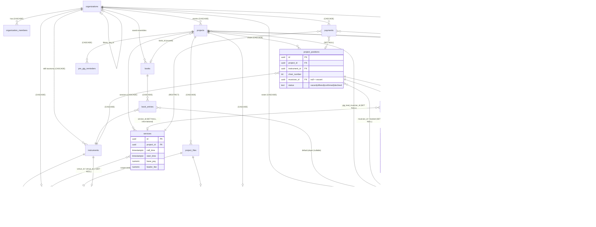
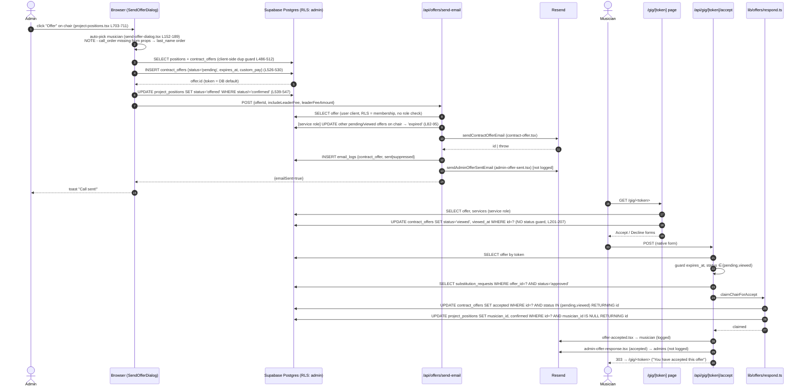
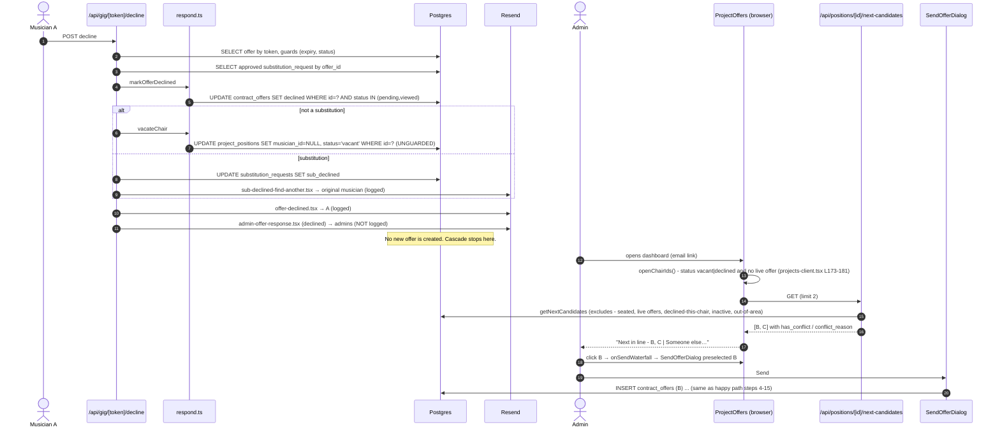
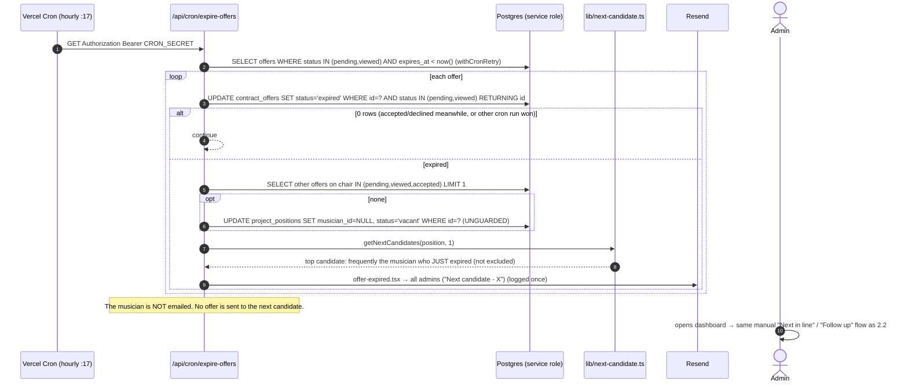

# Current state of the system
| | |
|---|---|
| Repo HEAD | `869ece3` (master, 2026-09-29) |
| Audit date | 2026-10-01 |
| Baseline | `tsc --noEmit` passes. `npm test` = 60 files / 994 tests, all passing on this HEAD. |
| Sources | Four read-only audits, kept as appendices: [A: architecture and infrastructure](audit/A-architecture-and-infrastructure.md), [B: domain model and tenancy](audit/B-domain-model-and-tenancy.md), [C: offer cascade trace](audit/C-offer-cascade-trace.md), [D: hard-coded assumptions and reuse](audit/D-hardcoded-assumptions-and-reuse.md) |
| Scope | What the code does today. Nothing here is a proposal unless it is labelled as a mitigation copied from an audit. |

This document is the executive map. Every claim comes from one of the four audits. Where two audits disagree, both versions are given and the item is listed in [section 8](#8-ambiguities-to-resolve-before-changing-anything). Paths are relative to the repo root and cited as `path:line` at HEAD `869ece3`.

## If you read nothing else
1. **There is no automatic cascade.** The system never sends an offer by itself. On decline, expiry or rescind it frees the chair and emails admins, sometimes naming a suggested next musician. An admin clicks to send the next offer. It is a suggest-and-click waterfall ([C §4.4](audit/C-offer-cascade-trace.md#44-automatic-or-admin-driven)).
2. **Offers are created from the browser.** `send-offer-dialog.tsx:526-530` inserts `contract_offers` straight into Postgres under RLS. The browser then calls `/api/offers/send-email`. Only substitution approval creates an offer on the server.
3. **A booking is `project_positions.musician_id` plus `status='confirmed'`.** The offer row is negotiation history, not the source of truth. A chair can be confirmed with no offer at all (direct assign, book import).
4. **A position implicitly covers ALL services of its project.** There is no service FK on positions or offers. Accepting means accepting every service, including services added later. Pay is still written per service.
5. **Candidate rankings are not stored.** `getNextCandidates()` recomputes them on every request from a single org-wide `musicians.call_order` integer per musician (not per instrument).
6. **The atomic seat claim is two guarded `UPDATE`s, not a transaction.** There is no RPC, no transaction and no unique index for any cascade invariant anywhere in the app.
7. **A verticals/terminology layer with 7 templates already exists in production** (`organizations.vertical`, `src/lib/verticals/`). It relabels nouns. It does not touch the data model.
8. **An AV production-crew template exists on an unmerged branch**, `origin/overhire-demo-skin`. Its migration number collides with master.
9. **Migrations are pasted into the SQL editor by hand.** There is no tracking table. Prod was also patched by hand scripts, so prod may not equal a clean replay of `001..090`.
10. **No test touches a database.** About 25 of 60 test files assert on source text. Three live cascade defects rated Critical (decline evicts a seated musician, a "viewed" write overwrites "accepted", cancelled events still accept bookings) have no test.

## 1. Architecture
Detail: [A](audit/A-architecture-and-infrastructure.md).
### 1.1 Frontend
- Next.js `16.3.6` App Router, React `19.2.3`, TypeScript 5, Tailwind 4, shadcn/ui on Radix. Forms use `react-hook-form` and `zod` 4 ([A §1.1](audit/A-architecture-and-infrastructure.md#11-framework-and-stack)).
- 24 `page.tsx` and 81 `route.ts` files. Pages are thin async server components that run large PostgREST embedded selects and hand data to `*-client.tsx` components. 113 files are `'use client'`.
- There are three data paths, mixed: server-component reads under RLS; supabase-js direct from the browser (45 files, reads and writes, including writes to `contract_offers`, `project_positions`, `services`, `projects`, `musicians`, `payments`); and `fetch('/api/...')` (95 call sites). There are no server actions ([A §1.5](audit/A-architecture-and-infrastructure.md#15-data-fetching-and-mutation-pattern)).
- A separate Next 14.1 marketing app lives in `podium-marketing/`.
### 1.2 Backend and route groups
Route handlers grouped by domain ([A §2.3](audit/A-architecture-and-infrastructure.md#23-routes-grouped-by-domain)):
- **Offers and cascade:** `api/offers/send-email`, `send-reminder`, `positions/[id]/{assign,unassign,rescind-offer,next-candidates}`, `gig/[token]/{accept,decline,request-sub}`, `substitutions/[id]/{approve,decline}`.
- **Gig logistics:** `send-gig-details*`, `send-music*`, `files/*`, `confirm-*`, `pre-gig-reminders/*`, `gig-lead`, `gig-report`, `report/[token]`.
- **Roster, W-9, payments, billing:** `musicians/import`, `send-w9-request`, `w9/[token]`, `organization/seed-skills`; `payments/{generate,bulk-update,export}`; Stripe `billing/{checkout,portal,webhook}`.
- **Music library:** 14 routes under `intake/*`, `library/*`, `repertoire/*`, plus `spotify/*`, all behind `requireIntakeEnabled` (404 when off).
- **Other:** `settings/*`, `auth/*`, venues, `webhooks/resend`, 7 × `cron/*` (see 1.7).

Authorization is uneven. 29 of 81 routes use a `require*` helper from `src/lib/api-helpers.ts`. 26 do their own inline `organization_members` check. 55 of 81 instantiate a service-role client, so tenant isolation in those routes lives in hand-written TypeScript filters. Only 21 routes use `serverError()`; the rest can leak Postgres error text ([A §2.1-2.2](audit/A-architecture-and-infrastructure.md#21-auth-helpers-srclibapi-helpersts)).
### 1.3 Database and migrations
- One Supabase Postgres project for everything (ref `cyspguwdocseisjyjqmu`). 40 tables, no views, 16 SQL functions, 17 triggers ([A §3](audit/A-architecture-and-infrastructure.md#3-database), [B §B.4](audit/B-domain-model-and-tenancy.md#b4-functions-triggers-rpcs-views)).
- `supabase/migrations/001..090`: 90 files, contiguous. **No Supabase CLI link, no runner, no `schema_migrations` table.** Merging a PR ships code but not SQL. Someone pastes the file into the SQL editor (`README.md:68-72`).
- **080/081 incident.** `080_enforce_plan_limits.sql` and `081_protect_privileged_org_columns.sql` sat unapplied for days in August 2026 while their PRs showed as merged. The response was process only: a PR template checkbox, paste-ready `scripts/*-2026-*.sql` bundles with RESULTS checks, and a rule that code must tolerate an unapplied migration (for example `getOrgVertical` and `resolveLibraryOrgId` fail open).
- `supabase/schema.sql` is stale and unsafe: 13 of 40 tables, and it recreates the world-readable and world-writable `contract_offers` token policies that `019` dropped (`schema.sql:413-419`). B calls it "a pre-001 design draft" that is not even an ancestor of `001`.
- Staging is paused. `scripts/staging-replay.sql` claims `001-065`.
- Deployed DB state can only be confirmed by hand in the SQL editor.
### 1.4 ORM and data layer
- No ORM. Raw supabase-js 2.90 query builders. `src/types/database.ts` (975 lines) is hand-written and the clients are not parameterized with it. There are 359 `any` sites ([A §4](audit/A-architecture-and-infrastructure.md#4-orm--data-layer)).
- Domain modules: `src/lib/offers/respond.ts`, `next-candidate.ts`, `schedule-conflict.ts`, `payments/compute.ts`, `projects/archive.ts`, `after-gig/*`, `verticals/*`, `plan.ts`.
- Only two RPCs are called from app code, `create_organization_with_owner` (browser onboarding) and `link_musician_records_to_user` (`auth/callback`). **No RPC is used for atomicity in any business flow.**
### 1.5 Authentication and identity
| Actor | Mechanism |
|---|---|
| Org staff (owner/admin/member) | Supabase Auth (email+password, Google OAuth), cookie session via `@supabase/ssr` |
| Org membership | `organization_members`, one account = one org (`UNIQUE(user_id)`, migration 077) |
| Musicians | **No accounts.** Each flow has its own bearer token in the URL: `/gig/[token]`, `/confirm-details/[token]`, `/confirm-music/[token]`, `/w9/[token]`, `/report/[token]`, calendar `?token=` |
| Platform admin | No in-app superuser. `PLATFORM_ADMIN_EMAIL` only receives emails |
| Cron | `Authorization: Bearer ${CRON_SECRET}`, fails closed when unset |
| Webhooks | Stripe `constructEvent`; Resend Svix HMAC with 5-minute tolerance |

**The musician portal was removed** (`src/lib/supabase/middleware.ts:44-48`). Leftovers remain: `musicians.user_id`, portal RLS policies and DEFINER helpers, `musician_notification_preferences`, `resolveMusicianIds()` with no callers, and `auth/callback/route.ts:33,52` still redirecting linked users to `/musician`, which 404s ([A §5](audit/A-architecture-and-infrastructure.md#5-authentication-and-identity)). The live portal-era RLS is the root of tenancy finding T-1.
### 1.6 Hosting, deployment, CI
- Vercel, production deploy on push to `master`. `vercel.json` `ignoreCommand` skips every non-master build, so preview deployments are effectively off.
- CI (`.github/workflows/ci.yml`): `npm ci`, `tsc --noEmit`, `npm run lint` (advisory, `continue-on-error`), `npm test`. CI does not run `next build`, does not check migrations, and has no E2E ([A §6](audit/A-architecture-and-infrastructure.md#6-hosting-and-deployment)).
- Backups are a JSON dump (`scripts/backup-database.js`) run by Windows Task Scheduler on the owner's PC. No `auth.users`, no storage, no DDL, no consistent snapshot, no restore script. PITR was declined ([A §13](audit/A-architecture-and-infrastructure.md#13-scripts-scripts)).
### 1.7 Background jobs
There is no queue, outbox, job table or worker. Every async effect runs inline in a request or in a cron that polls tables ([A §7](audit/A-architecture-and-infrastructure.md#7-background-jobs-webhooks-and-concurrency)).

| Path | Schedule (UTC) | What it does | Claim / idempotency | Kill switch |
|---|---|---|---|---|
| `/api/cron/expire-offers` | `17 * * * *` | Expires pending/viewed offers past `expires_at`; vacates the chair if no other live offer; names a next candidate in an admin email. Sends nothing to the musician | Status-conditioned `UPDATE`; vacate is check-then-act and unguarded | `CRON_ENABLED` |
| `/api/cron/offer-reminders` | `23 12 * * *` | Reminds musicians with offers expiring within 24h; emails admins "expiring soon" | Claims `reminder_sent_at IS NULL` before sending; never released, so at-most-once | `CRON_ENABLED` |
| `/api/cron/complete-projects` | `37 9 * * *` | Flips `active` to `completed` one day after the last date in org timezone | Conditional bulk `UPDATE` | `CRON_ENABLED` |
| `/api/cron/keepalive` | `41 6 */3 * *` | Keeps the free-tier Supabase project awake | n/a | Ignores `CRON_ENABLED` by design |
| `/api/cron/pre-gig-reminders` | `29 8,18 * * *` | Drafts a reminder 24-72h before the first service and emails admins to approve | `UNIQUE(project_id, trigger_date)` | `CRON_ENABLED` |
| `/api/cron/staffing-alerts` | `43 14 * * *` | Emails admins about unfilled positions 14/7/3 days out | `email_logs` lookup, not atomic, not overlap-safe. **Bug:** `THRESHOLDS.find` returns 14 for any `daysAway <= 14`, so 7-day and 3-day alerts never fire (`staffing-alerts/route.ts:10,90`) | `CRON_ENABLED` + `organizations.disable_staffing_alerts` |
| `/api/cron/after-gig` | `4,19,34,49 * * * *` | Pay summary to admins; report request to the gig lead | Claims `projects.pay_summary_sent_at` and releases on failure; `UNIQUE(project_id, musician_id)` on `gig_reports` | `CRON_ENABLED` |

Common plumbing in `src/lib/cron.ts`: `requireCronAuth`, `runCronJob` (Sentry plus ops email on a thrown error), `withCronRetry` (5 attempts, about 45s, initial fetch only). There is no run ledger or heartbeat. Per-item failures return 200 with a count and no alert. Schedules are fixed UTC; offer deadlines typed as a date are converted in the admin's browser timezone (`send-offer-dialog.tsx:480`).
### 1.8 Webhooks
- **Stripe** (`api/billing/webhook`): signature check, `stripe_events` dedupe insert, compensating delete of the dedupe row on failure. No event-order protection.
- **Resend** (`api/webhooks/resend`): Svix HMAC; bounce and complaint set `email_logs.status` and `musicians.email_status`. No dedupe table, no ordering.
### 1.9 Email
- Resend through one chokepoint, `src/lib/email/send.ts` (1,296 lines), with React Email templates in `src/lib/email/templates/`.
- `EMAIL_SAFE_MODE` is ON when unset and filters recipients against `EMAIL_ALLOWLIST`.
- A 600ms throttle (`awaitResendSlot`) uses a module-level variable, so it paces only within one serverless instance.
- `logEmail()` writes `email_logs` and never throws. Only 4 of 28 call sites log suppressed sends as `suppressed`; the rest log them as `sent`. Several admin emails are not logged at all ([C §8.2](audit/C-offer-cascade-trace.md#82-lost-or-never-recorded)).
- The send path never reads `musicians.email_status`, so bounced addresses are still mailed. There is no SMS and no channel abstraction. The only "text" feature opens the admin's own `sms:` URL.
- A counts 27 exported `send*Email` functions ([A §8.1](audit/A-architecture-and-infrastructure.md#81-components-srclibemail)). D counts 26 ([D §1.3](audit/D-hardcoded-assumptions-and-reuse.md#13-how-far-substitution-has-penetrated-measured)). This is listed in section 8.
### 1.10 File storage
| Store | Contents | Access |
|---|---|---|
| Supabase Storage `project-files` | Per-project files at `<orgId>/<projectId>/<uuid>.<ext>`, intake book covers | Server-minted upload URLs, signed downloads; org-folder scoped since 085 |
| Supabase Storage `w9-documents` | W-9 PDFs | Token upload via service role; admin signed URL |
| Cloudflare R2 `podium-repertoire` | 3,637 sheet-music part PDFs | Hand-rolled SigV4 presigned GET/PUT (`src/lib/storage/r2.ts`) |
### 1.11 Payments and tax
- `payments` holds one row per (service, musician), plus leader-fee rows. FKs to musicians and services are `ON DELETE RESTRICT` since 062. A partial unique index covers standard rows.
- The pay rule is in `src/lib/payments/compute.ts`. Base = accepted offer `custom_pay`, else `services.base_pay`. Leader fee only when `musicians.is_leader` and the base came from the service. Other readers use different rules (see 3.6).
- No money movement. Zelle fields only. Payments are marked paid by hand. XLSX export; 1099 aggregation runs in the browser (`tax-report-client.tsx`). The W-9 is a PDF upload via token.
- SaaS billing (Stripe tiers `free | ensemble | orchestra | symphony`) is dormant until both `NEXT_PUBLIC_BILLING_ENABLED` and `app_settings.billing_enforced` are flipped ([A §10](audit/A-architecture-and-infrastructure.md#10-payments-tax-and-billing)).
### 1.12 Tests
Vitest 4, 60 files, about 12.6k lines. **No test touches a real database, Supabase, Resend, Stripe, R2 or a browser.** There is no E2E and no RLS test against Postgres ([A §11](audit/A-architecture-and-infrastructure.md#11-tests)).

- **SRC**: `readFileSync` of production source or SQL, then `toContain`/`toMatch`. About 25 of 60 files include SRC assertions. Pure-SRC files include `offer-lifecycle`, `offer-assign-fixes`, `offer-viewed-status`, `reliability`, `rls-policy-safety`, `privileged-org-columns`, `plan-limit-enforcement`, `data-safety`, `route-gates`, `cron-schedules`. They pass if a string exists and break on harmless refactors.
- **MOCK**: the real route handler or lib with `vi.mock` and/or the in-memory `MockSupabaseDb` (`src/lib/__tests__/helpers/supabase-mock.ts`). Six stateful route files: `cron-expire-behavior`, `offer-lifecycle-behavior`, `rescind-guard`, `substitution-guards`, `unassign-history`, `after-gig`.
- **UNIT**: pure functions (plan, cron retry, venues, verticals, intake parsing, etc.).

C splits MOCK further into SCRIPTED (queued fake responses, filters ignored) and STATEFUL (the in-memory table map) ([C §5b](audit/C-offer-cascade-trace.md#5b-existing-tests-what-each-one-actually-exercises-and-how)). A notes that `tasks/todo.md:415` reports 3 failing tests in `org-membership.test.ts`. The baseline run on this HEAD shows all 994 tests passing, so that note appears stale (see section 8).
### 1.13 Logging and error reporting
- Sentry (`@sentry/nextjs`), errors only, no tracing, no replay. DSN is set in Vercel Production.
- 157 `console.error`, 69 `console.warn`, 16 `console.log`, all unstructured. No request or correlation id. No log drain. Vercel's viewer is the only log store.
- No general audit or event table. `email_logs` is the closest thing to an event log, with the caveats in 1.9. `impersonation_log` exists and is unused ([A §12](audit/A-architecture-and-infrastructure.md#12-logging-error-reporting-and-audit-trails)).
### 1.14 Existing feature flags and kill switches
| Flag | Scope | Default |
|---|---|---|
| `EMAIL_SAFE_MODE` + `EMAIL_ALLOWLIST` | Global env | ON when unset |
| `CRON_ENABLED` | Global env | Enabled when unset; `keepalive` ignores it |
| `NEXT_PUBLIC_BILLING_ENABLED` | Global env, inlined into the client bundle | Off, so every org resolves to Symphony |
| `app_settings.billing_enforced` | Global DB single row | false. Must be flipped together with the env var. Current prod value unconfirmed (`tasks/todo.md:366`) |
| `organizations.is_comped` | Per org | false |
| `organizations.intake_enabled` | Per org (music library) | off, fail-closed 404 |
| `organizations.library_org_id` | Per org shared-library pointer | null |
| `organizations.vertical` | Per org terminology template | `music_contractor` |
| `organizations.disable_staffing_alerts` | Per org | false |

Plus per-org plan gates in `src/lib/plan.ts` and per-vertical feature flags that are declared but mostly not consumed (see 4.1). There is no general feature-flag service and no per-user flag.

## 2. Domain model
Detail: [B](audit/B-domain-model-and-tenancy.md).
### 2.1 Table catalog (condensed)
40 tables in `public`. Tenant column key: `org_id` = has its own `organization_id`; `via X` = scoped through a parent; `global` = not tenant-scoped ([B §B.1](audit/B-domain-model-and-tenancy.md#b1-table-catalog-final-composed-shape)).

| Group | Table | Tenant | What it is |
|---|---|---|---|
| Staffing core | `organizations` | self | Tenant root; billing, vertical, flags, email branding, timezone |
| Staffing core | `organization_members` | org_id | Staff; role `owner/admin/member`; `UNIQUE(user_id)` |
| Staffing core | `musicians` | org_id (scalar) | Workers; contact, zip/radius, `call_order`, `is_leader`, `tags`, W-9 and Zelle columns, `email_status`, `is_active`, portal `user_id` |
| Staffing core | `instruments` | org_id | Skill taxonomy; `section` has no DB CHECK; no unique name per org |
| Staffing core | `musician_instruments` | via musicians | Worker to skill; `is_primary`, `proficiency` (unused in ranking) |
| Staffing core | `books` / `book_entries` | org_id / via books | Saved ensembles (roster templates), **not sheet music** |
| Staffing core | `staffing_presets` | org_id | Position shape templates, JSONB keyed by instrument name |
| Staffing core | `projects` | org_id | Events; status, client billing fields, `ensemble_type`, gig lead, `pay_summary_sent_at` |
| Staffing core | `services` | via projects | Calls/sessions; times, venues, `base_pay`, `leader_fee DEFAULT 50`. No personnel column |
| Staffing core | `project_positions` | via projects | Requirement and assignment conflated ("chair"). No unique `(project, instrument, chair)` |
| Staffing core | `contract_offers` | via positions | Offers; token, 7 statuses, `custom_pay`, `expires_at` |
| Staffing core | `substitution_requests` | via positions | Sub workflow; `service_id` recorded but ignored |
| Staffing core | `competing_schedules` | via musicians | Admin-entered busy blocks |
| Staffing core | `venues` / `zip_coordinates` | org_id / global | Venues with maps/parking; zip reference data |
| Communications | `email_logs` | org_id | Every logged send, with body |
| Communications | `gig_detail_sends` / `gig_detail_confirmations` | org_id / via sends | Logistics packets and per-musician token confirmations |
| Communications | `music_sends` / `music_confirmations` | org_id / via sends | Materials sends and confirmations |
| Communications | `project_files` / `project_file_instruments` / `project_file_downloads` | org_id / via files | Files, per-instrument visibility, download receipts |
| Communications | `pre_gig_reminders` / `reminder_templates` | org_id | Admin-approved reminder drafts; saved text snippets |
| Communications | `gig_reports` | org_id | After-gig report from the lead |
| Communications | `musician_notification_preferences` | via musicians | Dead (portal era) |
| Payments + tax | `payments` | org_id | Per service × musician payouts; RESTRICT FKs |
| Payments + tax | `stripe_events` / `app_settings` | global | Stripe idempotency ledger; singleton `billing_enforced` switch |
| Music library | `repertoire`, `repertoire_parts`, `repertoire_part_versions`, `title_aliases`, `intakes`, `intake_songs` | org_id each | Behind `intake_enabled` |
| Music library | `spotify_connections` | org_id (UNIQUE) | OAuth tokens in plaintext |
| Platform | `user_tutorial_state` / `impersonation_log` | org_id (+ user) / org_id | Onboarding wizard state; unused impersonation log |

The core staffing chain (`services`, `project_positions`, `contract_offers`, `substitution_requests`) has **no `organization_id`**. Every org check on them is a one- or two-hop join to `projects`.
### 2.2 Staffing-core relationships
Copied from [B §B.3.1](audit/B-domain-model-and-tenancy.md#b31-staffing-core).


### 2.3 How a booking is represented
- **The booking lives on `project_positions`.** A chair is booked when `musician_id IS NOT NULL AND status='confirmed'`. That one row is both the requirement (instrument + chair number on a project) and the assignment (musician + status). Payments, rosters, after-gig, gig details and music sends all read "who is booked" from it ([B §B.3.3](audit/B-domain-model-and-tenancy.md#b33-how-a-booking-is-represented-prose)).
- **`contract_offers` is the negotiation history and the acceptance record.** On accept, `claimChairForAccept` (`src/lib/offers/respond.ts:74-125`) flips the offer to `accepted`, then sets the chair. While the booking stands, the two rows mirror each other. Nothing in the DB keeps them consistent.
- A chair can be confirmed **with no offer**: direct assign (`api/positions/[positionId]/assign`), book import (`import-from-book-dialog.tsx:63-85`) and auto-populate (`auto-populate/route.ts:225`).
- The agreed rate (`custom_pay`) lives on the offer, not on an assignment.
- Offer history survives unassign, rescind and substitution as `released`, `rescinded` and `expired`. It is destroyed by CASCADE if the position or the musician row is deleted.
### 2.4 Candidates and ranking
**Rankings are not stored.** There is no rank column, candidate list or queue table. `getNextCandidates()` (`src/lib/next-candidate.ts:21-214`) computes on demand:
- musicians in the org, `is_active`, with a `musician_instruments` row for the chair's instrument;
- minus anyone seated on the project, anyone with a live offer on the project, and anyone who declined **this** chair;
- service-area hard filter against `zip_coordinates`;
- conflicts (`competing_schedules`, offers on other projects) demoted to the end, not excluded;
- sorted leaders first for chair 1, then `musicians.call_order` ascending. `call_order` is **one org-wide integer per musician**, regardless of instrument. NULL means unranked.

There are three separate rankers with different inputs and a fourth conflict implementation. The browser auto-pick in `send-offer-dialog.tsx` has no `call_order` or `is_leader` in its props, so it effectively sorts by last name ([C §1 Step 2](audit/C-offer-cascade-trace.md#step-2--candidate-ranking-and-selection-admin-driven)). `book_entries.priority` is selected but never used.
### 2.5 Position and service: do all services share the same personnel?
**Yes.** `project_positions` has no service FK, and there is no join table, no `services.musician_ids` and no per-service attendance ([B §B.3.3 item 4](audit/B-domain-model-and-tenancy.md#b33-how-a-booking-is-represented-prose), [C §6](audit/C-offer-cascade-trace.md#6-position--services-in-the-cascade-input-for-call-scoped-requirements)).
- The offer email, gig page, accept email, calendar and conflict check all resolve "the services of this offer" as `projects -> services` at read time. Adding or moving a service after acceptance silently changes what the musician agreed to.
- Pay is per service. `payments/generate` writes one row per (service, musician) for every confirmed chair.
- `substitution_requests.service_id` lets a musician name one service, but fulfilment moves the whole chair. A musician who asks for a sub for one rehearsal loses the whole gig.
### 2.6 Target vocabulary to existing tables
Copied from [B §B.7](audit/B-domain-model-and-tenancy.md#b7-mapping-to-the-target-generic-vocabulary).

| Target | Existing table(s) / columns | Gaps | Verdict |
|---|---|---|---|
| **Organization** | `organizations` (+ billing, vertical, `library_org_id`), `organization_members` (owner/admin/member) | One account = one org (077); cross-org sharing only via `library_org_id` | **exists as-is** |
| **Worker** | `musicians` (name, contact, address, zip/radius, `is_leader`, `call_order`, `tags`, `home_region`, payout (zelle), W-9, `email_status`, `is_active`, optional `user_id`) | Scalar org; no global person; music naming; payout/W-9/leader flags baked in as columns | **exists under a music name** |
| **Role** | `instruments` (name, abbreviation, section, sort_order) | `section` enum is music-only; no unique name per org; non-music verticals all use 'other' | **exists under a music name** |
| **WorkerRole** | `musician_instruments` (`is_primary`, `proficiency` free text) | No rank per role (`call_order` is per worker, not per role); no rate per role | **exists under a music name** (partial) |
| **Event** | `projects` (dates, status, client/coordinator/contract fields, ensemble_type, gig lead, pay_summary_sent_at) | Client-billing fields mixed into the event; `book_id` unused | **exists under a music name** |
| **Call** (time-boxed session) | `services` (service_type, call_time, start/end, venue_id ×2, base_pay, leader_fee) | Pay terms on the session; free-text venue duplicates | **exists under a music name** |
| **Requirement** (slot to fill) | `project_positions` (instrument_id, chair_number) | Same row is also the Assignment; no headcount/quantity concept (one row per chair); no unique (project, role, chair); templates in `staffing_presets` (JSON by instrument *name*) and `books`/`book_entries` | **partially exists (conflated with Assignment)** |
| **RequirementCall** (which calls a requirement covers) | none. A position implicitly covers every service of its project | No per-call staffing, no partial-call subs (`substitution_requests.service_id` recorded but ignored) | **missing** |
| **Candidate** | Computed on the fly in `src/lib/next-candidate.ts` from `musician_instruments`, `call_order`, zip radius, `competing_schedules`, declined/active offers; `book_entries` as default picks | No persisted candidate list, rank or reason; `book_entries.priority` unused | **missing (derived only)** |
| **Offer** | `contract_offers` (token, status ×7, sent/viewed/responded/expires, custom_pay, personal_message, reminder_sent_at) | One-live-offer-per-requirement is app-enforced only; token is about 122 bits, not the claimed 256 | **exists under a music name** |
| **OfferCascade** | none persisted. Manual "waterfall" (`project-offers.tsx`), and the expire cron emails a next-candidate suggestion | No sequence, no auto-advance, no cascade policy | **missing** |
| **Assignment** | `project_positions.musician_id` + `status='confirmed'`; accepted `contract_offers` row when booked via offer; `substitution_requests` for replacement | Conflated with Requirement; no own history (replacing the musician overwrites `musician_id`; history survives only in offers); agreed pay on Offer | **partially exists (conflated with Requirement and Offer)** |
| **Availability** | `competing_schedules` (busy blocks per musician), `zip_code`/`service_radius_miles`, `is_active` | No recurring availability, no "available" windows, no per-org vs global | **partially exists** |
| **Credential** | `musicians.w9_on_file / w9_file_url / w9_verified_at/by / w9_request_token… / w9_uploaded_at` | W-9 only; no generic credential or expiry model | **partially exists (W-9 only)** |
| **Document** | `project_files` (+ `project_file_instruments` role scoping, `project_file_downloads`), storage `project-files` / `w9-documents`, `repertoire_parts`(+versions, R2), `intakes.book_cover_path` | Several unrelated document stores; no generic document entity | **partially exists** |
| **Communication** | `email_logs`, `gig_detail_sends/confirmations`, `music_sends/confirmations`, `pre_gig_reminders`, `reminder_templates`, `musician_notification_preferences` (dead), `gig_reports` (inbound), `musicians.email_status` | Email only (no SMS); per-feature send/confirm tables instead of one model; `email_type` unconstrained | **exists (fragmented)** |
| **Payment** | `payments` (per service × musician, leader fee, type, status, export batch, paid_by); client-side billing on `projects`; Stripe subscription on `organizations` | Derived by re-running generate; amounts come from Offer.custom_pay or Call.base_pay | **exists as-is** (worker payouts) |
| **AuditEvent** | No generic table. Fragments: `email_logs`, `impersonation_log` (dead), `repertoire_part_versions`, `stripe_events`, offer timestamps, `payments.paid_by`, `w9_verified_by`, `pre_gig_reminders.approved_by` | No who/what/when log of state transitions | **missing** |
### 2.7 Status columns summary
| Column | Values (DB CHECK) | Notes |
|---|---|---|
| `projects.status` | draft, active, completed, cancelled | UI never creates `draft`. "Archived" = completed or cancelled. `cancelled` doubles as "archived because it has payments" |
| `projects.payment_status` | pending, deposit_paid, fully_paid | Client billing |
| `project_positions.status` | vacant, offered, confirmed, declined | **`declined` is never written.** `offered` is advisory. The real invariant is `musician_id` |
| `contract_offers.status` | pending, viewed, accepted, declined, rescinded, expired, released | No DB enforcement of transitions. `expires_at` acts as a hidden status |
| `substitution_requests.status` | pending_approval, approved, declined, sub_declined, filled, cancelled | **Column default `'pending'` violates the CHECK.** `cancelled` is never written |
| `payments.status` / `payment_type` | unpaid, pending, paid / standard, adjustment, correction, bonus | `status` is nullable |
| `pre_gig_reminders.status` | draft, sent, expired | |
| `intakes.status` | draft, confirmed | Planner columns from 082 are unused; `/plan/[token]` does not exist |
| `organizations.plan_tier` / `subscription_status` | trial, free, ensemble, orchestra, symphony / 8 Stripe values | Written only by the Stripe webhook; guarded by trigger 081 |
| `organization_members.role` | owner, admin, member | `member` is effectively unused by RLS writes |
| `musicians` | no status column; `is_active` soft delete; `email_status` ok/bounced/complained | |
| `email_logs.status` | no CHECK; code writes sent, suppressed, bounced, complained | |

Gig-details and music sends have no status column; state comes from `confirmed_at` timestamps. Transition sites are in [B §B.2](audit/B-domain-model-and-tenancy.md#b2-status--state-columns-values-and-transition-sites).

## 3. Offer cascade
Detail: [C](audit/C-offer-cascade-trace.md). The full as-implemented state machines are in [../state-machines.md](../state-machines.md).
### 3.1 Narrative trace (condensed)
1. **Position created (admin, browser).** Manual add, duplicate, project template or book import inserts `project_positions` directly (`add-position-dialog.tsx:192,243,312`; `projects-client.tsx:559,598,637`; `import-from-book-dialog.tsx:63-85`). Book import can insert `confirmed` with a musician and no offer. No unique `(project, instrument, chair)`.
2. **Candidate chosen (admin).** Admin clicks **Offer** (`project-positions.tsx:703-711`, shown whenever status is not `confirmed`, including `offered`) or a "Next in line" chip (`project-offers.tsx:570-615`, backed by `GET next-candidates`, `limit=2`).
3. **Offer row inserted (browser).** `handleSend` (`send-offer-dialog.tsx:467-627`): compute `expires_at` in browser time (default 48h, or "No expiration"); client-side duplicate check (`:486-512`, check-then-insert); `INSERT contract_offers` (`:514-530`) with no guard on chair state; `UPDATE project_positions SET status='offered' WHERE status<>'confirmed'` (`:539-547`).
4. **Offer delivered.** If the email toggle is on, the browser POSTs `/api/offers/send-email`. The route checks only that a user is logged in, then with the service role **expires every other live offer on the chair** (`send-email/route.ts:82-95`), then sends `contract-offer.tsx` and logs. If the send throws, no log row is written and the previous live offer is already dead. With the toggle off, no supersede runs.
5. **Musician views.** `/gig/[token]` (`src/app/gig/[token]/page.tsx:64-240`, service role) writes `status='viewed'` with **no status guard** (`:201-207`). The page renders nothing for `expired` or `released`.
6. **Accept.** `POST /api/gig/[token]/accept` checks `expires_at` and status, not project status or `is_active`. `claimChairForAccept` (`respond.ts:79-124`): (a) offer to `accepted` where status in (pending, viewed); (b) chair to musician + `confirmed` where `musician_id IS NULL` (or = original for a sub); (c) if (b) matched nothing, revert the offer to `pending` with no guard. A loser sees Accept again with no message. Sub bookkeeping marks the request `filled` and the original's offer `released`.
7. **Decline.** `markOfferDeclined` then `vacateChair` (`respond.ts:131-181`). `vacateChair` is **unguarded**: it clears whoever holds the chair. No next offer is created.
8. **Expire (cron, hourly :17).** `expire-offers/route.ts:21-186`: guarded expire; if no other live or accepted offer, unguarded vacate; `getNextCandidates(...,1)` names a candidate in the admin email. The musician is not emailed. The expired musician is not excluded from ranking and is often re-suggested first.
9. **Rescind (admin).** `rescind-offer/route.ts` is keyed by position and uses `.single()`, so it fails with 400 when a chair has two live offers. The vacate here is guarded.
10. **Direct assign (admin).** `assign/route.ts:4-192` claims the chair, accepts the musician's own pending offer, expires the rest. No email to anyone, no conflict check.
11. **Substitution.** Musician requests (`request-sub/route.ts`, check-then-insert); admin approves (`approve/route.ts`, up to 8 sequential writes with a compensating revert) and a sub offer goes out with a 7-day expiry. If the sub offer expires, the request stays `approved` forever and the original musician is locked out of requesting again.
12. **Drop.** No musician-initiated drop. Admin unassign (`unassign/route.ts`) releases accepted offers, rescinds pending ones, vacates the chair, and leaves substitution requests dangling.
13. **Project cancelled.** A browser `UPDATE projects SET status='cancelled'` (`delete-project-dialog.tsx:102-105`). Offers stay live, reminders continue, and a musician can still accept and receive "Confirmed". Project delete cascades all offers away with no notice.
### 3.2 Sequence diagrams
Copied from [C §2](audit/C-offer-cascade-trace.md#2-sequence-diagrams). Em-dashes in note text were replaced with hyphens or colons.

**Happy path (admin offers, musician accepts)**



**Decline, then next candidate (human in the loop)**



**Expire, then next candidate (cron proposes, admin disposes)**


### 3.3 State machines as implemented (brief)
Full diagrams, transition tables and guards: [../state-machines.md](../state-machines.md) and [C §3](audit/C-offer-cascade-trace.md#3-state-machines-as-implemented).
- **`contract_offers.status`**: `pending -> viewed -> accepted | declined | expired | rescinded`, and `accepted -> released`. `accepted -> pending` happens on a lost seat claim. The unguarded "viewed" write can move any terminal state back to `viewed`. No trigger or table enforces legal transitions. "Expired" has two meanings: `status='expired'` and `pending/viewed` with `expires_at < now()`. Readers disagree on which to use. `responded_at` and `response_notes` are overloaded.
- **`project_positions.status`**: `vacant -> offered -> confirmed -> vacant`. `declined` is never written. `offered` is advisory. A hard-deleted musician leaves a `confirmed` chair with `musician_id NULL`.
- **`substitution_requests.status`**: `pending_approval -> approved -> filled | sub_declined`, `pending_approval -> declined`. A sub offer that expires leaves the request in `approved` with no exit. `cancelled` is never written.
### 3.4 Concurrency scenarios (condensed)
Full analysis: [C §5](audit/C-offer-cascade-trace.md#5-concurrency-and-idempotency-analysis). The only mechanism anywhere is a conditional single-row `UPDATE ... WHERE status IN (...)` or `WHERE musician_id IS NULL`, checked by row count.

| # | Scenario | Safe? | Mechanism / gap |
|---|---|---|---|
| S1 | Two musicians accept the same chair at once | Chair safe; offer state mostly safe | Guarded chair update serializes on the row lock. Crash between steps leaves an offer `accepted` with no chair; loser sees Accept again |
| S2 | Same accept link clicked twice or replayed | Safe | Guarded offer update; emails only after a successful claim |
| S3 | Accept after the expire cron | Safe | Guarded updates on both sides; claim does not re-check `expires_at` in SQL |
| S4 | Accept after admin rescind | Safe | Guarded updates on both sides |
| S5 | Accept after admin direct-assigns someone else | Chair safe; UX poor | Musician never told; `assign` sends no email |
| S6 | `expire-offers` runs twice concurrently | Offers safe; vacate is a race | Read of "other active offers" then unguarded vacate can wipe a chair just won |
| S7 | Decline of an already-answered offer | Safe | Guarded update returns `already_responded` |
| S7b | Decline of a live offer on a chair someone else holds | **Unsafe** | `vacateChair` unguarded; evicts the holder silently. No test |
| S8 | Project cancelled with pending offers | **Unsafe** | No mechanism; accept still books |
| S8b | Project hard-deleted with pending offers | Unsafe (silent data loss) | FK cascade |
| S9 | Position deleted with pending offers | **Unsafe** | Browser delete, stale UI check, cascade |
| S10 | Musician deactivated with a pending offer | Unsafe (policy) | Accept never reads `is_active` |
| S10b | Musician hard-deleted | Unsafe | Chair stays `confirmed` with `musician_id NULL` |
| S11 | Second sub approved while the first holds the chair | Chair safe; state leaks | Request #2 stays `approved`; no unique index on requests |
| S12 | Email send fails after the offer row exists | Partially safe | Honest toast; no durable "undelivered" state; prior offer already superseded; toggle-off allows two live offers |
| S13 | Gig page GET races accept | **Unsafe** (narrow window, severe) | Unguarded "viewed" write can overwrite `accepted`; cron can later vacate the confirmed chair |
| S14 | Second offer on an `offered` chair with email off | **Unsafe** | No partial unique index; rescind fails on `.single()` |
| S15 | Linked musician or non-admin member calls `send-email` | Authz gap (low reach) | No role check; supersede runs with the service role |
### 3.5 Test coverage matrix
Verbatim from [C §5c](audit/C-offer-cascade-trace.md#5c-coverage-matrix-spec-scenarios--test-type), except that the "not covered" marker (an em-dash in C) is written here as **none**.

Legend: **R** = covered by a real-function/stateful test; **S** = covered only by a source-text test; **none** = not covered. Where the code itself is unsafe, that is noted.

| Spec scenario | Status | Where | Notes |
|---|---|---|---|
| Acceptance (normal) | **R** | `offer-lifecycle-behavior.test.ts:139-187`; `offer-respond-shared.test.ts:106-146` | |
| Decline | **R** | `offer-lifecycle-behavior.test.ts:344-373`; `offer-respond-shared.test.ts:208-250` | Decline evicting a seated holder (S7b) **none** (and the code is unsafe) |
| Timeout / offer expiration | **R** | `cron-expire-behavior.test.ts:150-328` | Expired musician re-suggested as next **none** (code wrong); sub-offer expiry **none** (code wrong) |
| Manual cancellation (admin rescind) | **R** | `rescind-guard.test.ts:114-185` | Two-live-offer `.single()` failure **none** |
| Manual cancellation (admin unassign / release) | **R** | `unassign-history.test.ts:130-200` | |
| Substitution (approve → sub accepts → original released) | **R** | `substitution-guards.test.ts:200-367`; `offer-lifecycle-behavior.test.ts:258-336,419-455` | Sub request creation (`request-sub`) **none** |
| Duplicate webhooks / actions (double click, replay, double approval, double cron) | **R** partial | accept replay `offer-lifecycle-behavior.test.ts:213-226`; double approval `substitution-guards.test.ts:224-262`; reminder claim **S** `reliability.test.ts:13-20` | Concurrent double cron run **none**; duplicate `request-sub` **none**; double "Send" in the dialog **none** |
| Simultaneous acceptance (two musicians, one chair) | **R** (sequential simulation) | `offer-lifecycle-behavior.test.ts:189-211` (pre-seeded holder); `offer-respond-shared.test.ts:175-196` (scripted 0-row) | No true concurrency; no DB constraint to test |
| Candidate removal (musician deactivated/deleted while holding an offer) | **none** | none | Code has no handling (S10/S10b) |
| Offer expiration vs late accept | **R** | `cron-expire-behavior.test.ts:227-265` | |
| Event (project) cancellation | **S** only for archive-instead-of-delete (`data-safety.test.ts:50-60`) | none | Offer handling on cancel **none**, and the code is unsafe (S8) |
| Position already filled (accept/assign/rescind into a held chair) | **R** | accept revert `offer-lifecycle-behavior.test.ts:189-211`; rescind `rescind-guard.test.ts:173-185`; assign 409 **S** only (`offer-assign-fixes.test.ts`) | Decline into a held chair (S7b) **none** |
| Replacement after a confirmed worker drops (unassign → re-offer; sub) | **R** partial | unassign `unassign-history.test.ts`; sub transfer tests | No test of "unassign then next-candidate/offer" as a flow; dangling sub requests **none** |
| Offer email send failure | **S** | `offer-email-honesty.test.ts:42-73,75-115` | Durable undelivered state **none** (doesn't exist) |
| Viewed-status write | **S** | `offer-viewed-status.test.ts` | Race S13 **none** (code unsafe) |
| Next-candidate ranking order / leaders / conflicts | **R** partial | `next-candidate-seated.test.ts` (exclusions only); `schedule-conflict.test.ts` (conflict detection) | Sort order, leader promotion, out-of-area exclusion **none** |

No test imports `assign/route`, `send-email/route`, `send-reminder/route`, `request-sub/route`, `next-candidates/route`, `offer-reminders`, `staffing-alerts`, `complete-projects` or the gig page as executable code.
### 3.6 Pay ambiguity
From [C §6.3](audit/C-offer-cascade-trace.md#63-pay-per-position-per-service-or-both). Pay lives in three places and four readers combine it with three different leader rules.

| Data | Column | Granularity |
|---|---|---|
| Base rate | `services.base_pay` | per service |
| Leader fee | `services.leader_fee DEFAULT 50` | per service |
| Negotiated amount | `contract_offers.custom_pay` | per offer (one number) |
| Position | none | no pay column on `project_positions` |

| Reader | Pay computed as | Leader rule |
|---|---|---|
| Send dialog (browser) | `customPay` input pre-filled from `basePay`, plus optional leader checkbox, saved to `custom_pay` | Checkbox; auto-check never fires (`is_leader` missing from props) |
| Offer email (`send-email/route.ts:99-114`) | `custom_pay`, else `services[0].base_pay + leaderFee` from the **unsorted** embed | Dialog flag, else `!hasCustomPay && chair_number===1` |
| Gig page (`gig/[token]/page.tsx:127-145`) | `custom_pay`, else earliest service `base_pay + (chair 1 ? leader_fee ?? 50 : 0)` | Chair 1, regardless of `is_leader` |
| Calendar (`offers/[offerId]/calendar/route.ts:190,230,303-305`) | `custom_pay ?? firstService.base_pay + (chair 1 ? leaderFee : 0)` | Chair 1 |
| Payments (`payments/generate/route.ts:76-108`, `compute.ts:33-47`) | `custom_pay ?? service.base_pay` **per service**, plus `leader_fee` only if `is_leader` and no `custom_pay` | `musicians.is_leader` |

The email and gig page show one figure ("Pay: $X") with no "per service" qualifier. Payments multiply it across every service. For a 3-service project offered at "$200", the musician reads $200 and the ledger writes $600, or the reverse, depending on what the contractor meant. A chair-1 non-leader is shown a leader fee and not paid one; a non-chair-1 leader is paid one and never shown it. C counts this as five readers in its table (dialog, email, gig page, calendar, payments) while its prose says four.

## 4. Hard-coded quartet assumptions
Detail: [D](audit/D-hardcoded-assumptions-and-reuse.md).
### 4.1 What already exists for generalization
- **Verticals module** `src/lib/verticals/` (667 lines, 16 files): `types.ts`, `terms.ts` (`term()`, `termCount()`), `registry.ts` (`resolveVertical()` never throws, falls back to `music_contractor`), `features.ts`, `nav-routes.ts`, `seeds.ts`, `server.ts` (`getServerVertical()`), `title-rules.ts`, and 7 templates. Stored in `organizations.vertical` (065), chosen at onboarding, passed to `create_organization_with_owner` ([D §1.1](audit/D-hardcoded-assumptions-and-reuse.md#11-the-verticals-module--srclibverticals-667-lines-16-files)).
- **TermDictionary keys** (7): `person` (musicians), `work` (projects), `session` (services), `skill` (instruments), `groupList` (books), `materials` (project files / music sends), `rank` (chair_number, or null). Missing keys: gig, sub, call (as offer), lead/leader fee, offer, position, ensemble, section, venue, call time, pay, gig details, gig report.
- **Feature flags** `useChairs`, `useTitleInference`, `useEnsembleDetection`, `showBooksTab`. **The predicates in `features.ts` are never called outside tests.** The only production read is `project-form-dialog.tsx:130`, which uses `useTitleInference` as a proxy for "is a music vertical". Other effects are achieved indirectly (nav config, `plainTitleRules`).
- **Templates table** (from D):

| key | person | work | session | skill | groupList | rank | chairs/titles/drift/books | seeds |
|---|---|---|---|---|---|---|---|---|
| `music_contractor` (default) | Musician | Project | Service | Instrument | Saved Ensemble | Chair | T/T/T/T | sql (64) |
| `orchestra_band` | Musician | Concert | Service | Instrument | Roster | Chair | T/T/T/T | sql (64) |
| `choir` | Singer | Concert | Session | Voice Part | Roster | null | F/F/F/T | 11 |
| `theatre` | Company Member | Production | Call | Role | Cast List | null | F/F/F/T | 13 |
| `dance` | Dancer | Production | Call | Role | Roster | null | F/F/F/T | 7 |
| `church_worship` | Team Member | Plan | Service | Team Role | Team | null | F/F/F/T | 12 |
| `event_agency` | Performer | Event | Set | Skill | Lineup | null | F/F/F/F | 6 |
| *(branch)* `production_crew` | Tech / Crew | Show | Call | Role | Crew List | Slot | T/F/F/F | 16 |

D and the `067` comments say the SQL seed is 64 instruments. B says the RPC seeds 73 rows and that the comment's "64" is wrong. See section 8.

- **Four guarding tests**: `vertical-identity.test.ts` (the "no-op guarantee" that freezes default terms, nav, features and the orchestral title matrix), `verticals-registry.test.ts` (registry invariants), `email-terminology.test.ts` (default vs choir rendering is byte-identical when terms are omitted), `nav-mapping.test.ts`. D recommends them as the regression contract for the quartet product.
- **Penetration metrics** ([D §1.3](audit/D-hardcoded-assumptions-and-reuse.md#13-how-far-substitution-has-penetrated-measured); heuristic, order of magnitude):

| Bucket | files | files using terms | term calls | music-noun literals |
|---|---|---|---|---|
| `src/components/projects` | 22 | 21 | 208 | 85 |
| `src/components/musicians` | 6 | 5 | 85 | 18 |
| `src/components/instruments` | 8 | 6 | 30 | 2 |
| `src/components/books` | 6 | 5 | 29 | 21 |
| `src/components/onboarding` | 2 | 1 | 20 | 0 |
| `src/components/settings` | 10 | 4 | 19 | 5 |
| `src/components/payments` | 4 | 3 | 16 | 0 |
| `src/components/schedules` | 3 | 2 | 9 | 0 |
| `src/components/providers`, `layout` | 5 | 2 | 6 | 0 |
| `src/components/gig` (token pages UI) | 4 | 0 | 0 | 9 |
| `src/components/emails`, `venues`, `dashboard`, `billing` | 7 | 0 | 0 | 7 |
| `src/components/intake` + `library` + `music` | 7 | 0 | 0 | 40 |
| `src/app/dashboard/**` | 24 | 1 | 8 | 11 |
| `src/app/gig`, `confirm-*`, `report`, `musician-policy` | 8 | 2 | 4 | 14 |
| `src/app/api/**` | 81 | 1 | 2 | 224 |
| `src/lib/email/templates` | 29 | 21 | 113 | 11 |
| **Total** (277 files) | 277 | 74 | 549 | 448 |

A second sweep found 169 more literals (gig, call, sub, lead, leader fee) that have no term key. Eight admin/cron email senders resolve terms with `organizationId = undefined` and always render music nouns (`send.ts:425,488,608,817,852,923,1132,1173`).
### 4.2 Category counts (105 findings)
T = terminology only; C = configurable behaviour; D = real domain constraint; M = migration risk ([D §2.13](audit/D-hardcoded-assumptions-and-reuse.md#213-summary-counts-by-category)).

| Area | T | C | D | M | total |
|---|---|---|---|---|---|
| Schema (S1-S28; S27 neutral) | 1 | 8 | 12 | 6 | 27 |
| Validations / zod (V1-V11; V10 neutral) | 3 | 5 | 2 | 0 | 10 |
| API routes (A1-A12; A9 neutral) | 3 | 1 | 7 | 0 | 11 |
| Crons (CR1-CR6) | 2 | 3 | 1 | 0 | 6 |
| Email templates (E1-E8) | 6 | 2 | 0 | 0 | 8 |
| Dashboard UI | 6 | 9 | 9 | 1 | 25 |
| Worker token pages (W1-W7; W6 neutral) | 3 | 2 | 1 | 0 | 6 |
| Music-library subsystem (one block) | 0 | 1 | 0 | 0 | 1 |
| Reports / exports | 1 | 0 | 0 | 0 | 1 |
| Onboarding | 2 | 0 | 0 | 0 | 2 |
| Shared libs (L1-L9; L8 neutral) | 1 | 4 | 3 | 0 | 8 |
| **Total** | **28** | **35** | **35** | **7** | **105** |
### 4.3 Top 15
Verbatim from [D §2.14](audit/D-hardcoded-assumptions-and-reuse.md#214-top-15-that-actually-matter-for-the-rearchitecture).

| # | Finding | Why it matters | Recommended treatment |
|---|---|---|---|
| 1 | **S1 Positions are project-level; everyone works every service** (`project_positions.project_id`, `001:114`) | Crews need different headcounts per call (load-in 8 hands, show 3 ops, strike 8). Breaks pay, conflicts, offers, call sheets, after-gig. | **Introduce alongside**: a `position_services` (requirement ↔ subset of services) join table where *no rows = all services* (today's semantics, zero migration of quartet data). Every reader that iterates `project.services` for a position switches to `servicesFor(position)` helper. |
| 2 | **S2 No quantity** (one row = one person) | "4 × Stagehand" must be 4 rows; the cascade is per row. | **New table alongside**: `requirements(project_id, skill_id, quantity, rate, service scope)` that *generates* N `project_positions` rows (positions stay the unit of offer). Quartet = quantity 1 each, identical rows. |
| 3 | **A1/L5/S8 Pay = position × every service** (`payments/generate/route.ts:95`, `compute.ts`) | Wrong pay as soon as #1 lands; `custom_pay` is per-service implicitly. | Route through the `servicesFor(position)` helper; add optional `rate_unit` (per call/per hour/per day/flat) on the offer/requirement defaulting to today's per-service. Keep `computeServicePay` as the single rule. |
| 4 | **S5/A3/L-respond Subs replace the whole position** although `substitution_requests.service_id` exists | Partial-call coverage is common for crews and orchestras alike. | Keep as-is for v1; when #1 lands, an approved per-service sub creates a child position scoped to that service. The column is already there. |
| 5 | **L4 Conflicts are project-wide** (`schedule-conflict.ts:66-122`) | A tech on the morning load-in of show A appears double-booked against the evening of show B. | Compute windows from the person's *own* positions' services (via #1 helper). Pure function, well tested (`schedule-conflict.test.ts`), low risk. |
| 6 | **S7/V8/L3 `is_leader` is a global person flag** and drives pay and candidate ordering ("leaders first for chair 1") | Crews have per-role leads (A1 is lead audio, crew chief); leadership is per position. | Keep the column for music (behind `useTitleInference`/a new `useLeaderFee` flag); add `project_positions.is_lead` / requirement-level premium for others. |
| 7 | **S6/V6/P6 `leader_fee` DEFAULT 50 on every service, ungated** | A non-music org with any `is_leader` person silently pays +$50/service. | **Vertical flag now** (`features.useLeaderFee`; hide field and default to null for non-music). Leave existing data untouched. |
| 8 | **CR1 After-gig lead falls back to "Violin 1"** (`after-gig/rules.ts:83-125`) and S14 one lead per project | Non-music orgs always hit "needs-pick" with Violin-1 copy. | Make the fallback a vertical config (`leadFallbackSkill: 'Violin 1' \| null`); keep music identical (identity test). Per-call leads later. |
| 9 | **S15/A4/W4 Document visibility only per instrument; `.limit(1)` person→position** | Call sheets/stage plots go to departments, calls, or individuals. | **Extend alongside**: add `project_file_targets(file_id, kind: skill\|position\|service\|person, ref_id)`; `scope='assigned'` + `project_file_instruments` remains the music path. Fix the `.limit(1)` to "any confirmed position". |
| 10 | **S21/V11 Roles = owner/admin/member; `member` unused by RLS** | Event agencies need coordinators/crew chiefs with limited rights. | New `role` values or a `member_permissions` table; `is_org_admin` remains the admin gate; add `has_org_permission(org, perm)`. |
| 11 | **S9/L3 Global `call_order`** (per person, not per skill) | A person can be first-call A1 and fifth-call hand. | Introduce per-skill priority (generalize `book_entries.priority` or add `musician_instruments.call_order`); keep global value as fallback. |
| 12 | **S10 No worker-skill attributes** (proficiency unused, no default rate, no credentials) | Crews price by role and gate by certification. | Add columns to `musician_instruments` (`default_rate`, `level`) + a `credentials` table (see gap list). No impact on quartet rows. |
| 13 | **P2 Position/service templates are written client-side** (`projects-client.tsx:528-600`) plus RLS-direct writes for musicians/projects/services (`080` header) | Any shape change to positions needs every client writer updated; no server choke-point to enforce new invariants. | Before #1/#2, move "create project from template" and "add positions" behind an API route/RPC. |
| 14 | **S12/S25/S28 DB nouns (`musicians`, `instruments`, `musician_id` × ~25 FKs, RPC names)** | Tempting to rename; enormous blast radius on the live quartet product. | **Do not rename.** Keep the term layer as the outward mapping (the module's stated design, `types.ts:4-11`). Optionally add DB views with generic names for new code. |
| 15 | **V1/V4/V5 Fixed enums: `INSTRUMENT_SECTIONS`, `SERVICE_TYPES`, `EVENT_TYPES`** (zod only; DB has no CHECK) | Non-music seeds collapse into "Other"; crews need load-in/strike (branch already writes them and would fail zod on edit). | **Vertical config**: `sections`, `sessionTypes`, `eventTypes` on `VerticalTemplate`; music values unchanged. No migration needed. |
### 4.4 Gap list
From [D Part 3](audit/D-hardcoded-assumptions-and-reuse.md#part-3--gap-list-target-concepts-with-no-counterpart-today).

| Target concept | Nearest existing thing | What is missing |
|---|---|---|
| Call-scoped requirements | `project_positions` (project-wide); `substitution_requests.service_id` (ignored) | A `position_services` join with "empty = all"; a `servicesFor(position)` helper adopted by pay, conflicts, emails, gig details, staffing alerts, calendar; UI |
| Quantity > 1 requirements | `staffing_presets` JSONB, `book_entries` rows, next-chair auto-increment | A requirement entity with `quantity`, rate and call scope that materializes N positions; "fill 4 of 4" progress |
| Credentials | `musicians.tags`; W-9 columns and upload-token flow | `credentials` table with expiry; requirement-level required credentials; candidate filtering; expiry cron |
| Availability requests | `competing_schedules` (orphaned UI), `schedule-conflict.ts`, token-response pattern | Request and response tables; template; feed into conflicts and ranking |
| SMS channel | `group-text-dialog.tsx` `sms:` URL; Resend pipeline; `email_logs`; `email_status` | Provider, consent and preferences, a channel-aware message log, inbound replies, opt-out |
| Append-only audit event log | Offer status history by row, `email_logs`, `impersonation_log`, `paid_by`, `w9_verified_by`, `stripe_events` | One insert-only `events` table with actor, entity, action, payload |
| Worker roles with proficiency / default rate | `musician_instruments.proficiency`, `services.base_pay`, `custom_pay`, `book_entries.priority` | `default_rate`, `level`, a rate resolution order |
| Org permission roles beyond owner/admin | `organization_members.role`, `is_org_admin()` | Role set or permissions table; `has_org_permission()`; UI gates |
| Document visibility by role/call | `project_files.scope` + `project_file_instruments`; send/confirm tables | Target table keyed by position, service, person or role-group; per-call batches |
| Per-call / per-position lead | `projects.gig_lead_musician_id`, `gig_reports UNIQUE(project_id, musician_id)` | Lead per service or department; report per call |
| Per-vertical session/section/event vocab | `SERVICE_TYPES`, `INSTRUMENT_SECTIONS`, `EVENT_TYPES` | Fields on `VerticalTemplate` (no migration) |
| Authenticated worker portal | Schema, RLS and RPCs from 016 and 033-035; token pages | App routes |
### 4.5 Reuse map
From [D Part 4](audit/D-hardcoded-assumptions-and-reuse.md#part-4--reuse-map-what-of-this-can-we-use-that-we-already-built).

| Target engine concept | Existing asset | Verdict |
|---|---|---|
| Vertical, outward nouns, quartet regression contract | `organizations.vertical`, `src/lib/verticals/*`, onboarding picker, seed RPC and route; `TermDictionary`, `term()`, `useTerms()`, `getServerVertical()`, `resolveEmailTerms()`; the four vertical tests | Use as-is; add keys and config fields; finish plumbing into API routes, token pages, 8 admin emails; every new key gets a frozen default |
| Feature gating | `features.ts`, `plan.ts` + SQL triggers, org flag columns + trigger 081 | Use as-is; start consuming the predicates; add `vertical` to trigger 081 once it gates behaviour |
| Skill taxonomy, roster | `instruments`, `musician_instruments`, seeds; `musicians` | Use; add per-vertical sections, `default_rate`, `level`, credentials, per-skill call order |
| Saved team / requirement template | `books`/`book_entries`, `staffing_presets` | Use `books` as crew lists; replace `staffing_presets` once requirements exist |
| Engagement / sessions | `projects`, `services` | Use; services already are "calls" |
| Positions + offers cascade, subs | `project_positions`, `contract_offers`, `respond.ts`, `next-candidate.ts`, offer crons; `substitution_requests` | Use, but add service scoping and requirement/quantity; honour `service_id` after call scoping |
| Availability | `competing_schedules`, `schedule-conflict.ts`, orphaned `/dashboard/schedules` | Use the conflict engine; add requests/responses |
| Documents + receipts | `project_files` family, send/confirm tables, confirm token pages | Use the mechanism; add a target table |
| Messaging | Resend pipeline, `email_logs`, branding, `reminder_templates`, Resend webhook | Use for email; generalize for SMS; replace `musician_notification_preferences` |
| Post-event, money | `src/lib/after-gig/*`, `gig_reports`, `/report/[token]`; `payments`, `compute.ts`, exports, 1099, W-9 tokens | Use; parameterize lead fallback and questions; iterate a position's own services; leader fee behind a flag |
| Permissions | `is_org_admin`/`is_org_member` | Extend |
| Second brand | branch `overhire-demo-skin` | Rebase onto master |
| Music library | repertoire/intake/spotify/library behind `intake_enabled` | Leave as a music-only module; it depends on the core, not the reverse |
### 4.6 The unmerged `origin/overhire-demo-skin` branch
6 commits off `hardening-2026-09`, 46 commits behind master, 27 files, +1150/−55. It adds a `production_crew` template ("Tech / Crew", "Show", "Call", "Role", "Slot"), a `VerticalBrand` / `brand.ts` "Overhire" brand override, a 16-role crew seed, a "three-call show" quick-start (Load-in / Show Day / Strike services, no positions), `scripts/seed-crew-demo.js`, `production-crew.test.ts`, and `tasks/fork-concept-crew.md`, which names per-call headcounts as "the one real data-model change" ([D §1.6](audit/D-hardcoded-assumptions-and-reuse.md#16-prior-architectural-intent-strategy-docs)).

Two blockers:
1. **Migration number collision.** The branch's `084_add_production_crew_vertical.sql` collides with master's `084_drop_membership_self_insert.sql`. D recommends renumbering to `091+`.
2. **`service_type` values outside zod.** The branch inserts `'load_in'` and `'strike'`, which are not in `SERVICE_TYPES` (`src/lib/validations/projects.ts:6`). The DB has no CHECK, so the insert works, but editing those services in the service form fails validation.

## 5. Tenant isolation
Detail: [B §B.5](audit/B-domain-model-and-tenancy.md#b5-tenant-isolation-audit).
### 5.1 RLS model
- RLS is enabled on every public table (047 force-enables it).
- **Staff policies** use `is_org_member(organization_id)` for SELECT and `is_org_admin(organization_id)` for writes. Child tables with no org column use `EXISTS` joins to the parent. B checked the joins and found them correct.
- **Musician-portal policies** (016, 033-035, 041) are keyed on `musicians.user_id = auth.uid()` through SECURITY DEFINER helpers. They are still live although the portal UI is gone.
- **Raw sub-select pattern** `organization_id IN (SELECT organization_id FROM organization_members WHERE user_id = auth.uid())` is used on `email_logs`, `gig_detail_*`, `project_files`, `project_file_instruments`, `music_sends`, `music_confirmations`, `project_file_downloads` and the admin policy on `musician_notification_preferences`. Migration 086 says this pattern "returns nothing" under a user session for venues. Whether it does so on these tables is unresolved (section 8).
- **Service-role-only tables**: `stripe_events`, `spotify_connections`, `app_settings` (no policies). All token flows run under the service role, so isolation on musician-facing paths is enforced in TypeScript.
- **Service-role routes** (55 of 81) rely on application checks. B spot-checked the ones that take a resource id and found each compares `organization_id` to the caller's membership. Most core staffing routes use the user-session client, so RLS is the gate there.
- `requireOrgAdmin()` uses `.single()` on membership, which is only correct because 077 enforces one membership per account.
### 5.2 Already guarded
| Hole | Fixed in | Test |
|---|---|---|
| `contract_offers` public `using(true)` SELECT/UPDATE | 019 | `rls-policy-safety.test.ts` |
| Portal era: invite-token broad SELECT, RLS recursion, arbitrary-email musician linking | 017, 034, 074 | |
| `gig_detail_*` `USING(true)` FOR ALL | 076 | `rls-policy-safety.test.ts` |
| Second membership per account | 077 | `org-membership.test.ts` |
| Org admin self-comping, `library_org_id` hijack | 081 | `privileged-org-columns.test.ts` |
| Self-insert membership into any org | 084 | `rls-policy-safety.test.ts` |
| `project-files` storage readable/deletable by any user | 085 | `rls-policy-safety.test.ts` |
| Venues raw sub-select | 086 | `rls-policy-safety.test.ts` |
| Plan caps bypassable via PostgREST | 080 | `plan-limit-enforcement.test.ts` |

All of these tests read SQL text. None runs a policy against Postgres.
### 5.3 Open findings
Severity and fix as written in [B §B.5.3](audit/B-domain-model-and-tenancy.md#b53-open-findings-cross-org-or-privilege-ranked).

| ID | Severity | Finding | Fix |
|---|---|---|---|
| T-1 | HIGH, verify against a live DB | A linked musician can rewrite their own `musicians` row, including `organization_id`, and so read another tenant's org row, instruments and venues. Policy "Musicians can update own contact info" (016) has no column restriction. Even without the org move, a linked musician can edit `call_order`, `is_leader`, `w9_verified_at/by`, `notes`, `tags`, `email_status` | Drop the portal policies (016 UPDATE/SELECT, 033-035, 041 downloads insert, notification prefs), or add a column-freezing trigger like 081 |
| T-2 | MEDIUM | Child-row FKs are not tenant-checked, so an org admin can write rows that reference another org's ids. Most realistic leak: a browser-inserted `contract_offers` row with another org's `musician_id`, later emailed by service-role crons and logged under the inserting org | Composite FKs `(id, organization_id)` once child tables carry `organization_id`, or BEFORE INSERT/UPDATE triggers |
| T-3 | LOW-MEDIUM | Leftover portal-era DEFINER functions `activate_musician_by_token` and `get_musician_by_invite_token` keep PUBLIC/anon EXECUTE; the first trusts a caller-supplied `p_user_id`. Separately, the DEFINER helpers lack `SET search_path` | Revoke EXECUTE or drop both |
| T-4 | LOW | `organizations` INSERT policy (018) lets any authenticated user insert org rows with arbitrary privileged columns. Trigger 081 is BEFORE UPDATE only. Rows are orphans after 084, so practical impact is nil today | Drop the policy |
| T-5 | LOW | `impersonation_log` INSERT checks only `admin_user_id = auth.uid()`, not org admin. Table is dead in app code | (B gives no explicit fix beyond noting the table is dead) |
| T-6 | in-tenant privilege, not cross-org | "Admins can manage organization members" (019) is FOR ALL `is_org_admin`. An admin can promote to owner or demote and delete the owner through PostgREST, bypassing the owner-only rule in `api/settings/members` | (B gives no explicit fix) |
| T-7 | design | `library_org_id` sharing deliberately crosses tenants. Acceptable today | Model it explicitly (for example a `library_shares` grant table) in the rearchitecture |

Related findings from the other audits: C's S15/R-15 (`send-email` has no role check and supersedes with the service role) and A's R9 (pervasive service-role use).

## 6. Historical data that must never be reinterpreted
From [B §B.8](audit/B-domain-model-and-tenancy.md#b8-historical-data-considerations).

| Data | Why it is sacred | Current exposure |
|---|---|---|
| `payments` | 1099 and tax records. `amount` was computed at generation time from `custom_pay` or `base_pay/leader_fee` and must not be recomputed from current rates | FKs RESTRICT since 062; `payments-client.tsx:212` can still hard-delete rows |
| `contract_offers` | The only proof a musician said yes. `rescinded` (061) and `released` (063) were added to keep history honest | CASCADE from position and from musician delete erases it |
| `project_positions` on past projects | The record of who played. `status='confirmed'` drives payment generation | `musician_id ON DELETE SET NULL` loses the person |
| `substitution_requests` | Sub history | CASCADE from position and requesting musician |
| `email_logs` (with `body`) | Communications history | FKs SET NULL |
| `gig_detail_confirmations`, `music_confirmations`, `project_file_downloads` | Receipts | CASCADE from musician |
| `intakes.raw_text`, `recessional_cue` | Stored verbatim by contract (069: "the cue must never be reworded") | |
| `repertoire_part_versions` | Append-only archive; R2 objects never deleted | |
| `gig_reports`, `projects.pay_summary_sent_at`, `projects.gig_lead_musician_id` | After-gig records; `pay_summary_sent_at` is also a once-only claim flag | |
| `stripe_events` | Idempotency ledger | |

Soft-delete and archive today: `projects.status` completed/cancelled (no `archived` flag, so a real cancellation and an archive look the same); `musicians.is_active`; `repertoire.is_active`; token revocation by nulling; terminal offer statuses. There are no `deleted_at` columns. Every other delete is a hard delete.

**Migration-order hazards** (B §B.8):
1. `substitution_requests.status` default `'pending'` violates its own CHECK.
2. No uniqueness on chairs, so data may already contain duplicate `(project, instrument, chair_number)` rows.
3. Legacy `call_order = 100` values were nulled in 045. NULL means unranked.
4. `services.venue` free text co-exists with `venue_id`. 059 backfilled by exact name.
5. Prod was patched by hand-run scripts. Introspect the live catalog (`pg_policies`, `pg_constraint`, `pg_indexes`) before writing transforms, and check whether the `schema.sql` indexes and uniques exist in prod.

Add from A: backups are not a consistent snapshot and have no restore tooling (A R11), so any data migration currently has no reliable rollback path.

## 7. Consolidated risk register
Merged from [C §9](audit/C-offer-cascade-trace.md#9-risk-register-cascade) (R-1..R-25), [A §15](audit/A-architecture-and-infrastructure.md#15-risk-register-infrastructure) (R1..R22) and [B §B.5.3](audit/B-domain-model-and-tenancy.md#b53-open-findings-cross-org-or-privilege-ranked) (T-1..T-7). 54 rows. Nothing was merged away; overlapping rows are cross-referenced in the risk text.

Rules used:
- Severity is the source audit's rating. Where it is a range ("Low-Medium", "Low/Medium"), the row sorts under the higher level and the original wording is kept.
- T-6 and T-7 have no severity in B. They are listed last as Unrated.
- C's mitigations and B's fixes are quoted in condensed form. A's register has no mitigation column; mitigations for A rows marked "(from A text)" are taken from A's own body text or its "why it matters" column, not invented.

| ID | Original | Area | Risk | Evidence | Severity | Minimal mitigation |
|---|---|---|---|---|---|---|
| CR-01 | C R-2 | cascade | Decline evicts whoever holds the chair (`vacateChair` unguarded) | `respond.ts:173-176` vs guarded `rescind-offer/route.ts:144-149` | Critical | Add `.is('musician_id', null)` to `vacateChair`, plus one stateful test |
| CR-02 | C R-3 | cascade | Gig-page "viewed" write can overwrite `accepted`/`declined`/`expired` | `gig/[token]/page.tsx:194-207` | Critical (narrow window) | `.eq('status','pending')` on the update |
| CR-03 | C R-5 | cascade | Project cancel/complete does not retire offers; cancelled events still accept bookings | `delete-project-dialog.tsx:102-105`; `accept/route.ts:28-66`; crons do not filter project status | Critical | Server cancel route that rescinds/releases and notifies; accept guard on project status; crons filter on project status |
| CR-04 | A R1 | infra | Migrations applied by hand with no tracking; prod schema state unknowable; 080/081 sat unapplied | `README.md:68-72`; no CLI or `schema_migrations` | Critical | (from A text) Supabase CLI-linked, CI-applied migrations, listed as undone in `docs/hardening-2026-09.md` |
| CR-05 | A R11 | infra | Backups are a JSON dump on a Windows PC; no auth.users, storage, DDL, consistent snapshot or restore; PITR declined | `scripts/backup-database.js`; `database-safety.md:44-50`; `tasks/todo.md:363` | Critical | (from A text) the plan in `tasks/todo.md:363`: GitHub Actions backup to R2, then Pro/PITR |
| HR-01 | C R-1 | cascade | No DB invariant for one live or one accepted offer per chair; two live offers can coexist (see CR-01, MR-04) | `send-offer-dialog.tsx:526-560`; supersede only in `send-email/route.ts:82-95` | High | Partial unique indexes on `contract_offers(project_position_id)` for live and for accepted, or one server RPC for create+supersede |
| HR-02 | C R-4 | cascade | Expire cron vacate is unguarded and check-then-act | `expire-offers/route.ts:109-126` | High | `.is('musician_id', null)` on the vacate |
| HR-03 | C R-6 | cascade | Expired or rescinded musician is re-suggested as "next", including in the expiry email | `next-candidate.ts:80-99` | High | Exclude expired/rescinded/released on this chair by default |
| HR-04 | C R-7 | cascade | Sub-offer expiry strands the substitution in `approved`; original locked out and not told | `expire-offers/route.ts:105-126`; `request-sub/route.ts:104-117` | High | On expiry, move the request to `sub_declined` and reuse `notifySubDeclined` |
| HR-05 | C R-8 | cascade | Position delete with a live offer cascades the offer away; musician not told | `project-positions.tsx:342-356,367-378`; `001:129,145` | High | Server route that refuses or rescinds+notifies first; RESTRICT for non-terminal offers via trigger |
| HR-06 | C R-9 | cascade | Deactivated musician can still accept; hard-deleted musician leaves a `confirmed` chair with `musician_id NULL` | `delete-musician-dialog.tsx:96-115`; `001:119,130` | High | Rescind on deactivate; accept guard on `is_active`; CHECK `(status='confirmed') = (musician_id IS NOT NULL)` |
| HR-07 | C R-18 | cascade | `custom_pay` per-offer vs per-service ambiguity; three leader rules | C §6.3 | High (money) | `pay_basis` on the offer; one `computeOfferPay` in `compute.ts` for all readers |
| HR-08 | C R-19 | cascade | Partial sub request transfers the whole chair | `request-sub:132` vs `respond.ts:89-96` | High (for call-scoped roadmap) | Block `service_id` until per-service seating exists, or warn in the form |
| HR-09 | C R-20 | cascade | Offer creation in the browser; rules split across client and server and bypassable via RLS (same root as HR-11) | `send-offer-dialog.tsx:485-547`; `project-offers.tsx:236-286`; RLS `001:353-361` | High (architecture) | `POST /api/positions/[id]/offers` server route or RPC owning create+supersede+send |
| HR-10 | A R2 | infra | `schema.sql` is stale and unsafe; recreates world-readable/writable `contract_offers` policies | `schema.sql:413-419`; `019:53-54` | High | (from A and B text) do not bootstrap from it; B says delete or label it |
| HR-11 | A R3 | cascade | No transactions; multi-step writes rely on conditional updates and partial compensation; offer creation in the browser | `send-offer-dialog.tsx:486-559`; `approve/route.ts:92-270`; `respond.ts:57-75` | High | (from A text) move invariants into server-side atomic operations (RPC, transaction, constraints) |
| HR-12 | A R4 | infra | No queue or outbox; emails inline; offer-reminders never retries a failed send | `src/lib/cron.ts`; `offer-reminders/route.ts:92-175` | High | (from A text) durable jobs before adding SMS and automated cascades |
| HR-13 | A R9 | tenancy | 55/81 routes use the service role plus 26 hand-rolled admin checks; isolation lives in TypeScript filters | A §2.2; `docs/hardening-2026-09.md` | High | (from A text) consolidate admin checks, listed as an undone second-pass item |
| HR-14 | A R12 | infra | No staging (paused), one prod DB, no E2E, tests never touch Postgres, about 40% string-matching | `staging.md:5-10`; A §11 | High | (from A text) the undone second-pass item "one Playwright happy path"; real-DB tests for RLS and triggers |
| HR-15 | A R14 | infra | Email hard-wired: no channel abstraction or preferences; bounced addresses still mailed; suppressed logged as `sent` at 24 of 28 sites | A §8 | High | (from A text) a notification layer; reliable logging |
| HR-16 | B T-1 | tenancy | Linked musician can rewrite own `musicians` row including `organization_id` and read another tenant's org, instruments, venues | Policy 016; RPC 074; `get_musician_org_ids()` 034 | High (verify against a live DB) | Drop portal policies or add a column-freezing trigger like 081 |
| MR-01 | C R-10 | cascade | Seat claim not transactional; a crash or failed revert leaves an offer `accepted` with no chair; no reconciler | `respond.ts:79-121` | Medium | `claim_chair(offer_id)` RPC, or nightly reconciliation |
| MR-02 | C R-11 | cascade | Loser of a lost race sees Accept again with no message | `respond.ts:105-108`; `gig-page-client.tsx:101,446` | Medium | Revert to a terminal state; render banners |
| MR-03 | C R-12 | cascade | `expired`/`released` render nothing on the gig page | `gig-page-client.tsx:312-487` | Medium | Add banners |
| MR-04 | C R-13 | cascade | Two-live-offer chair cannot be rescinded (`.single()` errors) | `rescind-offer/route.ts:75-91` | Medium | Rescind by `offerId` |
| MR-05 | C R-14 | cascade | Send failure after supersede kills the previous offer; no durable undelivered state | `send-email/route.ts:82-95,295-301` | Medium | Create+supersede+enqueue in one call; log failures as `failed`; show "undelivered" |
| MR-06 | C R-15 | tenancy | `send-email` has no role check and supersedes with the service role; reachable by any member or a linked musician | `send-email/route.ts:16-25,35-63,82-89`; `034:65-66` | Medium | Require owner/admin like `assign`; supersede with the user client |
| MR-07 | C R-16 | cascade | Browser ranker ignores call order and leaders and does not exclude offer-less seats | `dashboard/projects/page.tsx:116-120`; `send-offer-dialog.tsx:152-189` | Medium | Select `call_order, is_leader`, or use `next-candidates` |
| MR-08 | C R-17 | cascade | Four conflict implementations with different semantics; shared one misses offer-less seats | `schedule-conflict.ts:125-138`; `send-offer-dialog.tsx:192-318` | Medium | One `findConflicts` that also reads seated musicians, called via API |
| MR-09 | C R-21 | cascade | Cron lag: expiry up to about 60 min late; 4-hour offers never reminded; "No expiration" offers live forever | `vercel.json`; `send-offer-dialog.tsx:1105-1110` | Low/Medium | Central `isLive(offer)` at read time; hourly reminders; cap expiry at first service |
| MR-10 | A R5 | infra | Rate limiter and Resend throttle are per instance only | `email/client.ts:89`; `rate-limit.ts` | Medium | (from A text) a shared limiter across instances |
| MR-11 | A R6 | infra | Crons are fixed UTC; deadlines use browser timezone; windows use UTC ms | `vercel.json`; `send-offer-dialog.tsx:480`; `staffing-alerts/route.ts:84` | Medium | (from A text) per-org local scheduling |
| MR-12 | A R7 | infra | Staffing-alert threshold bug: 7-day and 3-day alerts never fire | `staffing-alerts/route.ts:10,90` | Medium | (from A text) fix the threshold selection and add a behavioural test |
| MR-13 | A R8 | infra | No cron run ledger or heartbeat; per-item failures return 200; no "did not run" alert | `cron.ts:139-148`; `automaticVercelMonitors: false` | Medium | (from A text) observability before adding more jobs |
| MR-14 | A R10 | tenancy | One org per account hard-wired via `.single()` in about 38+ sites | `077`; `api-helpers.ts:47-51` | Medium | (from A text) needed before multi-org membership; A gives no specific fix |
| MR-15 | A R13 | infra | Untyped data layer: hand-written `database.ts`, clients not generic, 359 `any` | `src/types/database.ts`; `supabase/server.ts:7` | Medium | (from A text) generated types and typed clients, listed in the hardening second pass |
| MR-16 | A R15 | data | No general audit/event log; no actor attribution; offers keep status, not history | A §12 | Medium | (from A and D) an append-only event log designed in |
| MR-17 | A R16 | infra | Stripe and Resend webhooks have no event-order protection | `billing/webhook/route.ts:162-200`; `webhooks/resend/route.ts:152-184` | Low-Medium | (from A text) compare event time or version before writing |
| MR-18 | A R17 | infra | Dual billing switch must be flipped together; `billing_enforced` state unconfirmed | `.env.example`; `tasks/todo.md:366` | Medium | (from A text) confirm the DB value; flip both together |
| MR-19 | A R20 | infra | Scaling hot spots: `listUsers` scans break invites past one page; per-admin `getUserById` loops; crons load all active projects | `settings/members/route.ts:42,114`; `supabase/server.ts:128-150`; `pre-gig-reminders/route.ts:268-303` | Medium | (from A text) keyed queries or views |
| MR-20 | A R22 | infra | CI does not run `next build`; lint advisory; previews disabled | `ci.yml`; `vercel.json` | Medium | (from A text) build in CI; preview environments |
| MR-21 | B T-2 | tenancy | Child-row FKs not tenant-checked; cross-org ids can be written; realistic leak via browser offer insert | B §B.5.3 | Medium | Composite `(id, organization_id)` FKs or BEFORE INSERT/UPDATE triggers |
| MR-22 | B T-3 | tenancy | Portal-era DEFINER functions keep PUBLIC/anon EXECUTE; DEFINER helpers lack `SET search_path` | 016/017/049; 034 | Low-Medium | Revoke EXECUTE or drop both |
| LR-01 | C R-22 | data | Duplicate sub requests (check-then-insert) and duplicate positions (no unique on project/instrument/chair) | `request-sub/route.ts:104-141`; `001:114-124` | Low | Partial unique on open sub requests; unique `(project_id, instrument_id, chair_number)` |
| LR-02 | C R-23 | cascade | Admin emails always use default terms; several are not logged | `send.ts:426,818,853`; C §8.2 | Low | Pass `organizationId`; log all sends |
| LR-03 | C R-24 | cascade | Stale comments describe removed portal routes and a sleep that does not exist | `respond.ts:11-25`; `accept/route.ts:94-96`; `expire-offers/route.ts:83-85` | Low | Delete them |
| LR-04 | C R-25 | cascade | Unassign leaves substitution requests dangling | `unassign/route.ts:86-132` | Low | Set open requests to `cancelled` |
| LR-05 | A R18 | infra | Dead and stale portal code and schema; `/musician` redirect is a live 404 | `auth/callback/route.ts:33,52` | Low | (from A text) remove portal remnants (overlaps HR-16, MR-22) |
| LR-06 | A R19 | infra | Music library (about 15-20% of code) is owner-specific: hard-coded org ids, local paths, Windows scripts | `scripts/audit-consistency.js:20-21`; `wire-shared-library.js` | Low (well-gated) | (from A and D) keep as an isolated music-only module |
| LR-07 | A R21 | infra | Spotify OAuth tokens in plaintext columns | `072_spotify_connections.sql` | Low | (from A text) fix secret handling before adding more OAuth integrations |
| LR-08 | B T-4 | tenancy | `organizations` INSERT policy (018) allows orphan org rows with arbitrary privileged columns | 018; 081 is UPDATE-only | Low | Drop the policy |
| LR-09 | B T-5 | tenancy | `impersonation_log` INSERT not org-checked | 028 | Low | (B: table is dead; no explicit fix given) |
| UR-01 | B T-6 | tenancy | Admin can promote to owner or demote/delete the owner via PostgREST | 019 "Admins can manage organization members" | Unrated (in-tenant privilege) | (B gives no explicit fix) |
| UR-02 | B T-7 | tenancy | `library_org_id` sharing deliberately crosses tenants | 075; 081; `resolveLibraryOrgId` | Unrated (design) | Model explicitly, for example a `library_shares` grant table |

Totals: Critical 5, High 16, Medium 22, Low 9, Unrated 2.

## 8. Ambiguities to resolve before changing anything
Each item is a place where the code, the docs, prod or the audits disagree. Resolve each before writing a migration or refactor that depends on it.

| # | What is ambiguous | Why it matters | How to resolve |
|---|---|---|---|
| 1 | **`schema.sql` vs migrations.** `schema.sql` has `UNIQUE(project_id, instrument_id, chair_number)`, `UNIQUE(book_id, musician_id, instrument_id)`, 256-bit token default, `substitution_requests.service_id ON DELETE CASCADE`, and many indexes. Migrations have none of these ([B §B.0](audit/B-domain-model-and-tenancy.md#schemasql-vs-migrations-concrete-disagreements)) | Any transform or new index assumes one shape | SQL probe on `pg_indexes`, `pg_constraint`, and `information_schema.columns.column_default` for these tables |
| 2 | **Prod patched by hand scripts vs a clean replay.** `scripts/*.sql` bundles were run in the SQL editor; 086 says prod was patched by the script first. `staging-replay.sql` says 001-065 but mentions 084 | Prod may not match `001..090` | Dump `pg_policies`, `pg_trigger`, `pg_proc` from prod and diff against a fresh replay |
| 3 | **Do the `schema.sql` indexes exist in prod?** Migrations create no index on `projects(organization_id)`, `services(project_id)`, `project_positions(project_id)`, `contract_offers(project_position_id)` | Performance plans and new index names may collide or be redundant | `select indexname, indexdef from pg_indexes where schemaname='public'` |
| 4 | **Offer token entropy.** A cites `schema.sql:153` (`gen_random_bytes(32)`, 256 bits). B cites `001:131` (`replace(uuid_generate_v4()::text,'-','')`, about 122 bits) and notes comments in 078/082/089 wrongly claim 256 bits. Both lines exist; the migration default is what a replay produces | Token security claims and new token columns that "match contract_offers" | `select column_default from information_schema.columns where table_name='contract_offers' and column_name='token'` |
| 5 | **`custom_pay` per offer or per service?** Shown as one figure; multiplied across every service by payments | Money. A 3-service gig offered at "$200" is $200 or $600 | Owner decision, then confirm against historical `payments` rows for multi-service projects |
| 6 | **Three leader-fee rules** across dialog, email, gig page, calendar and payments (C counts "four readers" in prose and lists five in its table) | Money and what musicians were shown | Owner decision on one rule; then one shared function |
| 7 | **`substitution_requests.status` default `'pending'` violates the CHECK** | Any insert that omits status fails; a migration that rewrites the table may trip on it | Check `column_default` in prod; decide on `pending_approval` as the default |
| 8 | **Is `project_positions.status='declined'` ever used?** Code never writes it, but `openChairIds` and the staffing-alert email read it | Whether the value can be dropped or must be mapped | `select status, count(*) from project_positions group by 1` |
| 9 | **Are two live offers per chair present in prod?** The code allows it (S12, S14) | Sizes R-1 and R-2 and decides whether a partial unique index can be created without cleanup | Probe D1 below |
| 10 | **Does the raw sub-select RLS pattern return rows?** 086 says it "returns nothing" under a user session for venues. It is still used on `email_logs`, `project_files`, `gig_detail_*`, `music_*` | Either these tables are silently fail-closed for user reads, or 086's diagnosis is wrong | In the SQL editor, `set role authenticated` with a real staff JWT claim and `select count(*)` from each table; compare with the service role |
| 11 | **Current value of `app_settings.billing_enforced`** (`tasks/todo.md:366` still open) | Plan-limit triggers fire only when it is true; must match the env var | `select * from app_settings` |
| 12 | **Do user-linked musician rows still exist?** (`musicians.user_id is not null`). This is the reach of T-1 and S15 | Decides urgency of dropping portal policies | `select organization_id, count(*) from musicians where user_id is not null group by 1` |
| 13 | **`call_order` default.** D's S9 cites `DEFAULT 100` from `004:4`. B says the default is NULL since 045, and 045 nulled the 100s. Both lines exist; 045 is later | Ranking semantics of NULL vs 100 | `column_default` probe; `select count(*) from musicians where call_order = 100` |
| 14 | **Music seed size.** D and the `067` comments say 64 instruments. B says the RPC seeds 73 rows and the comment is wrong | Identity test expectations and any re-seed | Count instruments in an org created via the RPC, or count the VALUES rows in `067` |
| 15 | **`send-email` authorization.** A's route table marks it "U+I" (inline membership check). C says it checks only that a user is logged in. The route source (`send-email/route.ts:16-25`) shows only `auth.getUser()` before the offer read, which matches C | Whether R-15 is real | Resolved in favour of C by reading the route; keep R-15 |
| 16 | **Does any cancelled project mean "cancelled" or "archived"?** Both write `status='cancelled'` | Retiring offers on cancel (CR-03) would wrongly hit archived projects | Owner decision; probe D7 for accepted offers on cancelled projects |
| 17 | **Duplicate chairs in prod** (no unique on `(project_id, instrument_id, chair_number)`) | A unique index cannot be added without cleanup | `select project_id, instrument_id, chair_number, count(*) from project_positions group by 1,2,3 having count(*)>1` |
| 18 | **Counts that differ between audits.** Hand-typed tables in `database.ts`: 19 (A) vs 18 (B). `send*Email` functions: 27 (A) vs 26 (D). Music library size: A puts `src/lib/intake` + `repertoire` + `spotify` at about 3.4k lines and 15-20% of the code; D puts `src/lib/intake` alone at 5,364 lines and the module at about 13k | Low impact, but anyone sizing the work should recount | `rg`/`wc -l` on the named paths |
| 19 | **Failing tests.** A cites `tasks/todo.md:415` reporting 3 failing tests in `org-membership.test.ts`. The baseline run on this HEAD passes all 994 tests | The todo note is probably stale | Re-run `npx vitest run src/lib/__tests__/org-membership.test.ts` and update `tasks/todo.md` |
| 20 | **Live offers with no expiry and offers never delivered** | Size R-21 and R-14 | Probes D10 and D12 below |
| 21 | **`vertical` is not frozen by trigger 081** | Harmless while it only relabels; matters once a vertical gates behaviour | Owner decision before any vertical gates logic |
| 22 | **Vercel plan** is not stated in the repo; sub-daily crons imply a paid plan | Cron frequency changes (hourly reminders) depend on it | Check the Vercel dashboard |

**Recommended pre-migration check.** The 12 read-only probes from [C Appendix D](audit/C-offer-cascade-trace.md#appendix-d--sql-probes-to-size-these-risks-in-production-read-only), to run against production (read replica) before deciding priorities:

```sql
-- D1. Chairs with more than one live offer (R-1, S14)
select project_position_id, count(*)
from contract_offers
where status in ('pending','viewed')
group by 1 having count(*) > 1;

-- D2. Chairs with more than one accepted offer (R-1)
select project_position_id, count(*)
from contract_offers where status = 'accepted'
group by 1 having count(*) > 1;

-- D3. Accepted offers whose chair is not held by that musician (R-2, R-3, R-4, R-10)
select o.id, o.project_position_id, o.musician_id, p.musician_id as seated, p.status
from contract_offers o join project_positions p on p.id = o.project_position_id
where o.status = 'accepted' and (p.musician_id is distinct from o.musician_id);

-- D4. Confirmed chairs with nobody in them (R-9, hard-deleted musician)
select id, project_id from project_positions
where status = 'confirmed' and musician_id is null;

-- D5. Seated chairs whose status is not confirmed
select id, status from project_positions
where musician_id is not null and status <> 'confirmed';

-- D6. Live offers on cancelled/completed projects (R-5)
select o.id, pr.status, o.expires_at
from contract_offers o
join project_positions p on p.id = o.project_position_id
join projects pr on pr.id = p.project_id
where o.status in ('pending','viewed') and pr.status in ('cancelled','completed');

-- D7. Accepted offers on cancelled projects (bookings for cancelled events)
select o.id, pr.name from contract_offers o
join project_positions p on p.id = o.project_position_id
join projects pr on pr.id = p.project_id
where o.status = 'accepted' and pr.status = 'cancelled';

-- D8. Stranded substitution requests (R-7)
select s.id, s.status, o.status as offer_status
from substitution_requests s left join contract_offers o on o.id = s.offer_id
where s.status = 'approved' and (o.id is null or o.status in ('expired','rescinded'));

-- D9. Live offers held by inactive musicians (R-9)
select o.id from contract_offers o join musicians m on m.id = o.musician_id
where o.status in ('pending','viewed') and m.is_active = false;

-- D10. Offers with no successful contract_offer email (R-14)
select o.id from contract_offers o
where o.status in ('pending','viewed')
and not exists (select 1 from email_logs e
                where e.offer_id = o.id and e.email_type = 'contract_offer' and e.status = 'sent');

-- D11. Offers whose 'viewed' happened after a response (R-3 fingerprint)
select id from contract_offers
where status = 'viewed' and responded_at is not null;

-- D12. Never-expiring live offers past their project end (R-21)
select o.id from contract_offers o
join project_positions p on p.id = o.project_position_id
join projects pr on pr.id = p.project_id
where o.status in ('pending','viewed') and o.expires_at is null and pr.end_date < current_date;
```

The R-numbers in the probe comments are C's original IDs. Map them to this document's IDs through the "Original" column in section 7.

## 9. Glossary
The database keeps its music nouns. The vertical layer changes only what users see (`src/lib/verticals/types.ts:4-11`). D recommends not renaming tables (Top 15 #14).

| DB noun | Quartet / UI term (default vertical) | Generic engine term | Notes |
|---|---|---|---|
| `organizations` | Organization | Organization | Tenant root |
| `organization_members` | Member (owner/admin/member) | Staff user | One org per account |
| `musicians` | Musician | Worker | Scalar org; no global person identity |
| `instruments` | Instrument | Role (skill) | `section` is a music enum in zod only |
| `musician_instruments` | Instruments played | WorkerRole | No per-role rank or rate |
| `projects` | Project | Event | `work` term key |
| `services` | Service | Call | `session` term key; time-boxed |
| `project_positions` | Chair / Position | Requirement + Assignment (conflated) | One row = one slot = one person |
| `project_positions.chair_number` | Chair | Rank / slot ordinal | `rank` term key; null for rank-less verticals |
| `contract_offers` | Offer ("Call" in email subjects) | Offer | Negotiation and acceptance record |
| `substitution_requests` | Sub request | Replacement request | Whole-chair transfer today |
| `books` / `book_entries` | Saved Ensemble | Crew list / roster template | **Naming trap: a roster list, not sheet music** |
| `staffing_presets` | Preset | Requirement template | JSONB keyed by instrument name |
| `competing_schedules` | Schedule | Unavailability | Admin-entered busy blocks; UI orphaned |
| `musicians.call_order` | Call order | Global worker priority | Not per role |
| `musicians.is_leader` / `services.leader_fee` | Leader / leader fee | Lead flag / lead premium | Music-only semantics |
| `project_files` / `music_sends` / `music_confirmations` | Music | Materials / documents | `materials` term key |
| `gig_detail_sends` / `gig_detail_confirmations` | Gig details | Logistics packet / call sheet | No term key |
| `pre_gig_reminders` | Pre-gig reminder | Pre-event reminder | |
| `gig_reports` / `projects.gig_lead_musician_id` | Gig report / gig lead | Post-event report / event lead | One lead per project |
| `payments` | Payment | Payout | Per service × worker |
| `email_logs` | Emails | Communication log | Email only |
| `venues` | Venue | Venue / location | |
| `repertoire`, `repertoire_parts`, `intakes`, `intake_songs` | Library, parts, intake | (music-only module) | Behind `intake_enabled` |

**The `books` naming trap.** `books` and `book_entries` are the staffing core's roster lists (musician per instrument and chair, used to pre-fill positions). The music library's "books" are generated PDF part-books with no table of their own, assembled from `repertoire_parts` and stored in `project-files`, with the cover at `intakes.book_cover_path` ([A §9.2](audit/A-architecture-and-infrastructure.md#92-music-library--intake--book-builder-subsystem), [B §B.3.2](audit/B-domain-model-and-tenancy.md#b32-music-library-subsystem-book-builder)).
