# Staffing state machines

Status: Part 1 is a description of HEAD `869ece3`. Part 2 is a **proposal**. Nothing in Part 2 exists in code today.

This document serves the spec rule: "Do not allow random combinations of booleans to represent operational states. Document explicit state machines for Event, Requirement, Offer, Assignment, Payment."

Sources. Every "as implemented" claim comes from the audit reports and is cited as `file:line`:

- **C** = `docs/architecture/audit/C-offer-cascade-trace.md` (scenarios S1 to S15, risks R-1 to R-25, probes D1 to D12, walk-throughs E1 to E5)
- **B** = `docs/architecture/audit/B-domain-model-and-tenancy.md` (§B.2 status columns)
- **A** = `docs/architecture/audit/A-architecture-and-infrastructure.md` (§7 crons, webhooks, transactions)

A few lines were re-checked at HEAD while writing. They are marked "(verified)".

## Conventions

Short file names used in tables. All paths are relative to the repo root.

| Short name | Full path |
|---|---|
| `respond.ts` | `src/lib/offers/respond.ts` |
| `accept` | `src/app/api/gig/[token]/accept/route.ts` |
| `decline` | `src/app/api/gig/[token]/decline/route.ts` |
| `request-sub` | `src/app/api/gig/[token]/request-sub/route.ts` |
| `page.tsx` | `src/app/gig/[token]/page.tsx` |
| `send-email` | `src/app/api/offers/send-email/route.ts` |
| `assign` / `unassign` / `rescind-offer` | `src/app/api/positions/[positionId]/<name>/route.ts` |
| `approve` / `sub-decline` | `src/app/api/substitutions/[requestId]/{approve,decline}/route.ts` |
| `expire-offers` / `offer-reminders` / `complete-projects` / `pre-gig cron` | `src/app/api/cron/<name>/route.ts` |
| `send-offer-dialog.tsx`, `project-offers.tsx`, `project-positions.tsx`, `projects-client.tsx`, `delete-project-dialog.tsx`, `project-form-dialog.tsx` | `src/components/projects/` |
| `001`, `026`, `063` ... | `supabase/migrations/<nnn>_*.sql` |

Initiator vocabulary: **admin UI** (browser Supabase client, RLS only), **admin route** (server route with owner/admin check), **musician token** (`/gig/<token>`, no session), **cron**, **webhook**, **FK cascade**, **system revert** (compensating write inside a route).

Idempotency vocabulary: **conditional update** (single-row `UPDATE ... WHERE status IN (...)` with row count checked), **check-then-act** (read, then unguarded write), **unique index**, **no**.

⚠ marks a transition that is unguarded or unsafe. Each ⚠ cites a C scenario or risk id.

---

# Part 1. As implemented today (HEAD 869ece3)

## 1.0 Concurrency baseline

- There are no transactions, no RPCs for business writes, no `SELECT ... FOR UPDATE`, no version columns and no partial unique indexes on the cascade tables (C §5, A §7.6, B §B.4).
- The only mechanism is a single-row conditional `UPDATE` whose row count is checked. Under READ COMMITTED the second writer re-evaluates the `WHERE` clause, so each single-row guard is correct. Multi-step sequences are not atomic (C §5).
- No DB trigger validates legal transitions. Any writer with UPDATE rights can set any value allowed by the CHECK (C §3.1).
- There is no queue or outbox. Emails are sent inline in the request or in a polling cron (A §7.1).

## 1.1 Offer: `contract_offers.status`

Allowed values: `pending, viewed, accepted, declined, rescinded, expired, released` (`063:11-13`). Column default `'pending'` (B §11). `RESPONDABLE_STATUSES = ['pending','viewed']` (`respond.ts:29`).

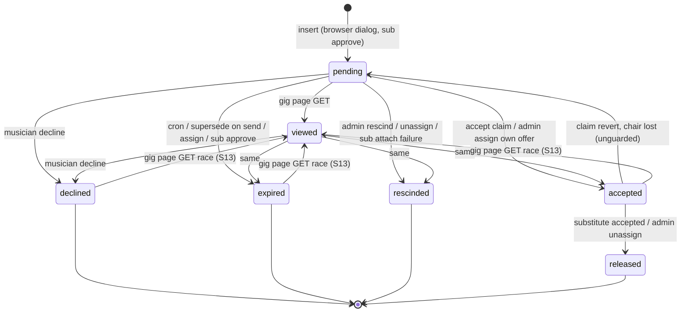

The edges into `viewed` from `accepted`, `declined` and `expired` are bugs. The same race can hit `rescinded` and `released` (`page.tsx:201-207` has no status guard).

| From | To | Initiator | Code | Guard | Side effects | Notifications (template, recipient, logged?) | Idempotent? |
|---|---|---|---|---|---|---|---|
| ∅ | pending | admin UI | `send-offer-dialog.tsx:526-530` | RLS admin (`001:353-361`). Client dup check `:486-512` is check-then-insert. No check of the position's state | position → `offered` (`:539-547`); then `send-email` supersedes other live offers → `expired` (`send-email:82-95`) | `contract-offer` → musician, logged yes (`contract_offer`); `admin-offer-sent` → admins, logged **no** (`send-email:188-274`). Only if the email toggle is on | ⚠ **no**. Double Send inserts two rows. Toggle off skips the supersede (R-1, R-20, S14, E2) |
| ∅ | pending | admin UI (inline waterfall) | `project-offers.tsx:267-279` | same as above | position → `offered` with no guard (`:283-286`) | via `send-email` | ⚠ no. Dead path in practice (C §3.1) |
| ∅ | pending | admin route (sub approve) | `approve:216-227` | request claimed `pending_approval → approved` (`approve:91-108`) | substitute's own prior live offers → `expired` (`:202-213`); request gets `offer_id`, `substitute_musician_id` (`:237-261`) | `sub-request-approved` → original, yes; `contract-offer` → substitute, yes; `admin-offer-sent` → admins, **no** | yes, conditional update on the request |
| pending | viewed | musician token | `page.tsx:194-213` | ⚠ read-time `status==='pending'` only; write is `WHERE id=?` (`:201-207`) | `viewed_at = now` | none | ⚠ no. Can overwrite any terminal status (S13, R-3) |
| pending / viewed | accepted | musician token | `respond.ts:79-84` via `accept:24-248` | `status IN (pending,viewed)`; app-level `expires_at` check (`accept:59-61`). ⚠ No check of project status, `is_active` or position status (`accept:64-66`) | chair claim (`respond.ts:89-98`). Sub branch: request → `filled` (`accept:114-117`), original → `released` (`:125-130`) | `offer-accepted` → musician, yes; `admin-offer-response` (accepted) → admins, **no**; sub: `musician-released` → original, yes (`respond.ts:199-244`) | yes, conditional update. ⚠ Two-step claim is not atomic (R-10). Accept on cancelled project succeeds (S8, R-5). Inactive musician can accept (S10, R-9) |
| pending / viewed | accepted | admin route (assign) | `assign:162-171` | `status IN (pending,viewed)`, after the chair claim | none | none (`assign:132`) | yes, but row count not checked |
| accepted | pending | system revert | `respond.ts:105-108` | ⚠ **none** (`WHERE id=?`) | `responded_at = NULL` | none. Loser sees Accept again (R-11) | ⚠ no. If the revert fails the offer is stuck `accepted` with no chair (S1, R-10) |
| pending / viewed | declined | musician token | `respond.ts:141-152` via `decline:23-200` | `status IN (pending,viewed)` | non-sub: `vacateChair` ⚠ unguarded (`respond.ts:173-176`). Sub: request → `sub_declined` (`decline:113-120`) | `offer-declined` → musician, yes; `admin-offer-response` (declined) → admins, **no**; sub: `sub-declined-find-another` → original, yes | yes for the offer. ⚠ The vacate evicts a seated holder (S7b, R-2, E1, E2) |
| pending / viewed | expired | cron | `expire-offers:86-91` | `status IN (pending,viewed)`; `responded_at` not set | if no other pending/viewed/accepted offer (`:109-115`), vacate ⚠ unguarded (`:117-126`). ⚠ No sub-request handling (R-7) | `offer-expired` → all admins, logged once to `adminEmails[0]` (`:150-185`). Musician: **none**. Names the just-expired musician as "next" (R-6, E4) | yes for the offer. ⚠ Vacate is check-then-act (S6, R-4) |
| pending / viewed | expired | admin route (supersede on send) | `send-email:82-95` | `status IN (pending,viewed) AND id<>?`; service-role client | none | none to the superseded musician (C App. C) | yes (re-run is harmless), row count not checked. ⚠ No role check (S15, R-15). Runs before the send; a failed send leaves no live offer (S12, R-14) |
| pending / viewed | expired | admin route (assign) | `assign:173-182` | same | none | none (S5) | yes, row count not checked |
| pending / viewed | expired | admin route (sub approve retry) | `approve:202-213` | same, scoped to the substitute | none | none | yes |
| pending / viewed | rescinded | admin route (rescind) | `rescind-offer:113-122` | `status IN (pending,viewed)`; 0 rows → 409. ⚠ Offer found by position with `.single()` (`:75-91`) | non-sub: position → `vacant` guarded `musician_id IS NULL` (`:143-156`). Sub: request → `sub_declined` (`:159-165`) | `offer-rescinded` → musician, yes; `admin-offer-response` (rescinded) → admins, **no**; sub: `sub-declined-find-another` → original, yes (`:195-297`) | yes. ⚠ Two live offers make both un-rescindable (R-13) |
| pending / viewed | rescinded | admin route (unassign) | `unassign:112-120` | `status IN (pending,viewed)` | see unassign row in §1.2 | ⚠ none to the pending musician; only the seated one is told (C §3.1) | yes |
| pending / viewed | rescinded | admin route (sub attach failure) | `approve:251-255` | `status IN (pending,viewed)` | request released to `pending_approval` | none | yes |
| accepted | released | musician token (substitute accepts) | `accept:125-130` | `status='accepted' AND musician_id=<original>` | none beyond the claim | `musician-released` → original, yes | yes, row count not checked |
| accepted | released | admin route (unassign) | `unassign:102-110` | `status='accepted'` | chair vacated (§1.2) | `position-unassigned` → musician, yes; inline HTML → admins, yes per recipient (`unassign:141-203`) | yes |
| any | (row deleted) | FK cascade | position delete `001:129`; musician delete `001:130`; project delete via positions | none | `email_logs.offer_id` → NULL (`038:11`) | ⚠ none (S8b, S9, R-8) | n/a. History destroyed |

Non-status columns written on offers:

| Column | Writer | Guard | Idempotent? |
|---|---|---|---|
| `reminder_sent_at` | `offer-reminders:94-110` (cron) | `reminder_sent_at IS NULL` (claim before send) | yes. At-most-once; a failed send is not retried (A §7.2) |
| (none) | manual `send-reminder` | `status` only (`send-reminder:62`), ignores `expires_at` | no latch. Can remind on a lapsed offer (C §3.1) |

## 1.2 Requirement and Assignment (conflated): `project_positions.status` + `musician_id`

Allowed values: `vacant, offered, confirmed, declined` (`001:120`). Default `'vacant'`. The real "who sits here" signal is `musician_id` (C §3.2). No unique `(project_id, instrument_id, chair_number)` (`001:114-124`, R-22).

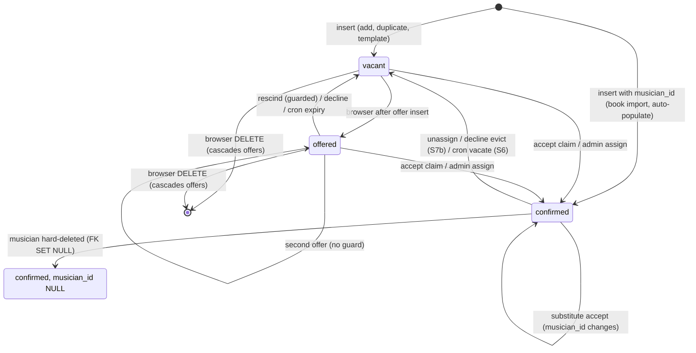

`declined` is in the CHECK but is never written (C §3.2, B §B.2). It is still read by `openChairIds` (`projects-client.tsx:177`) and typed by the staffing alert (`send.ts:1166`).

| From | To | Initiator | Code | Guard | Side effects | Notifications | Idempotent? |
|---|---|---|---|---|---|---|---|
| ∅ | vacant | admin UI | `add-position-dialog.tsx:192,243,312`; `project-positions.tsx:438-452`; `projects-client.tsx:559,598,637` | RLS only | none | none | ⚠ no. No unique chair key (R-22) |
| ∅ | confirmed (+musician_id) | admin UI (book import) | `import-from-book-dialog.tsx:63-85` | RLS only | none. ⚠ No offer, no log, no conflict check (C §8.2) | none | ⚠ no. `23505` handler is unreachable (C §1 step 1) |
| ∅ | confirmed (+musician_id) | admin route (auto-populate PUT) | `auto-populate/route.ts:200-244` | auth + RLS, no role check | none | none | ⚠ no (no UI caller) |
| vacant | offered | admin UI | `send-offer-dialog.tsx:539-547` | `status <> 'confirmed'` | none | (see offer) | yes. Failure only `console.error` |
| any | offered | admin UI (inline waterfall) | `project-offers.tsx:283-286` | ⚠ none | none | (see offer) | dead path |
| vacant / offered | confirmed (+musician_id) | musician token | `respond.ts:89-98` | `musician_id IS NULL` (or `= original` for subs), row count checked | offer reverted on 0 rows (`:105-108`) | (see offer) | yes, conditional update. ⚠ Not in one transaction with the offer write (R-10) |
| vacant / offered | confirmed (+musician_id) | admin route (assign) | `assign:134-154` | `musician_id IS NULL`, row count → 409 | own offer → `accepted`, others → `expired` (`:162-182`) | ⚠ none at all (`assign:132`, S5) | yes. ⚠ No conflict check (C §1 step 6e) |
| confirmed | confirmed (new musician_id) | musician token (substitute accepts) | `respond.ts:94-96` | `musician_id = requesting_musician_id` | request → `filled`; original → `released` | (see offer) | yes |
| any | vacant (musician_id NULL) | musician token (decline) | `respond.ts:173-176` | ⚠ **none** | none | (see offer) | ⚠ no. Evicts a holder (S7b, R-2) |
| any | vacant (musician_id NULL) | cron | `expire-offers:117-126` | ⚠ read "no other live offer" (`:109-115`), then unguarded write | none | (see offer) | ⚠ check-then-act (S6, R-4) |
| offered | vacant | admin route (rescind) | `rescind-offer:143-156` | `musician_id IS NULL` | none | (see offer) | yes |
| confirmed | vacant (musician_id NULL) | admin route (unassign) | `unassign:122-132` | none (intended) | accepted → `released`, live → `rescinded` (`:102-120`). ⚠ Sub requests left dangling (R-25) | `position-unassigned` → musician, yes; inline HTML → admins, yes | yes (absolute assignment) |
| confirmed | confirmed with musician_id NULL | FK cascade (musician hard-deleted) | `001:119` (`ON DELETE SET NULL`) | none | musician's offers deleted (`001:130`) | none | ⚠ leaves a "confirmed" chair with nobody. Staffing alerts count it filled (`staffing-alerts:101-103`) (S10b, R-9) |
| vacant / offered | (row deleted) | admin UI | `project-positions.tsx:342-356` (single), `:367-378` (clear all) | ⚠ UI-only check on stale state | cascades `contract_offers`, `substitution_requests` (`001:129,145`); `payments.project_position_id` → NULL (`013:9`) | ⚠ none | ⚠ no (S9, R-8) |
| any | (row deleted) | FK cascade (project delete) | `delete-project-dialog.tsx:72-94` | only when no payments | as above | ⚠ none | n/a (S8b) |

## 1.3 Substitution request: `substitution_requests.status`

Allowed values: `pending_approval, approved, declined, sub_declined, filled, cancelled` (`026:13-15`).

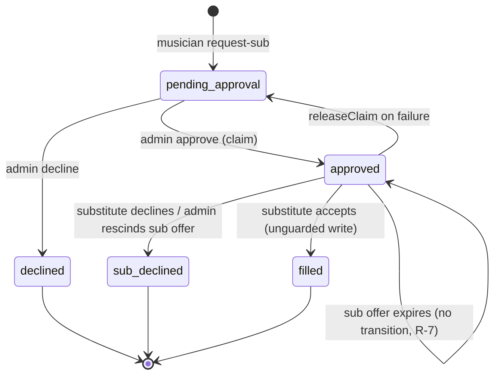

| From | To | Initiator | Code | Guard | Side effects | Notifications | Idempotent? |
|---|---|---|---|---|---|---|---|
| ∅ | pending_approval | musician token | `request-sub:127-141` | offer `accepted` (`:71-76`); plan gate (`:92-98`); dup check `:104-117` | none | `admin-sub-request` → admins, **no** (`:174-200`) | ⚠ check-then-insert, no unique index (R-22) |
| pending_approval | approved | admin route | `approve:91-108` | `status='pending_approval'`, row count. ⚠ Does not check that the requester still holds the chair or that no other request is approved (S11) | find/create substitute (`:142-188`); expire substitute's prior offers; insert sub offer; attach `offer_id` | `sub-request-approved` → original, yes; `contract-offer` → substitute, yes; `admin-offer-sent` → admins, no | yes, conditional update |
| approved | pending_approval | system revert | `approve:115-125` | `status='approved'` | sub offer → `rescinded` if attached (`:251-255`) | none | yes. Up to 8 sequential writes, only some compensated (A §7.6) |
| pending_approval | declined | admin route | `sub-decline:91-111` | `status='pending_approval'`, row count | `admin_notes` | `sub-request-declined` → original, **no** (`:139-160`) | yes |
| approved | filled | musician token (substitute accepts) | `accept:114-117` | ⚠ `id` only | (see offer) | `musician-released` → original, yes | relies on the upstream offer claim |
| approved | sub_declined | musician token (substitute declines) | `decline:113-120` | ⚠ `id` only | none | `sub-declined-find-another` → original, yes | relies on the upstream offer claim |
| approved | sub_declined | admin route (rescind sub offer) | `rescind-offer:159-165` | ⚠ `id` only | none | same | relies on the upstream offer claim |
| approved | approved (stuck) | cron (sub offer expires) | `expire-offers:105-126` (no sub branch) | n/a | none | ⚠ original: none; admins get a generic "next candidate" email (E3) | ⚠ original is locked out of a new request (R-7) |
| pending_approval / approved | (unchanged) | admin route (unassign) | `unassign:86-132` | n/a | sub offer rescinded, request untouched | none | ⚠ dangling (R-25) |
| any | (row deleted) | admin UI | `sub-requests.tsx:116` (B §B.2) | RLS | none | none | n/a |
| any | (row deleted) | FK cascade | position delete `001:145`; requesting musician delete `001:146` | none | none | none | n/a |

`cancelled` is never written (B §B.2). The column default `'pending'` violates the CHECK (B §12, B §B.8 hazard 1). An insert that omits `status` fails. App code always sets `pending_approval` (`request-sub:134`).

## 1.4 Event: `projects.status`

Allowed values: `draft, active, completed, cancelled` (`001`, zod `src/lib/validations/projects.ts:3`). DB default `'draft'` (B §8).

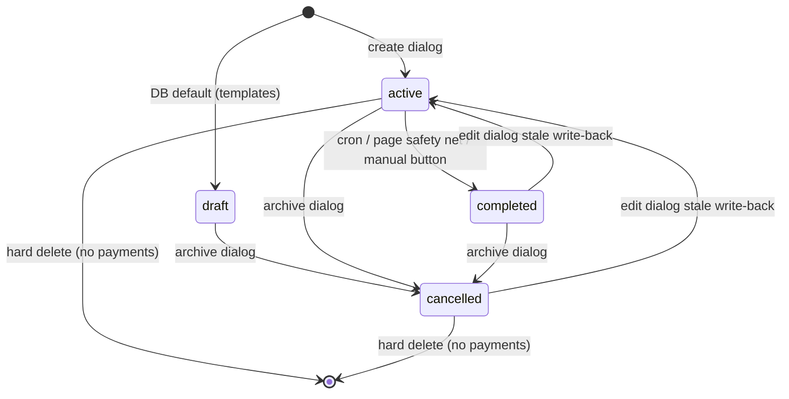

| From | To | Initiator | Code | Guard | Side effects | Notifications | Idempotent? |
|---|---|---|---|---|---|---|---|
| ∅ | active | admin UI | `project-form-dialog.tsx:177,237` | `trg_enforce_project_limit` (080) | none | none | no |
| active | completed | cron | `complete-projects:38-47` | `status='active'` + `isReadyToComplete` (`src/lib/projects/archive.ts`) | ⚠ none. Live offers stay live; "No expiration" offers live forever (R-21) | none | yes, conditional bulk update |
| active | completed | admin page load (safety net) | `src/app/dashboard/projects/page.tsx:79-84` | `status='active'` + org | same | none | yes |
| any | completed | admin UI (button) | `projects-client.tsx:469-474` (verified) | ⚠ `id` only | same | none | yes (absolute) |
| any | cancelled | admin UI ("Archive") | `delete-project-dialog.tsx:102-105` | ⚠ `id` only | ⚠ **none**: offers stay live, reminders continue, accept still books (S8, R-5, E5) | ⚠ none | yes (absolute) |
| any | loaded value | admin UI (edit dialog) | `project-form-dialog.tsx:441-449` writes `status: data.status`, seeded from `project.status` at `:202` (verified) | ⚠ `id` only | can silently undo a concurrent cron completion or archive | none | ⚠ no (stale write-back; not in the audit reports) |
| any | (row deleted) | admin UI | `delete-project-dialog.tsx:72-94` | no payments | cascades positions, offers, sub requests | ⚠ none (S8b) | n/a |

`cancelled` doubles as "archived because it has payments". A real cancellation and an archive are indistinguishable (B §B.8). The UI's "Archived" view is `status IN ('completed','cancelled')` (`projects-client.tsx:404`). Only `staffing-alerts` filters on `status='active'` (`staffing-alerts:56`). `offer-reminders` (`:22-65`) and `expire-offers` (`:21-51`) do not filter on project status.

## 1.5 Payment: `payments.status` and `payment_type`

`status` CHECK `unpaid, pending, paid`, default `'unpaid'`, **nullable** (`013`, B §16). `payment_type` NOT NULL default `standard`, CHECK `standard, adjustment, correction, bonus` (`027`). Partial unique `payments_standard_unique (service_id, musician_id, is_leader_fee) WHERE payment_type='standard'` (`027`). FKs to musicians and services are RESTRICT (`062`).

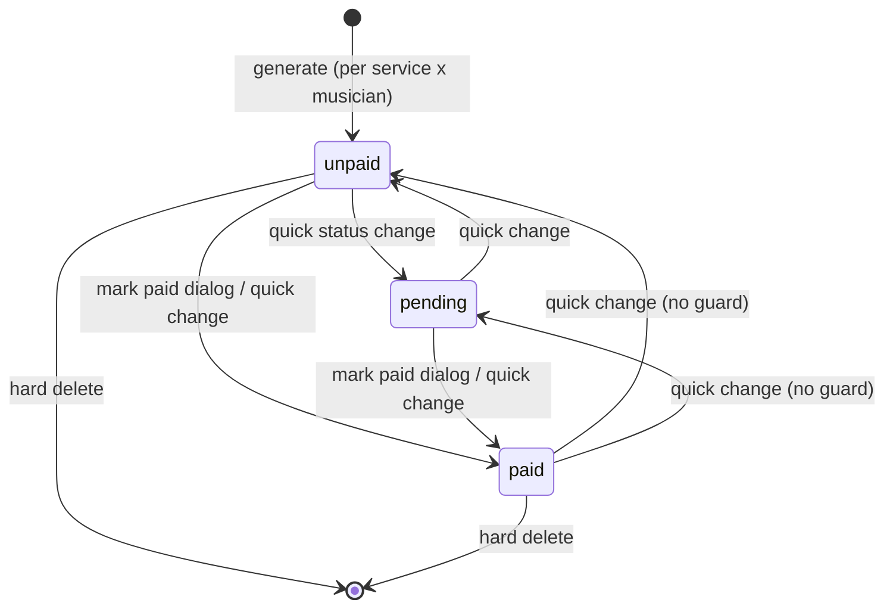

| From | To | Initiator | Code | Guard | Side effects | Notifications | Idempotent? |
|---|---|---|---|---|---|---|---|
| ∅ | unpaid | admin route | `src/app/api/payments/generate/route.ts:100-108` | positions `status='confirmed'` (`:39`); app-level existing-key filter (`:120-152`) | none | none | yes, partial unique index on standard rows |
| any | paid | admin UI → admin route | `src/components/payments/payment-status-dialog.tsx:48` → `src/app/api/payments/bulk-update/route.ts:52-56` | ⚠ `id IN (...)` + org check; no from-state guard | `payment_date` defaults to today (`:47-49`). `paid_by` (`050`) is not written by this path (verified) | none | yes (absolute assignment) |
| any | any | admin UI → admin route | `src/components/payments/payments-client.tsx:225-232` → `bulk-update` | ⚠ none on from-state | none | none | yes (absolute) |
| any | (row deleted) | admin UI | `payments-client.tsx:212` | ⚠ RLS admin only | none | none | n/a. Tax records can be hard-deleted (B §B.8) |

## 1.6 Pre-gig reminder: `pre_gig_reminders.status`

CHECK `draft, sent, expired` (`053`). `UNIQUE(project_id, trigger_date)` (`053:13`).

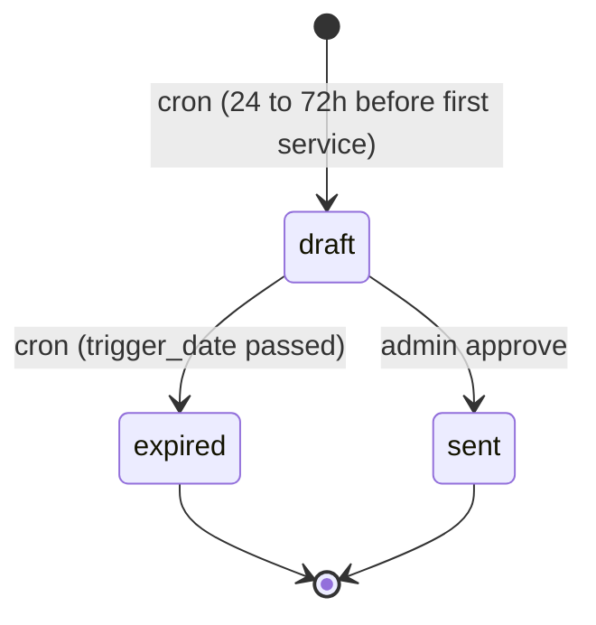

| From | To | Initiator | Code | Guard | Side effects | Notifications | Idempotent? |
|---|---|---|---|---|---|---|---|
| ∅ | draft | cron | `pre-gig cron:122-131` (verified) | active projects (`:75`) with confirmed musicians (`:107`) | none | `pre_gig_notification` → admins, logged yes (`:168-188`) | yes, unique index (A §7.2) |
| draft | expired | cron | `pre-gig cron:24-31` (verified) | `status='draft' AND trigger_date < now` | none | none | yes, conditional update |
| draft | sent | admin route | `src/app/api/pre-gig-reminders/[reminderId]/approve/route.ts:33` (read check), `:62-68` (send), `:73-80` (write) (verified) | ⚠ read-time `status==='draft'`; write is `WHERE id=?` | `approved_by`, `sent_at`, `musician_count` | gig details → each confirmed musician, logged yes (`gig_details`, `src/lib/send-gig-details.ts:234-239`) | ⚠ check-then-act. Two concurrent approvals send twice. The route itself warns about re-approval when the mark fails (`:83-85`) |

## 1.7 State inferred from other columns ("boolean soup")

| Case | What it means today | Evidence | Problem |
|---|---|---|---|
| `expires_at` as hidden status | `pending/viewed` with `expires_at < now()` is "expired" for some readers and "live" for others | Time-aware: `accept:59`, `decline:58`, `gig-page-client.tsx:100,440`, `project-offers.tsx:404-418,470-472`, `projects-client.tsx:178-179`, `next-candidate.ts:88-90`, `schedule-conflict.ts:142-147`. Status-only: `rescind-offer:86`, `unassign:116`, `assign:121`, `send-email:89`, `send-reminder:62`, `send-offer-dialog.tsx:504` | Two definitions of "live". Cron lag up to about 60 min (R-21) |
| `reminder_sent_at` latch | "auto reminder already sent" and also the cron claim token | `040:2`; `offer-reminders:94-110` | Manual reminders do not set it. At-most-once with no retry |
| `viewed_at` | redundant with `viewed`; after accept it is the only trace that the offer was seen | C §3.1 | `viewed` itself is lost on accept |
| `responded_at` overload | musician answered, admin withdrew, or superseded; not set on cron expiry; nulled on revert | `respond.ts:105-108`; `expire-offers:86-91`; C §3.1 | Cannot tell "replaced" from "timed out" |
| `response_notes` overload | musician decline reason (portal, gone) or admin rescind reason | `rescind-offer:118`; C §3.1 | Author is ambiguous |
| Inferred substitution link | an offer is a "sub offer" only while `substitution_requests.offer_id = offer.id AND status='approved'` | `accept:80-92` | After `filled` or `sub_declined` the offer cannot be identified as a sub offer from its own row |
| `project_positions.status='declined'` | never written; read as "open" | `001:120`; `projects-client.tsx:177`; `send.ts:1166` | Dead value in a live predicate |
| `project_positions.status='offered'` | advisory; never cleared by supersede | C §3.2 | Real "open chair" test combines status and live offers (`projects-client.tsx:173-181`) |
| `substitution_requests.status='cancelled'` | never written; admins hard-delete instead | B §B.2; `sub-requests.tsx:116` | Unassign leaves requests dangling (R-25) |
| `substitution_requests.status` default `'pending'` | violates its own CHECK | B §12 | Latent insert failure |
| `projects.status='cancelled'` | real cancellation **or** "archived because it has payments" | B §B.8 | Indistinguishable |
| `payments.status` NULL | allowed by the schema | B §16 | Undefined state |

## 1.8 Invariants that SHOULD hold but are not enforced by the database

| # | Invariant | Enforced today by | Where it can be violated | Probe |
|---|---|---|---|---|
| I1 | At most one live (pending/viewed) non-sub offer per position | app code only: `send-email:82-95` supersede | email toggle off (E2); send failure before supersede (S12); inline waterfall; direct RLS writes (R-1, R-20, S14) | D1 |
| I2 | At most one accepted offer per position | app code: chair claim `respond.ts:89-98` | revert failure (R-10); viewed overwrite (S13); assign marks own offer accepted outside a transaction; sub release happens after the claim (C §5.1) | D2 |
| I3 | `status='confirmed'` ⇔ `musician_id IS NOT NULL` | nothing | musician hard-delete (`001:119`, S10b); any client RLS write | D4, D5 |
| I4 | An accepted offer's musician is the seated musician | app code: claim | decline evict (R-2), viewed overwrite then cron vacate (R-3), cron vacate race (R-4), crash mid-claim (R-10) | D3 |
| I5 | No live offers on cancelled or completed projects | nothing | archive and complete have no side effects (S8, R-5, R-21) | D6, D12 |
| I6 | No accepted offers created after the project is cancelled | nothing | accept route never reads `projects.status` (E5) | D7 |
| I7 | `approved` sub request ⇔ a live sub offer exists | app code partly | sub offer expiry (R-7, E3); unassign (R-25); concurrent approvals (S11) | D8 |
| I8 | At most one open sub request per (position, requester) | check-then-insert `request-sub:104-117` | concurrent requests (R-22) | none |
| I9 | One row per (project, instrument, chair_number) | nothing | any insert path (R-22) | none |
| I10 | Live offers are held by active musicians | nothing | deactivation has no side effects (S10, R-9) | D9 |
| I11 | A musician is seated at most once per project | app code: `assign:92-106`; client dup check | book import, auto-populate | none |
| I12 | `viewed` never follows a response | nothing | `page.tsx:201-207` (R-3) | D11 |
| I13 | A position with a live offer is not deleted | UI-only stale check | `project-positions.tsx:342-378` (R-8, S9) | none |
| I14 | Offer history survives | nothing | FK CASCADE from positions and musicians (`001:129,130`) | none |
| I15 | Every live offer was delivered | nothing | send failure leaves no `email_logs` row (S12, R-14) | D10 |

---

# Part 2. Target state machines (PROPOSAL, not current behaviour)

Everything below is proposed. It keeps the quartet product's observable behaviour identical by default. New behaviour sits behind flags or only fixes the ⚠ items above.

## 2.0 Ground rules

### 2.0.1 Fixed decisions

- Database nouns are not renamed. `project_positions` stays the unit of offer and payment. `contract_offers` stays the offer table.
- New tables are added alongside: `staffing_events` (first), then `assignments`, then `requirements` with quantity and `position_services` scope (later; out of scope for the machines below except where noted).
- New columns are additive and nullable or defaulted. No existing value changes meaning.

### 2.0.2 The `staffing_events` log

One append-only row per state transition, written **in the same transaction** as the transition.

| Column | Type | Notes |
|---|---|---|
| `id` | uuid pk | |
| `organization_id` | uuid not null | tenant key, RLS member SELECT, no UPDATE or DELETE grants |
| `occurred_at` | timestamptz default now() | |
| `entity_type` | text | `offer`, `requirement`, `assignment`, `substitution`, `event`, `payment` |
| `entity_id` | uuid | plain uuid, **no FK** so the log survives any delete |
| `project_id`, `project_position_id`, `offer_id` | uuid null | denormalized for querying, no FK |
| `action` | text | e.g. `offer.created`, `offer.superseded`, `requirement.cancelled` |
| `actor_type` | text | `admin`, `worker`, `cron`, `webhook`, `system` |
| `actor_user_id`, `actor_musician_id` | uuid null | who |
| `from_state`, `to_state` | text null | before and after |
| `reason` | text null | e.g. `chair_taken`, `replaced_by_offer`, `project_cancelled` |
| `correlation_id` | uuid | groups all rows written by one operation |
| `idempotency_key` | text null | `UNIQUE WHERE idempotency_key IS NOT NULL` |
| `payload` | jsonb | terms snapshot, candidate rank snapshot, triggering offer id |

Completeness during the compatibility period: an `AFTER UPDATE OF status` / `AFTER UPDATE OF musician_id` / `AFTER INSERT` trigger on `contract_offers`, `project_positions`, `substitution_requests` and `projects` writes a row when the RPC did not already write one. RPCs set `app.actor_type`, `app.actor_id` and `app.correlation_id` with `set_config(..., true)` so the trigger can attribute browser and legacy writes as `actor_type='admin'` with `auth.uid()`.

### 2.0.3 One liveness predicate

```sql
-- the only definition of "live offer"; used by every reader and RPC
create function is_live_offer(o contract_offers) returns boolean
language sql stable as $$
  select o.status in ('pending','viewed')
     and (o.expires_at is null or o.expires_at > now())
$$;
```

TypeScript mirrors it as `isLiveOffer(offer, now)` in one module. All nine readers in §1.7 switch to it. Partial unique indexes cannot use `now()`, so they key on `status IN ('pending','viewed')` only. Every RPC that creates or claims an offer first expires lapsed offers on the same position inside its transaction (§2.1, T-O6b). That keeps the index and the predicate in agreement.

### 2.0.4 RPCs

| RPC | Replaces | Machines touched |
|---|---|---|
| `create_offer(position_id, musician_id, terms, expires_at, idempotency_key)` | browser insert + `send-email` supersede | Offer, Requirement |
| `claim_chair(offer_token)` | `claimChairForAccept` | Offer, Requirement, Assignment, Substitution |
| `respond_decline(offer_token, notes)` | `markOfferDeclined` + `vacateChair` | Offer, Requirement, Substitution |
| `rescind_offer(offer_id, reason)` | `rescind-offer` (keyed by offer, fixes R-13) | Offer, Requirement, Substitution |
| `expire_offer(offer_id)` | cron per-offer block | Offer, Requirement, Substitution |
| `assign_direct(position_id, musician_id, source)` | `assign`, book import, auto-populate | Requirement, Assignment, Offer |
| `unassign(position_id, reason)` | `unassign` | Requirement, Assignment, Offer, Substitution |
| `cancel_position(position_id, reason)` | browser DELETE | all |
| `cancel_project(project_id, reason)` | browser `status='cancelled'` | all |
| `approve_substitution(request_id, substitute)` | `approve` (8 sequential writes) | Substitution, Offer |

Routes become thin: auth, call the RPC, then send emails from the RPC's returned list of notifications. Emails go out after commit. Every send, including failures, is written to `email_logs` (a `status='failed'` value needs no schema change; `email_logs.status` has no CHECK, B §B.2). The admin emails that are unlogged today (C §8.2) become logged.

### 2.0.5 Flags

| Flag | Scope | Default | Effect |
|---|---|---|---|
| `auto_cascade` | org (`organizations.auto_cascade_enabled boolean default false`) and requirement (`project_positions.cascade_policy text default 'manual'`) | off, `manual` | §2.7 |
| `notify_superseded` | org | off | sends an email on supersede (today: none) |

## 2.1 Offer (target)

States: `pending`, `viewed`, `accepted`, `declined`, `expired`, `superseded` (new), `rescinded`, `released`.

- Live: `pending`, `viewed`, and only when `is_live_offer()` is true.
- Terminal: `declined`, `expired`, `superseded`, `rescinded`, `released`. No transition leaves a terminal state.
- `expired` means "timed out" only. `superseded` means "replaced by another offer, a direct assign, or a lost chair race".

New additive columns: `contract_offers.substitution_request_id uuid null` (FK RESTRICT; replaces the inferred link of §1.7), `created_by uuid null`, `terms_snapshot jsonb null`.

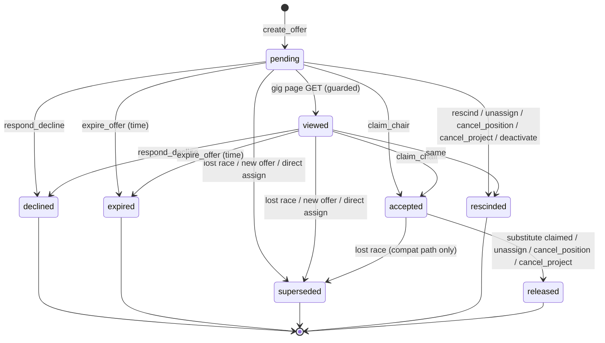

| Id | From → To | Initiator | Guard | Side effects | Notifications | Idempotency | `staffing_events` row |
|---|---|---|---|---|---|---|---|
| T-O1 | ∅ → pending | admin route; system (auto cascade); admin route (sub approval) | project `status IN ('draft','active')`; requirement `status IN ('vacant','offered')` and `musician_id IS NULL` (non-sub); musician `is_active` and same org; musician not seated and not holding a live offer on this project | lapsed offers on the position → `expired` (T-O6b); live non-sub offers → `superseded` (T-O7a); requirement → `offered` | `contract-offer` → worker (logged); `admin-offer-sent` → admins (logged) | RPC transaction; unique `idempotency_key` (dialog generates a uuid when it opens, so a double click returns the first offer); partial unique index U-O1 | `offer.created`, actor admin or system, null → pending, payload: terms snapshot, candidate rank and source (`next_in_line`, `someone_else`, `follow_up`, `auto_cascade`, `sub_approval`) |
| T-O2 | pending → viewed | worker token | `status='pending'` (fixes R-3) and viewer is not org staff | `viewed_at = now` | none | conditional update; 0 rows is a no-op | `offer.viewed`, actor worker, pending → viewed (first view only) |
| T-O3 | pending/viewed → accepted | worker token via `claim_chair` | offer row `FOR UPDATE`; `is_live_offer`; project `IN ('draft','active')`; musician `is_active`; requirement not `cancelled`; chair `musician_id IS NULL` (or `= original` for a sub offer) | requirement → `confirmed` + `musician_id`; assignment row `confirmed` (T-A1); other live non-sub offers → `superseded`. Sub: original's accepted offer → `released` **first**, then this offer → `accepted`; original assignment → `replaced`; request → `filled` | `offer-accepted` → worker; `admin-offer-response` (accepted) → admins (now logged); sub: `musician-released` → original | RPC transaction; conditional update; U-O2. Replay returns `already_responded` with no writes or emails | `offer.accepted`, actor worker, before → accepted |
| T-O4 | pending/viewed → superseded (lost race) | worker token via `claim_chair` | chair already held (by someone other than the original, for a sub offer) | none | none by default; gig page shows "This position has been filled" (fixes R-11, R-12) | RPC transaction | `offer.superseded`, actor worker, reason `chair_taken` |
| T-O4c | accepted → superseded | system (compat only) | used only while the two-step TS claim still exists; replaces `respond.ts:105-108` | none | as T-O4 | conditional update `WHERE status='accepted'` | `offer.superseded`, actor system, reason `chair_taken` |
| T-O5 | pending/viewed → declined | worker token via `respond_decline` | `status IN ('pending','viewed')` | requirement → `vacant` only `WHERE musician_id IS NULL` and no other live offer (fixes R-2). Sub: request → `sub_declined` | `offer-declined` → worker; `admin-offer-response` (declined) → admins (logged); sub: `sub-declined-find-another` → original | conditional update | `offer.declined`, actor worker; triggers §2.7 when auto |
| T-O6 | pending/viewed → expired | cron via `expire_offer` | `status IN ('pending','viewed') AND expires_at <= now()`; project filter not needed (cancel and complete retire offers) | requirement → `vacant` guarded as T-O5 (fixes R-4). Sub: request → `expired` (T-S5) | `offer-expired` → admins (logged); musician: none (unchanged); "next candidate" excludes this musician (R-6) | conditional update; `responded_at` stays NULL (unchanged) | `offer.expired`, actor cron; triggers §2.7 when auto |
| T-O6b | pending/viewed → expired (lazy) | system, inside any RPC on the same position | `NOT is_live_offer()` and status live | as T-O6 minus emails; the hourly cron still sends the admin email for it once | none in the RPC; cron sends | conditional update | `offer.expired`, actor system, reason `lapsed_on_access` |
| T-O7a | pending/viewed → superseded | admin route (`create_offer`) or system (auto) | another live non-sub offer on the same position | none | none by default (unchanged); `notify_superseded` flag sends one | conditional update inside the RPC | `offer.superseded`, reason `replaced_by_offer`, payload `new_offer_id` |
| T-O7b | pending/viewed → superseded | admin route (`assign_direct`) | live offer of another musician on the position | own live offer → `accepted` instead (T-O3 side path) | as T-O7a | as T-O7a | `offer.superseded`, reason `direct_assign` |
| T-O7c | pending/viewed → superseded | admin route (`approve_substitution` retry) | substitute's own prior live sub offer on the position | none | none | as T-O7a | `offer.superseded`, reason `sub_reapproved` |
| T-O8 | pending/viewed → rescinded | admin route (`rescind_offer` by offer id, `unassign`, `cancel_position`, `cancel_project`, musician deactivation) | `status IN ('pending','viewed')` | requirement → `vacant` guarded `musician_id IS NULL`. Sub: request → `sub_declined` (rescind) or `cancelled` (unassign, cancel) | `offer-rescinded` → worker (now also on unassign, fixing C §3.1); `admin-offer-response` (rescinded) → admins on direct rescind; sub: `sub-declined-find-another` → original on rescind only | conditional update; keyed by offer id (fixes R-13) | `offer.rescinded`, actor admin, reason `admin`, `unassign`, `position_cancelled`, `project_cancelled`, `musician_deactivated` |
| T-O9 | accepted → released | worker token (`claim_chair` for sub); admin route (`unassign`, `cancel_position`, `cancel_project`) | `status='accepted'` and musician is the seated one | assignment → `replaced` or `cancelled` | `musician-released` (sub) or `position-unassigned` (unassign) or `project-cancelled` (new template, logged) → worker | conditional update | `offer.released`, reason `substitute_claimed`, `unassign`, `position_cancelled`, `project_cancelled` |

Offer DB guarantees:

| Id | Guarantee |
|---|---|
| U-O1 | `CREATE UNIQUE INDEX ON contract_offers (project_position_id) WHERE status IN ('pending','viewed') AND substitution_request_id IS NULL` |
| U-O1s | `CREATE UNIQUE INDEX ON contract_offers (project_position_id) WHERE status IN ('pending','viewed') AND substitution_request_id IS NOT NULL` (one live sub offer per chair) |
| U-O2 | `CREATE UNIQUE INDEX ON contract_offers (project_position_id) WHERE status = 'accepted'`. The substitution caveat of C §5.1 is solved by ordering inside `claim_chair`: release the original (`accepted → released`) before accepting the sub offer, in one transaction. Non-deferrable unique indexes are checked per statement, so the order matters |
| T-OX | `BEFORE UPDATE OF status` trigger rejects any update whose `OLD.status` is terminal, and any `→ viewed` from a status other than `pending`. This is the DB backstop for §1.0's "any writer can set any value" |
| FK | `project_position_id` and `musician_id`: CASCADE → **RESTRICT** |
| RLS | revoke admin INSERT and UPDATE on `contract_offers` from the browser role after the RPCs ship (R-20); keep SELECT |

## 2.2 Requirement: `project_positions` (target)

States: `vacant`, `offered`, `confirmed`, `cancelled` (new). `declined` stays in the CHECK for compatibility. It is never written (as today) and is dropped only after a probe shows zero rows.

`offered` is maintained by the RPCs: set by `create_offer`, cleared to `vacant` when the last live non-sub offer leaves and the chair is empty. Readers that need precision still use `is_live_offer()`.

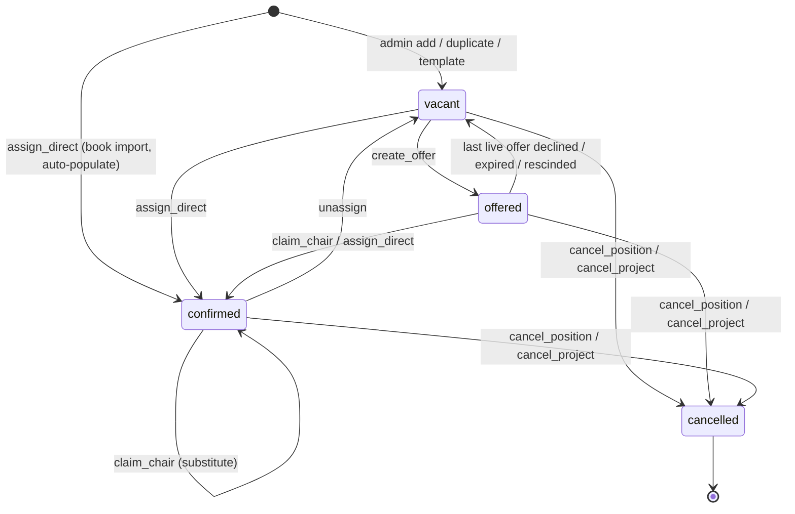

| Id | From → To | Initiator | Guard | Side effects | Notifications | Idempotency | `staffing_events` row |
|---|---|---|---|---|---|---|---|
| T-R1 | ∅ → vacant | admin route (or admin UI during compat) | project `IN ('draft','active')`; unique chair key U-R2 | none | none | U-R2 | `requirement.created` |
| T-R2 | ∅ → confirmed | admin route via `assign_direct(source='book_import')` | as T-R1, plus musician active, not seated on project | assignment `confirmed`, source `book_import` | none (unchanged) | RPC + U-R2 + U-A1 | `requirement.created` then `requirement.confirmed` |
| T-R3 | vacant → offered | admin or system via `create_offer` | `musician_id IS NULL` | (see T-O1) | (see T-O1) | RPC | `requirement.offered` |
| T-R4 | offered → vacant | worker, cron or admin via T-O5, T-O6, T-O8 | `musician_id IS NULL` and no other live non-sub offer | none | (see offer) | conditional update | `requirement.vacated`, reason from the offer |
| T-R5 | vacant/offered → confirmed | worker (`claim_chair`) or admin (`assign_direct`) | `musician_id IS NULL`, status not `cancelled` | assignment row; other live offers superseded | (see T-O3; direct assign sends none, unchanged) | RPC + CHECK C-R1 + U-O2 | `requirement.confirmed`, payload source |
| T-R6 | confirmed → confirmed | worker (`claim_chair`, sub) | `musician_id = requesting_musician_id` | see T-O3 sub branch | (see T-O3) | RPC | `requirement.reassigned`, before and after musician |
| T-R7 | confirmed → vacant | admin route (`unassign`) | owner/admin | accepted → `released`; live → `rescinded`; assignment → `cancelled`; open sub requests → `cancelled` (T-S6, fixes R-25) | `position-unassigned` → worker; admin email (logged); `offer-rescinded` → any pending holder | RPC | `requirement.vacated`, reason `unassign` |
| T-R8 | any non-cancelled → cancelled | admin route (`cancel_position`) or `cancel_project` | owner/admin | live offers → `rescinded`; accepted → `released`; assignment → `cancelled`; open sub requests → `cancelled`; `musician_id = NULL` | `offer-rescinded` → each live holder; `position-unassigned` → seated worker (or `project-cancelled` when called by `cancel_project`) | RPC; conditional update `WHERE status <> 'cancelled'` | `requirement.cancelled`, reason |
| T-R9 | (hard delete) | admin route | only when the position has **no** `contract_offers`, `assignments` or `substitution_requests` rows ever (enforced by FK RESTRICT) | none | none | FK | `requirement.deleted` |

Requirement DB guarantees:

| Id | Guarantee |
|---|---|
| C-R1 | `CHECK ((status = 'confirmed') = (musician_id IS NOT NULL))`, added `NOT VALID` after data repair (§2.9.2), then `VALIDATE` |
| C-R2 | CHECK values become `vacant, offered, confirmed, declined, cancelled` |
| U-R2 | `UNIQUE (project_id, instrument_id, chair_number) WHERE status <> 'cancelled'`, after a duplicate probe (B §B.8 hazard 2) |
| FK | `musician_id`: SET NULL → **RESTRICT** (fixes S10b). Musicians with history use `is_active=false` |
| Delete | positions with history use `cancelled`, never DELETE |

## 2.3 Assignment (target, new table)

`assignments` is the seat history. During the compatibility period `project_positions.musician_id` stays the read model. Every write to `musician_id` writes an assignment row in the same transaction (RPC, or the compat trigger for browser writes).

| Column | Notes |
|---|---|
| `id`, `organization_id` | |
| `project_position_id` | FK RESTRICT |
| `musician_id` | FK RESTRICT |
| `status` | `pending`, `confirmed`, `withdrawn`, `cancelled`, `completed`, `replaced` |
| `source` | `offer`, `direct_assign`, `book_import`, `substitution` |
| `offer_id` | FK RESTRICT, null for direct assign and book import |
| `substitution_request_id` | null unless source is `substitution` |
| `started_at`, `ended_at`, `ended_reason` | `ended_*` null while open |
| `created_by` | auth user, null for worker or system |

State meanings:

- `pending`: seat reserved, awaiting worker acknowledgement. Not written by any quartet flow. Reserved for a future "assign with acknowledgement" flow.
- `confirmed`: the worker holds the seat.
- `withdrawn`: the worker left without a substitute. No path writes it today (C §1 step 7: "There is no drop action"). Reserved.
- `cancelled`: an admin removed the worker, or the requirement or event was cancelled.
- `completed`: the event completed with this worker seated.
- `replaced`: a substitute took the seat.

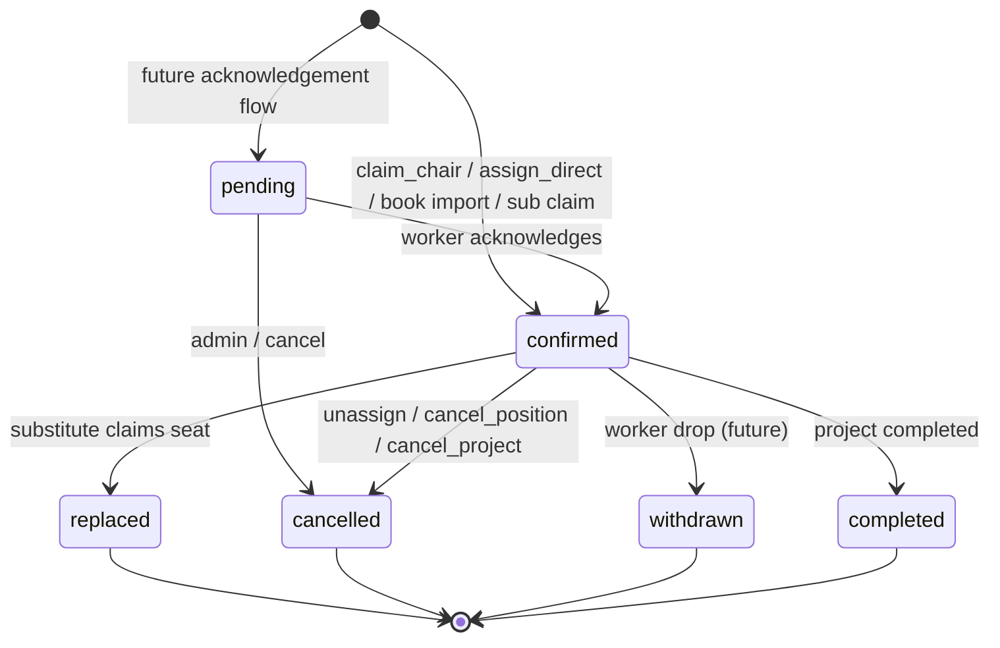

| Id | From → To | Initiator | Guard | Side effects | Notifications | Idempotency | `staffing_events` row |
|---|---|---|---|---|---|---|---|
| T-A1 | ∅ → confirmed (source `offer`) | worker via `claim_chair` | as T-O3 | requirement confirmed | (see T-O3) | U-A1 inside RPC | `assignment.started`, payload `offer_id` |
| T-A2 | ∅ → confirmed (source `direct_assign` / `book_import`) | admin via `assign_direct` | as T-R5 | live offers superseded | none (unchanged) | U-A1 | `assignment.started`, actor admin |
| T-A3 | ∅ → confirmed (source `substitution`) | worker via `claim_chair` (sub) | as T-O3 sub | previous assignment → `replaced` (T-A4) first | (see T-O3) | U-A1; order: end old, then insert new | `assignment.started` |
| T-A4 | confirmed → replaced | worker via `claim_chair` (sub) | open assignment for the original | none | `musician-released` → original | conditional update `WHERE ended_at IS NULL` | `assignment.ended`, reason `substitute_claimed` |
| T-A5 | confirmed → cancelled | admin (`unassign`, `cancel_position`, `cancel_project`) | open | (see T-R7, T-R8) | (see T-R7, T-R8) | conditional update | `assignment.ended`, reason |
| T-A6 | confirmed → completed | cron or admin (`complete_project`) | project → `completed` in the same transaction | none | none | conditional update | `assignment.completed`, actor cron or admin |

DB guarantees: U-A1 `UNIQUE (project_position_id) WHERE status IN ('pending','confirmed')`. CHECK `(ended_at IS NULL) = (status IN ('pending','confirmed'))`.

**"Why did Mike get this job?"** Read Mike's open assignment on the position.

1. `source` and `created_by` say how he was seated (offer, direct assign, book import, substitution) and by whom.
2. `offer_id` links to the offer. Its `offer.created` event holds the terms snapshot and the candidate snapshot: rank, `call_order` at the time, conflict flags, and whether it was picked from "Next in line", typed via "Someone else", a follow-up, or auto cascade.
3. Earlier `staffing_events` on the same `project_position_id` list who was asked before him and how each offer ended (`declined`, `expired`, `superseded`, `rescinded`).
4. For a substitution, `substitution_request_id` links to the original musician's request and their `replaced` assignment.

Today only part of this is answerable, and nothing is answerable for direct assign or book import (C §8.3).

Backfill: one row per currently seated position. If an `accepted` offer for the same musician exists, `source='offer'` and `offer_id` is set. Otherwise the true source (direct assign or book import) cannot be known. Those rows get `source = NULL` with an additive `backfilled boolean default false` set true and a CHECK `source IS NOT NULL OR backfilled`. This avoids guessing.

## 2.4 Substitution request (target)

States: `pending_approval`, `approved`, `declined`, `sub_declined`, `filled`, `expired` (new), `cancelled` (existing value, now written). Default fixed to `'pending_approval'`.

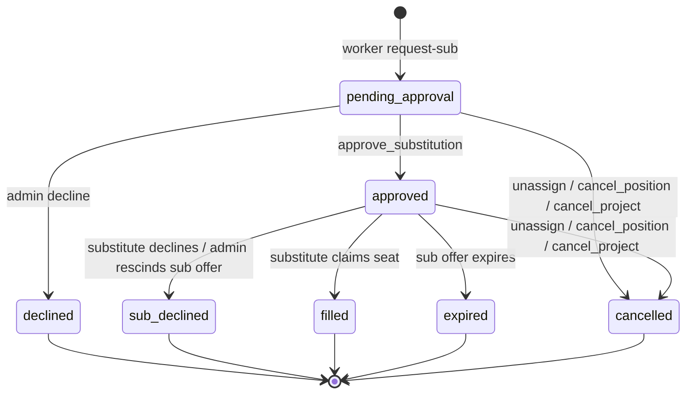

The `approved → pending_approval` revert disappears: `approve_substitution` is one transaction, so a failure rolls back.

| Id | From → To | Initiator | Guard | Side effects | Notifications | Idempotency | `staffing_events` row |
|---|---|---|---|---|---|---|---|
| T-S1 | ∅ → pending_approval | worker token | requester's offer `accepted` and requester holds the seat; plan gate | none | `admin-sub-request` → admins (now logged) | U-S1 | `substitution.requested`, actor worker |
| T-S2 | pending_approval → approved | admin via `approve_substitution` | `status='pending_approval'`; requester still seated; no other `approved` request for the position (fixes S11) | find or create substitute; T-O7c; insert sub offer with `substitution_request_id` (T-O1) | `sub-request-approved` → original; `contract-offer` → substitute; `admin-offer-sent` → admins (all logged) | RPC + conditional update + U-O1s | `substitution.approved`, actor admin |
| T-S3 | pending_approval → declined | admin route | `status='pending_approval'` | none | `sub-request-declined` → original (now logged) | conditional update | `substitution.declined` |
| T-S4 | approved → filled | worker via `claim_chair` | `status='approved'` (was `id` only) | see T-O3 sub | see T-O3 | conditional update in RPC | `substitution.filled` |
| T-S4b | approved → sub_declined | worker (`respond_decline`) or admin (`rescind_offer`) | `status='approved'` | none | `sub-declined-find-another` → original | conditional update in RPC | `substitution.sub_declined` |
| T-S5 | approved → expired | cron via `expire_offer` on the sub offer | `status='approved'` and its offer just expired | none; requester keeps the seat | original: `sub-declined-find-another` with an "expired" variant (logged); admins: a sub-specific expiry email, not the generic "next candidate" one (fixes R-7, E3) | conditional update | `substitution.expired`, actor cron |
| T-S6 | pending_approval/approved → cancelled | admin via `unassign`, `cancel_position`, `cancel_project` | open | live sub offer → `rescinded` (T-O8) | substitute: `offer-rescinded`; original: covered by `position-unassigned` or `project-cancelled` | conditional update | `substitution.cancelled`, reason |

DB guarantees: U-S1 `UNIQUE (project_position_id, requesting_musician_id) WHERE status IN ('pending_approval','approved')` (fixes R-22). Because `expired`, `sub_declined` and `cancelled` fall outside U-S1, the original can file a new request right after any of them. `ALTER COLUMN status SET DEFAULT 'pending_approval'`. FKs: `project_position_id` and `requesting_musician_id` CASCADE → RESTRICT. Admin hard-delete (`sub-requests.tsx:116`) is replaced by `cancelled`.

Scope caveat: transfers stay whole-chair until `position_services` exists (C §6.2, R-19). Unchanged by this proposal.

## 2.5 Event: `projects` (target)

States: `draft`, `active`, `completed`, `cancelled`. Plus an orthogonal `archived_at timestamptz null` (new).

- `cancelled` means "this event will not happen". Only `cancel_project` writes it.
- `archived_at` means "hide from the default list". It has no side effects and works with any status.
- The delete dialog's "archive instead of delete" path (`delete-project-dialog.tsx:96-115`) writes `archived_at`, not `cancelled`. This separates the two meanings (B §B.8).

The alternative (keep overloading `cancelled` and add a `cancel_reason`) was rejected: it would make `cancel_project` side effects fire on archive of a completed, already-paid gig.

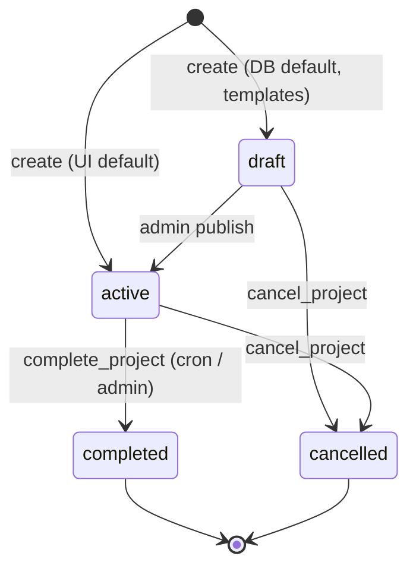

| Id | From → To | Initiator | Guard | Side effects | Notifications | Idempotency | `staffing_events` row |
|---|---|---|---|---|---|---|---|
| T-E1 | ∅ → active / draft | admin | plan limit trigger (080) | none | none | none needed | `event.created` |
| T-E2 | draft → active | admin | `status='draft'`; plan limit trigger | none | none | conditional update | `event.activated` |
| T-E3 | active → completed | cron (`complete-projects`), admin page safety net, admin button | `status='active'` and `isReadyToComplete` for cron; `status='active'` for admin (fixes the `id`-only button) | live offers → `expired` reason `event_completed` (no emails); confirmed assignments → `completed` | none | conditional update | `event.completed`, actor cron or admin |
| T-E4 | draft/active → cancelled | admin route via `cancel_project` | owner/admin; `status IN ('draft','active')` | every requirement → `cancelled` (T-R8): live offers → `rescinded`, accepted → `released`, assignments → `cancelled`, open sub requests → `cancelled`; open `pre_gig_reminders` drafts → `expired` | new `project-cancelled` → each released and each rescinded worker (logged); admin confirmation email (logged) | RPC; conditional update `WHERE status IN ('draft','active')`; replay is a no-op | `event.cancelled`, reason; one `correlation_id` for all child events |
| T-E5 | any → archived_at set / cleared | admin | none | none | none | absolute | `event.archived` / `event.unarchived` |
| T-E6 | (hard delete) | admin | no payments (today) **and** no offer, assignment or sub-request history (new, via FK RESTRICT) | none | none | FK | `event.deleted` |

Rules that follow from the event machine:

- `claim_chair` rejects when the project is not `draft` or `active` (fixes S8, E5). The gig page shows "This event has been cancelled" or "This event has ended".
- `offer-reminders` and `expire-offers` join `projects` and act only on `status IN ('draft','active')` (fixes R-5). After T-E3 and T-E4 there are no live offers on those projects anyway; the filter is a backstop.
- The edit dialog stops writing `status` (`project-form-dialog.tsx:449`). Status changes only through T-E2 to T-E5.
- `cancelled → active` and `completed → active` are not allowed in this version. An admin who needs the event back creates a new one.

## 2.6 Payment (target: presentation layer only)

No schema change to `payments`. The three stored states and `payment_type` keep their meaning. Tax records are not reinterpreted (B §B.8).

The worker-visible generalization is a pure mapping function, `paymentStageForWorker(assignment, payments[])`, in `src/lib/payments/`.

| Worker-visible stage | Derived from | Quartet today |
|---|---|---|
| Work completed | assignment `completed` (or project `completed` with the worker seated) and no `payments` row for that (service, musician) | implied, not shown |
| Submitted | reserved. Requires a future timesheet or invoice table. Never derived from `payments` | not used |
| Approved | `payments.status = 'unpaid'` (contractor has generated the amount) or `status IS NULL` | "Unpaid" |
| Scheduled | `payments.status = 'pending'` | "Pending" |
| Paid | `payments.status = 'paid'` (with `payment_date`) | "Paid" |

- `payment_type` is shown as line items: `standard` per service; `adjustment`, `correction` and `bonus` as extra lines in the same stage as their own `status`. Totals sum all lines.
- The stage for an assignment is the least advanced stage among its standard rows.
- The admin UI keeps the existing labels. Only worker-facing surfaces use the mapping.

Transitions on `payments` stay as in §1.5. The only proposed additions are logs and guards outside the table:

| Id | Change | Mechanism |
|---|---|---|
| T-P1 | log every status change and delete | trigger on `payments` writes `staffing_events` (`payment.status_changed`, `payment.deleted`) with before and after. No column added |
| T-P2 | `paid → unpaid/pending` requires an explicit confirm in the UI | app code in `bulk-update`; optional |
| T-P3 | block hard delete of `paid` or exported rows | RLS policy or trigger; optional, flagged as a decision for the owner |

## 2.7 Cascade policy

Each requirement has an effective policy: **auto** if `organizations.auto_cascade_enabled` is true **and** `project_positions.cascade_policy = 'auto'`. Otherwise **manual**. Every existing org and every existing position is `manual`. Manual is exactly today's behaviour: the system suggests, an admin clicks (C §4.4).

Auto cascade:

| Item | Rule |
|---|---|
| Triggers | an offer on the position reaches `declined` (T-O5), `expired` (T-O6) or `superseded` (T-O4, T-O7a/b). `rescinded` does not trigger (admin intent). Sub offers never trigger |
| Action | `suggestNext(position)` then `create_offer` for the top **unconflicted** candidate, with `source='auto_cascade'` and the org's default expiry (capped at the first service start) |
| Candidate rules | must first fix R-6: exclude musicians who declined, expired, were rescinded or were released on this position. Also exclude musicians with no email or `email_status='bounced'`. Without these exclusions auto cascade would loop on the same person |
| Idempotency key | `auto_offer:<position_id>:<triggering_offer_id>`, stored on the `offer.created` event (unique). At most one auto offer per triggering offer, even when the cron and the request both try |
| Where it runs | inline after the triggering RPC commits, and again in the hourly `expire-offers` sweep for any trigger without a matching key (catch-up). Both paths use the same key |
| Stop conditions | requirement `confirmed` or `cancelled`; project not `active`; a live non-sub offer already exists; no eligible unconflicted candidate; per-position cap of auto offers reached (proposed 10) |
| Stop notification | no eligible candidate or cap reached: new `cascade-exhausted` → admins (logged), once per (position, triggering offer). Filled, cancelled, inactive project or existing live offer: no email |
| `staffing_events` | `cascade.offer_created` (payload: trigger offer, rank snapshot) or `cascade.stopped` (reason) |

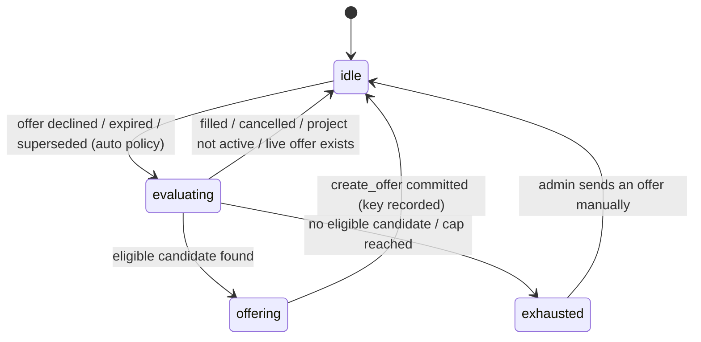

This machine is not stored. It describes the behaviour of one evaluation.

## 2.8 DB-level guarantees, summary

| Machine | Partial unique indexes | CHECK | FK policy | RPCs |
|---|---|---|---|---|
| Offer | U-O1, U-O1s, U-O2 | status set adds `superseded`; T-OX trigger on terminal states | position, musician: CASCADE → RESTRICT | `create_offer`, `claim_chair`, `respond_decline`, `rescind_offer`, `expire_offer` |
| Requirement | U-R2 | C-R1, C-R2 | `musician_id`: SET NULL → RESTRICT | `assign_direct`, `unassign`, `cancel_position` |
| Assignment | U-A1 | ended_at ⇔ open status; source or backfilled | all RESTRICT | written only inside the RPCs above |
| Substitution | U-S1 | status set unchanged; default fixed | position, requester: CASCADE → RESTRICT | `approve_substitution`, plus branches of `claim_chair`, `respond_decline`, `expire_offer` |
| Event | none | status set unchanged | positions keep CASCADE from projects, but RESTRICT below them blocks deleting projects with history | `cancel_project`, `complete_project` |
| Payment | unchanged (`payments_standard_unique`) | unchanged | unchanged (RESTRICT since 062) | none |
| Log | `staffing_events.idempotency_key` unique where not null | none | no FKs | written by RPCs and compat triggers |

## 2.9 Mapping today → target

### 2.9.1 Every existing value maps without reinterpretation

| Machine | Today's value | Target value | Notes |
|---|---|---|---|
| Offer | pending | pending | live only if `is_live_offer()` |
| Offer | viewed | viewed | |
| Offer | accepted | accepted | |
| Offer | declined | declined | |
| Offer | expired | expired | existing rows stay `expired`, even those that were really supersedes (`responded_at` set). `superseded` is written only going forward |
| Offer | rescinded | rescinded | |
| Offer | released | released | |
| Requirement | vacant | vacant | |
| Requirement | offered | offered | |
| Requirement | confirmed + musician_id | confirmed | |
| Requirement | confirmed + NULL musician_id | vacant | data repair (§2.9.2), logged |
| Requirement | declined | declined (never written) | probe expects 0 rows |
| Requirement | (hard-deleted) | n/a | `cancelled` going forward |
| Substitution | pending_approval, approved, declined, sub_declined, filled | same | |
| Substitution | cancelled | cancelled | existing rows: none expected |
| Substitution | approved with an expired or rescinded sub offer (D8) | expired / sub_declined | data repair, logged, original notified |
| Event | draft, active, completed | same | |
| Event | cancelled | cancelled, plus `archived_at = updated_at` | the history cannot tell archive from cancel, so the status stays and the row also stays hidden |
| Payment | unpaid, pending, paid, NULL | unchanged | worker stage mapping only |
| Pre-gig | draft, sent, expired | unchanged | approve gains `WHERE status='draft'` (fixes §1.6 ⚠) |

### 2.9.2 Data repair before constraints

Run the C Appendix D probes first. Each repair is a forward transition with `actor_type='system'`, `reason='data_repair'` in `staffing_events`.

| Probe | Repair |
|---|---|
| D1 (two live offers) | keep the newest; older ones → `superseded` |
| D2 (two accepted) | keep the one matching `project_positions.musician_id`; others → `released`; flag for admin review |
| D3 (accepted, not seated) | admin review list; no automatic change |
| D4 (confirmed, no musician) | → `vacant` |
| D5 (seated, not confirmed) | → `confirmed` |
| D6 (live offers on cancelled or completed projects) | → `rescinded` (cancelled) or `expired` (completed), no emails |
| D7 (accepted on cancelled projects) | admin review list |
| D8 (stranded sub requests) | → `expired` or `sub_declined` |
| Duplicate chair keys | admin review before U-R2 |

## 2.10 What the quartet admin observes differently

With `auto_cascade` off (the default), the admin workflow is the same: create chairs, click Offer, read response emails, click "Next in line", assign, unassign, approve subs, archive.

Visible differences, all of them fixes to ⚠ items:

1. **Archive vs cancel.** "Archive" hides the project as before and touches nothing else. A new, explicit "Cancel event" action retires offers and emails the affected musicians. Before, archive did nothing to offers (R-5).
2. **Delete.** Projects and chairs that ever had offers can no longer be hard-deleted; the dialog offers archive (projects) or cancel (chairs) instead, as it already does when payments exist.
3. **Offers list.** Replaced offers show "Superseded" instead of "Expired". "Next in line" no longer suggests the musician who just timed out (R-6).
4. **Rescind** works when a chair somehow has two live offers (R-13). In practice that state can no longer occur.
5. **More admin emails are logged** in `email_logs`; the emails themselves are unchanged.
6. **Completed events** show leftover live offers as "Expired".
7. **Musicians** see clear banners for "position filled", "replaced", "event cancelled" and "expired" instead of a blank card (R-11, R-12). A pending musician removed by unassign now gets the existing `offer-rescinded` email.
8. **Substitutes that time out** now release the original's request and email them (R-7).

Nothing else changes unless an org enables `auto_cascade`.

## 2.11 Suggested order of work

1. One-line guards with stateful tests: `vacateChair` (R-2), viewed write (R-3), cron vacate (R-4), pre-gig approve guard.
2. `staffing_events` table and compat triggers.
3. Data repair (§2.9.2), then U-O1, U-O1s, U-O2, U-R2, U-S1, C-R1, default fix.
4. `is_live_offer` everywhere; `superseded` value; `substitution_request_id`.
5. RPCs: `claim_chair`, `create_offer`, `respond_decline`, `rescind_offer`, `expire_offer`.
6. `assignments` table, backfill, `assign_direct`, `unassign`.
7. `cancel_position`, `cancel_project`, `archived_at`; FK RESTRICT changes; revoke browser writes.
8. `auto_cascade` flag and the cascade evaluator.
